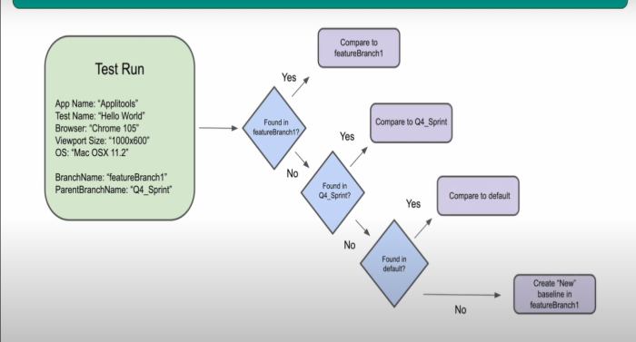

# Branching

* Branching allows you to create and maintain multiple versions of your baselines similar to how you create branches in your code using something like git.

## Branching Properties

* **BranchName** - run your tests on a specified branch
* **Parent BranchName** - run your tests on a sub-branch of the specified parent branch
* **Baseline BranchName** - look for baseline comparisons in the specified branch, skip the usual algorithm

## Branching Concepts

* If no branch is specified. test runs on the "default" branch
* If a baseline doesn't exist in the specified branch,
Applitools server Will Check parent branch followed by
default branch for matching baselines



## Example

Change to following code

```java
@test
public void branchesTest(){
driver.get("https://applitools.com/helloworld/?diff2");
eyes.check(Target.window());
}
```

`suiteConfig.setBranchName("BranchExample1")`
