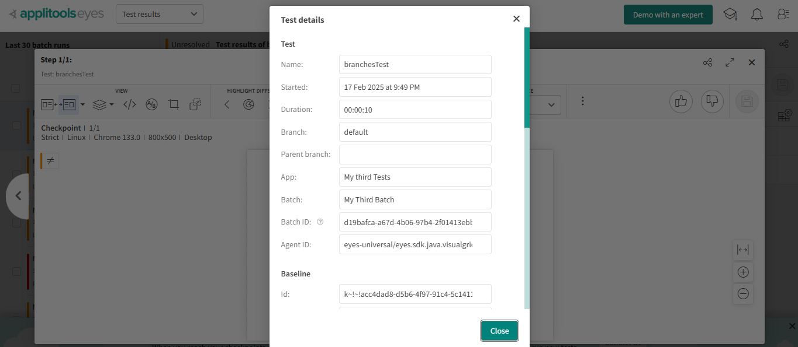
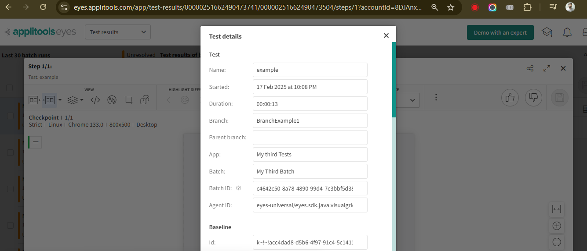
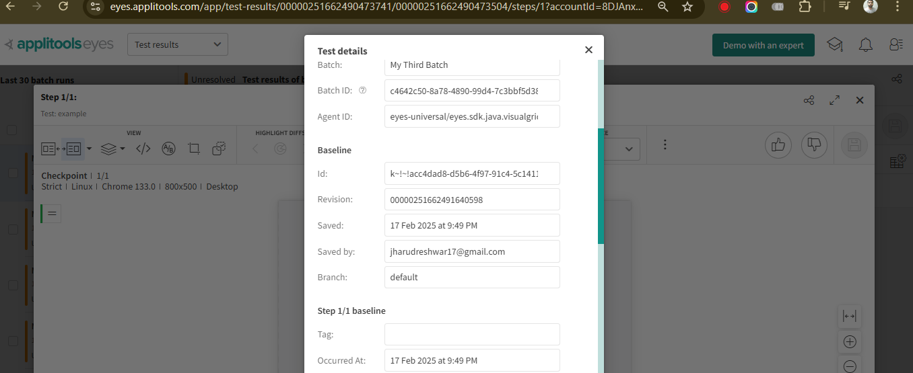
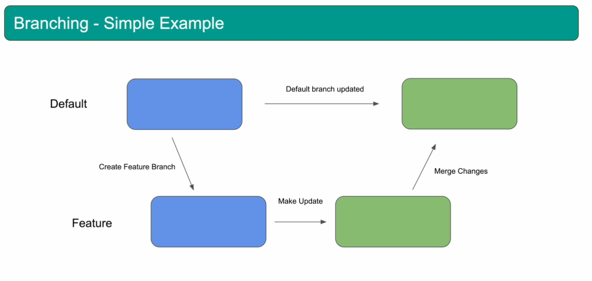
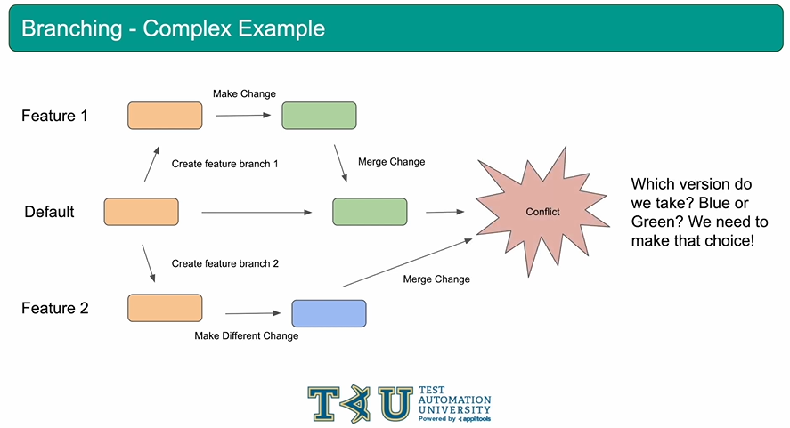
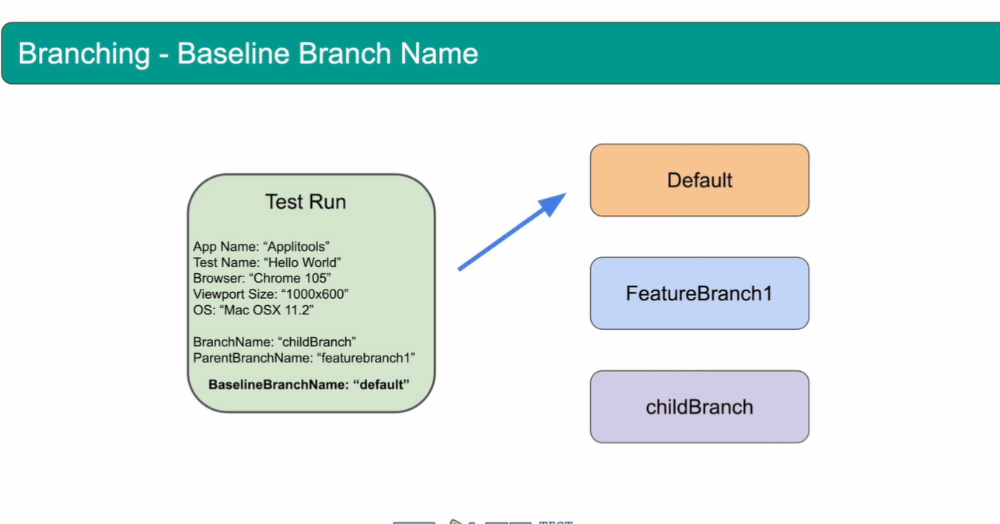

# Branching

## Outline

* Manage versions of baselines
* Similar to git branching
* Compare screenshots between different branches
* Manage branches
    * Create, Merge, Delete, or Copy

* Branching allows you to create and maintain multiple versions of your baselines similar to how you create branches in your code using something like git.

## Branching Properties

* **BranchName** - It allows to run your tests on a specified branch
* **Parent BranchName** - run your tests on a sub-branch of the specified parent branch
* **Baseline BranchName** - look for baseline comparisons in the specified branch, skip the usual algorithm

## Branching Concepts

* If no branch is specified. test runs on the "default" branch
* If a baseline doesn't exist in the specified branch,
Applitools server Will Check parent branch followed by
default branch for matching baselines
* If a matching baseline isn't found on any one of these checks, a new baseline will be created in the branch that you're running your tests on. Refer to diagram


## Example

Change to following code

```java
@test
public void branchesTest(){
driver.get("https://applitools.com/helloworld/?diff2");
eyes.check(Target.window());
}
```

`suiteConfig.setBranchName("BranchExample1")`



* All tests run on the default branch by default which make sense

Branch Name changed



* Also check the baseline - branch it is default



It is "default" because of that baseline progression logic that I mentioned earlier. No baseline was found in this new branch that we created, but there was a baseline found in the default branch. Thereafter we are comparing this 

we can also confirm above by going to "branch baselines" from the menu


Q. how to create baselines(Images) on the baseline branch - BranchExample1
We need to perform on the following options - 

1. Copy baselines - i.e. copy baselines onto this branch from another branch
2. Update the baseline - Make a change to a baseline when running on this branch
3. Create a new baseline - create a new baseline that doesn't exist on the default branch.

Summary of above code 



## Branching - Complex example



## Branching - baselineBranchName

* Specifies which branch the Eyes server should check
for a matching baseline
* Overrides the usual algorithm of checking branch =>
parentBranch => default
* If baseline is not found in the specified branch, test is
marked as new and created in the branch you're
running in


## Branching - Baseline branch name

Our usual progression will be skipped and it will compare the baseline(images) with
which we set with `setBaselineBranchName`


