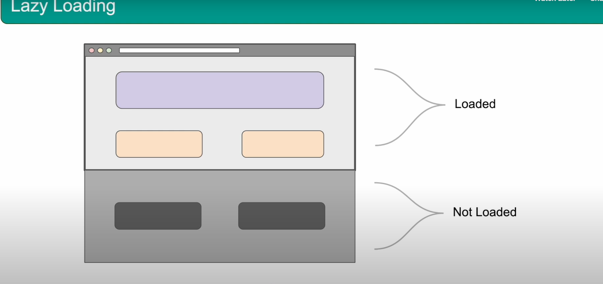

# Lazy Loading



```
        eyes.check(Target.window().layoutBreakpoints(true).lazyLoad());
```

## .lazyLoad()

* Scrolls the page incrementally
* Loads all the assets into the DOM
* Should only be used when necessary