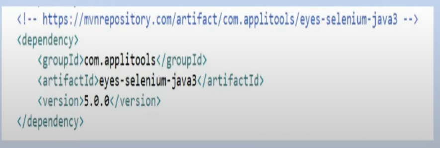

# Applitools

## How to get started

* Prerequisite/Configuration
    * Development environment
        * Java (java -version)
        * Maven (mvn -v)
        * Existing/Create Test Automation Framework
        * Add Applitool eyes, dependency to pom.xml




## https://applitools.com/pricing/

## Getting Started

* Initialize Eyes and pass your API key

```java
// Initialize the eyes SDK and set your private API key
Eyes eye = new Eyes();

// Set Applitool API key
eye.setApiKey("Set API Key");
```

* Set the application (AUT) name , and test name and set browsers's viewport size.

```
// Start test by setting AUT's name, window/page name, viewport width and height

eye.open(driver, "appName", "windowName", new RectangleSize(600,800));

// Navigating to demo app
driver.get("https://www.google.com");
```

* Generate/Capture screenshot

```
eye.checkWindow("Login page");
```

* End the test
```
// End the test
eye.close();

// close the browser
driver.quit();

// If a test is running, aborts it. Otherwise, does nothing.
eye.abortIfNotClosed();

```


## What are Match Levels?
