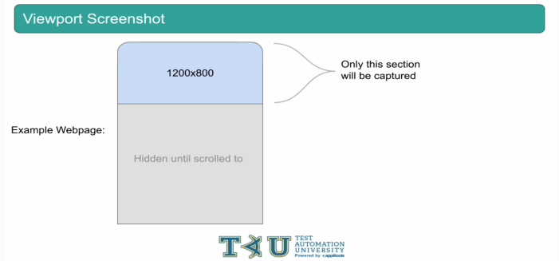
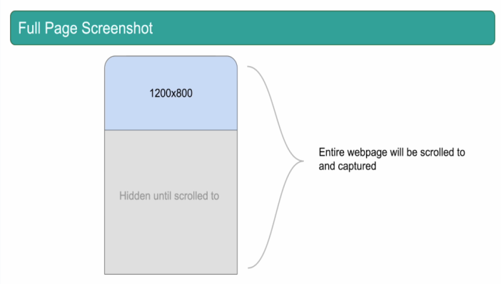
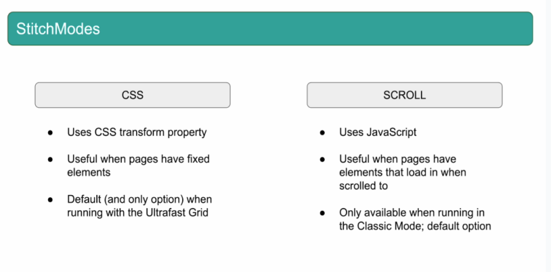
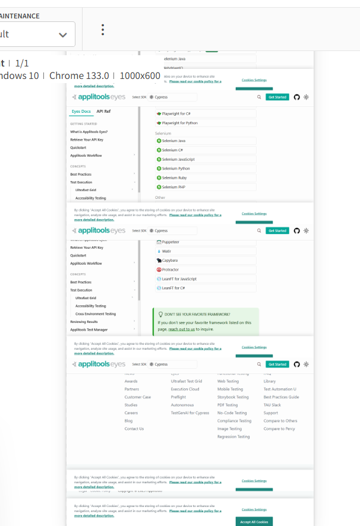
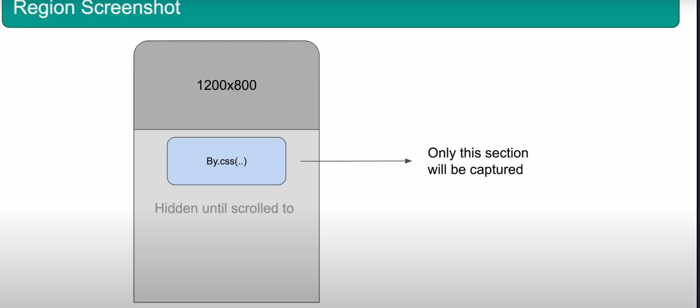
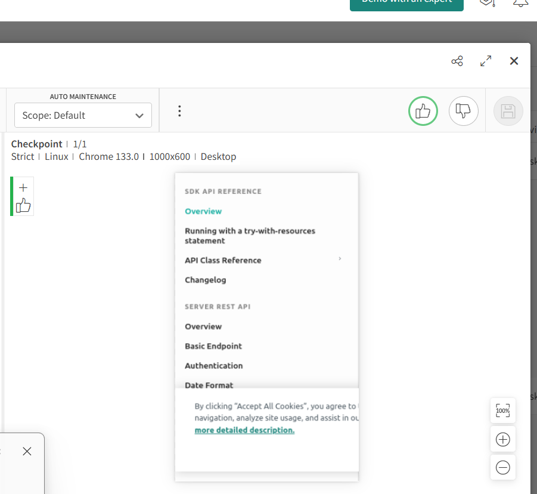
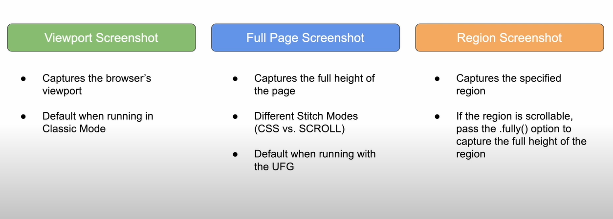

# Types of Screenshots

## Viewport Screenshot

```java
import io.github.bonigarcia.wdm.WebDriverManager;

import java.awt.Rectangle;

import org.junit.jupiter.api.*;
import org.openqa.selenium.By;
import org.openqa.selenium.WebDriver;
import org.openqa.selenium.WebElement;
import org.openqa.selenium.bidi.module.Browser;
import org.openqa.selenium.chrome.ChromeDriver;

import com.applitools.eyes.BatchInfo;
import com.applitools.eyes.EyesRunner;
import com.applitools.eyes.TestResultsSummary;
import com.applitools.eyes.config.Configuration;
import com.applitools.eyes.selenium.BrowserType;
import com.applitools.eyes.selenium.ClassicRunner;
import com.applitools.eyes.selenium.Eyes;
import com.applitools.eyes.selenium.fluent.Target;
import com.applitools.eyes.visualgrid.model.DeviceName;
import com.applitools.eyes.visualgrid.model.ScreenOrientation;
import com.applitools.eyes.visualgrid.services.RunnerOptions;
import com.applitools.eyes.visualgrid.services.VisualGridRunner;

public class TestCase1 {
    static WebDriver driver;
    static BatchInfo myTestBatch;
    static Configuration suiteConfig;
	static EyesRunner testRunner;
    Eyes eyes;

    @BeforeAll
    public static void beforeAll() {
//    	WebDriverManager.chromedriver().setup();
//    	driver = new ChromeDriver();
    	
    	driver = WebDriverManager.chromedriver().create();
    	myTestBatch = new BatchInfo("My Second Batch");
    	myTestBatch.setSequenceName("Advanced Visual Testing");
    	
    	
    	// Scale Configuration for multiple files
    	suiteConfig = new Configuration();
    	suiteConfig.setApiKey(System.getenv("APPLITOOLS_API_KEY"));
    	suiteConfig.setBatch(myTestBatch);
    	
    	
    	// Runner
    	testRunner = new ClassicRunner();
    	testRunner = new VisualGridRunner(new RunnerOptions().testConcurrency(5));
    }
    
    @BeforeEach
    public void beforeEach(TestInfo testInfo) {
    	eyes = new Eyes(testRunner);
    	eyes.setConfiguration(suiteConfig);
    	
    	eyes.open(
    		    driver,
    		    "My second Tests",  // App name
    		    testInfo.getTestMethod().get().getName(),
    		    new com.applitools.eyes.RectangleSize(1000, 600)  // Correct way to set window size
    			);

    }
    
    @Test
    public void applitoolsTutorialPageViewport() {
        driver.get("https://applitools.com/tutorials");
        eyes.check(Target.window().fully(false));
    }

    @Test
    public void exampleTestCase() {
    	driver.get("https://example.com");
    	eyes.check(Target.window());
    }
    
    
    @AfterEach
    public void afterEach() {
    	eyes.closeAsync();
    }
    @AfterAll
    public static void afterAll() {
    	driver.close();
    	TestResultsSummary results = testRunner.getAllTestResults();
    	System.out.println(results);
    }
}

```




* Browser viewport size
The Browser viewport covers only the portion of the browser   that shows the actual webpage

Things like the URL bar, Bookmarks bar, and the close or   minimize buttons are not included in the browser's viewport.

* Browser window size


## Full Page Screenshot

```java
import io.github.bonigarcia.wdm.WebDriverManager;

import java.awt.Rectangle;

import org.junit.jupiter.api.*;
import org.openqa.selenium.By;
import org.openqa.selenium.WebDriver;
import org.openqa.selenium.WebElement;
import org.openqa.selenium.bidi.module.Browser;
import org.openqa.selenium.chrome.ChromeDriver;

import com.applitools.eyes.BatchInfo;
import com.applitools.eyes.EyesRunner;
import com.applitools.eyes.TestResultsSummary;
import com.applitools.eyes.config.Configuration;
import com.applitools.eyes.selenium.BrowserType;
import com.applitools.eyes.selenium.ClassicRunner;
import com.applitools.eyes.selenium.Eyes;
import com.applitools.eyes.selenium.fluent.Target;
import com.applitools.eyes.visualgrid.model.DeviceName;
import com.applitools.eyes.visualgrid.model.ScreenOrientation;
import com.applitools.eyes.visualgrid.services.RunnerOptions;
import com.applitools.eyes.visualgrid.services.VisualGridRunner;

public class TestCase1 {
    static WebDriver driver;
    static BatchInfo myTestBatch;
    static Configuration suiteConfig;
	static EyesRunner testRunner;
    Eyes eyes;

    @BeforeAll
    public static void beforeAll() {
//    	WebDriverManager.chromedriver().setup();
//    	driver = new ChromeDriver();
    	
    	driver = WebDriverManager.chromedriver().create();
    	myTestBatch = new BatchInfo("My Second Batch");
    	myTestBatch.setSequenceName("Advanced Visual Testing");
    	
    	
    	// Scale Configuration for multiple files
    	suiteConfig = new Configuration();
    	suiteConfig.setApiKey(System.getenv("APPLITOOLS_API_KEY"));
    	suiteConfig.setBatch(myTestBatch);
    	
    	
    	// Runner
    	testRunner = new ClassicRunner();
    	testRunner = new VisualGridRunner(new RunnerOptions().testConcurrency(5));
    }
    
    @BeforeEach
    public void beforeEach(TestInfo testInfo) {
    	eyes = new Eyes(testRunner);
    	eyes.setConfiguration(suiteConfig);
    	
    	eyes.open(
    		    driver,
    		    "My second Tests",  // App name
    		    testInfo.getTestMethod().get().getName(),
    		    new com.applitools.eyes.RectangleSize(1000, 600)  // Correct way to set window size
    			);

    }
    
    @Test
    public void applitoolsTutorialPageViewport() {
        driver.get("https://applitools.com/tutorials");
        eyes.check(Target.window());
    }

    @Test
    public void exampleTestCase() {
    	driver.get("https://example.com");
    	eyes.check(Target.window());
    }
    
    
    @AfterEach
    public void afterEach() {
    	eyes.closeAsync();
    }
    @AfterAll
    public static void afterAll() {
    	driver.close();
    	TestResultsSummary results = testRunner.getAllTestResults();
    	System.out.println(results);
    }
}


```



## Stitch Modes




1. **CSS** Mode - In this mode the sticky element will be repeated.

```java
import io.github.bonigarcia.wdm.WebDriverManager;

import java.awt.Rectangle;

import org.junit.jupiter.api.*;
import org.openqa.selenium.By;
import org.openqa.selenium.WebDriver;
import org.openqa.selenium.WebElement;
import org.openqa.selenium.bidi.module.Browser;
import org.openqa.selenium.chrome.ChromeDriver;

import com.applitools.eyes.BatchInfo;
import com.applitools.eyes.EyesRunner;
import com.applitools.eyes.TestResultsSummary;
import com.applitools.eyes.config.Configuration;
import com.applitools.eyes.selenium.BrowserType;
import com.applitools.eyes.selenium.ClassicRunner;
import com.applitools.eyes.selenium.Eyes;
import com.applitools.eyes.selenium.fluent.Target;
import com.applitools.eyes.visualgrid.model.DeviceName;
import com.applitools.eyes.visualgrid.model.ScreenOrientation;
import com.applitools.eyes.visualgrid.services.RunnerOptions;
import com.applitools.eyes.visualgrid.services.VisualGridRunner;

public class TestCase1 {
    static WebDriver driver;
    static BatchInfo myTestBatch;
    static Configuration suiteConfig;
	static EyesRunner testRunner;
    Eyes eyes;

    @BeforeAll
    public static void beforeAll() {
//    	WebDriverManager.chromedriver().setup();
//    	driver = new ChromeDriver();
    	
    	driver = WebDriverManager.chromedriver().create();
    	myTestBatch = new BatchInfo("My Second Batch");
    	myTestBatch.setSequenceName("Advanced Visual Testing");
    	
    	
    	// Scale Configuration for multiple files
    	suiteConfig = new Configuration();
    	suiteConfig.setApiKey(System.getenv("APPLITOOLS_API_KEY"));
    	suiteConfig.setBatch(myTestBatch);
    	
    	
    	// Runner
    	testRunner = new ClassicRunner();
//    	testRunner = new VisualGridRunner(new RunnerOptions().testConcurrency(5));
    }
    
    @BeforeEach
    public void beforeEach(TestInfo testInfo) {
    	eyes = new Eyes(testRunner);
    	eyes.setConfiguration(suiteConfig);
    	
    	eyes.open(
    		    driver,
    		    "My second Tests",  // App name
    		    testInfo.getTestMethod().get().getName(),
    		    new com.applitools.eyes.RectangleSize(1000, 600)  // Correct way to set window size
    			);

    }
    
    @Test
    public void applitoolsTutorials_StitchModes() {
        driver.get("https://applitools.com/tutorials");
        eyes.check(Target.window());
    }

    @Test
    public void exampleTestCase() {
    	driver.get("https://example.com");
    	eyes.check(Target.window().fully());
    }
    
    
    @AfterEach
    public void afterEach() {
    	eyes.closeAsync();
    }
    @AfterAll
    public static void afterAll() {
    	driver.close();
    	TestResultsSummary results = testRunner.getAllTestResults();
    	System.out.println(results);
    }
}

```



* **CSS Stitch** Mode

`suiteConfig.setStitchMode(StitchMode.CSS);`

## Region Screenshot



* Ultra fast grid uses **CSS stitching** by default.



```java
import io.github.bonigarcia.wdm.WebDriverManager;

import java.awt.Rectangle;

import org.junit.jupiter.api.*;
import org.openqa.selenium.By;
import org.openqa.selenium.WebDriver;
import org.openqa.selenium.WebElement;
import org.openqa.selenium.bidi.module.Browser;
import org.openqa.selenium.chrome.ChromeDriver;

import com.applitools.eyes.BatchInfo;
import com.applitools.eyes.EyesRunner;
import com.applitools.eyes.TestResultsSummary;
import com.applitools.eyes.config.Configuration;
import com.applitools.eyes.selenium.BrowserType;
import com.applitools.eyes.selenium.ClassicRunner;
import com.applitools.eyes.selenium.Eyes;
import com.applitools.eyes.selenium.StitchMode;
import com.applitools.eyes.selenium.fluent.Target;
import com.applitools.eyes.visualgrid.model.DeviceName;
import com.applitools.eyes.visualgrid.model.ScreenOrientation;
import com.applitools.eyes.visualgrid.services.RunnerOptions;
import com.applitools.eyes.visualgrid.services.VisualGridRunner;

public class TestCase1 {
    static WebDriver driver;
    static BatchInfo myTestBatch;
    static Configuration suiteConfig;
	static EyesRunner testRunner;
    Eyes eyes;

    @BeforeAll
    public static void beforeAll() {
    	driver = WebDriverManager.chromedriver().create();
    	myTestBatch = new BatchInfo("My Second Batch");
    	myTestBatch.setSequenceName("Advanced Visual Testing");
    	
    	
    	// Scale Configuration for multiple files
    	suiteConfig = new Configuration();
    	suiteConfig.setApiKey(System.getenv("APPLITOOLS_API_KEY"));
    	suiteConfig.setBatch(myTestBatch);
    	
    	// Runner
//    	testRunner = new ClassicRunner();
    	testRunner = new VisualGridRunner(new RunnerOptions().testConcurrency(1));
    }
    
    @BeforeEach
    public void beforeEach(TestInfo testInfo) {
    	eyes = new Eyes(testRunner);
    	eyes.setConfiguration(suiteConfig);
    	
    	eyes.open(
    		    driver,
    		    "My second Tests",  // App name
    		    testInfo.getTestMethod().get().getName(),
    		    new com.applitools.eyes.RectangleSize(1000, 600)  // Correct way to set window size
    			);

    }
    
    @Test
    public void regionScreenshot() {
        driver.get("https://applitools.com/tutorials/quickstart/web/selenium/java/junit");
        eyes.check(Target.region(By.cssSelector(".menu")));
    }

    @Test
    public void exampleTestCase() {
    	driver.get("https://example.com");
    	eyes.check(Target.window().fully());
    }
    
    
    @AfterEach
    public void afterEach() {
    	eyes.closeAsync();
    }
    @AfterAll
    public static void afterAll() {
    	driver.close();
    	TestResultsSummary results = testRunner.getAllTestResults();
    	System.out.println(results);
    }
}

```

* If region screenshot is long and to capture the full height  
and out of viewport use this one
`eyes.check(Target.region(By.cssSelector(".menu")).fully());`

# Recap

