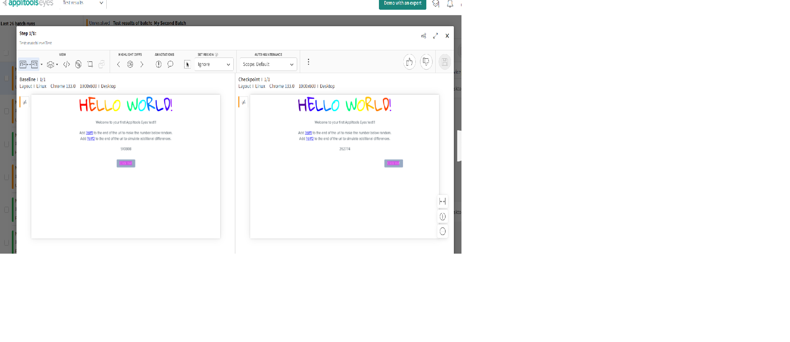
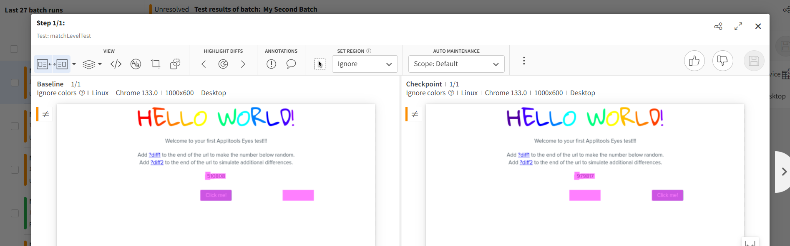

# Match Levels

## Strict Match Level

* Default Algorithm
* Mimics the human Eyes
* Smart enough to ignore the noise
* Only flags important differences


```java
import io.github.bonigarcia.wdm.WebDriverManager;

import java.awt.Rectangle;

import org.junit.jupiter.api.*;
import org.openqa.selenium.By;
import org.openqa.selenium.WebDriver;
import org.openqa.selenium.WebElement;
import org.openqa.selenium.bidi.module.Browser;
import org.openqa.selenium.chrome.ChromeDriver;

import com.applitools.eyes.BatchInfo;
import com.applitools.eyes.EyesRunner;
import com.applitools.eyes.TestResultsSummary;
import com.applitools.eyes.config.Configuration;
import com.applitools.eyes.selenium.BrowserType;
import com.applitools.eyes.selenium.ClassicRunner;
import com.applitools.eyes.selenium.Eyes;
import com.applitools.eyes.selenium.StitchMode;
import com.applitools.eyes.selenium.fluent.Target;
import com.applitools.eyes.visualgrid.model.DeviceName;
import com.applitools.eyes.visualgrid.model.ScreenOrientation;
import com.applitools.eyes.visualgrid.services.RunnerOptions;
import com.applitools.eyes.visualgrid.services.VisualGridRunner;

public class TestCase1 {
    static WebDriver driver;
    static BatchInfo myTestBatch;
    static Configuration suiteConfig;
	static EyesRunner testRunner;
    Eyes eyes;

    @BeforeAll
    public static void beforeAll() {
    	driver = WebDriverManager.chromedriver().create();
    	myTestBatch = new BatchInfo("My Second Batch");
    	myTestBatch.setSequenceName("Advanced Visual Testing");
    	
    	
    	// Scale Configuration for multiple files
    	suiteConfig = new Configuration();
    	suiteConfig.setApiKey(System.getenv("APPLITOOLS_API_KEY"));
    	suiteConfig.setBatch(myTestBatch);
    	
    	// Runner
//    	testRunner = new ClassicRunner();
    	testRunner = new VisualGridRunner(new RunnerOptions().testConcurrency(1));
    }
    
    @BeforeEach
    public void beforeEach(TestInfo testInfo) {
    	eyes = new Eyes(testRunner);
    	eyes.setConfiguration(suiteConfig);
    	
    	eyes.open(
    		    driver,
    		    "My second Tests",  // App name
    		    testInfo.getTestMethod().get().getName(),
    		    new com.applitools.eyes.RectangleSize(1000, 600)  // Correct way to set window size
    			);

    }
    
    @Test
    public void matchLevelTest() {
        // driver.get("https://applitools.com/helloworld/?diff1");
        driver.get("https://applitools.com/helloworld/?diff2");
        eyes.check(Target.window());
        }

    @Test
    public void exampleTestCase() {
    	driver.get("https://example.com");
    	eyes.check(Target.window().fully());
    }
    
    
    @AfterEach
    public void afterEach() {
    	eyes.closeAsync();
    }
    @AfterAll
    public static void afterAll() {
    	driver.close();
    	TestResultsSummary results = testRunner.getAllTestResults();
    	System.out.println(results);
    }
}

```

## Match Levels - Layout

* Validates the general layout
* Userful for dyanmic data (i.e. timestamps, user IDs, etc.)
* Some tests make sense to run the strict and others make sense to run with layout.

```java
import io.github.bonigarcia.wdm.WebDriverManager;

import java.awt.Rectangle;

import org.junit.jupiter.api.*;
import org.openqa.selenium.By;
import org.openqa.selenium.WebDriver;
import org.openqa.selenium.WebElement;
import org.openqa.selenium.bidi.module.Browser;
import org.openqa.selenium.chrome.ChromeDriver;

import com.applitools.eyes.BatchInfo;
import com.applitools.eyes.EyesRunner;
import com.applitools.eyes.MatchLevel;
import com.applitools.eyes.TestResultsSummary;
import com.applitools.eyes.config.Configuration;
import com.applitools.eyes.selenium.BrowserType;
import com.applitools.eyes.selenium.ClassicRunner;
import com.applitools.eyes.selenium.Eyes;
import com.applitools.eyes.selenium.StitchMode;
import com.applitools.eyes.selenium.fluent.Target;
import com.applitools.eyes.visualgrid.model.DeviceName;
import com.applitools.eyes.visualgrid.model.ScreenOrientation;
import com.applitools.eyes.visualgrid.services.RunnerOptions;
import com.applitools.eyes.visualgrid.services.VisualGridRunner;

public class TestCase1 {
    static WebDriver driver;
    static BatchInfo myTestBatch;
    static Configuration suiteConfig;
	static EyesRunner testRunner;
    Eyes eyes;

    @BeforeAll
    public static void beforeAll() {
    	driver = WebDriverManager.chromedriver().create();
    	myTestBatch = new BatchInfo("My Second Batch");
    	myTestBatch.setSequenceName("Advanced Visual Testing");
    	
    	
    	// Scale Configuration for multiple files
    	suiteConfig = new Configuration();
    	suiteConfig.setApiKey(System.getenv("APPLITOOLS_API_KEY"));
    	suiteConfig.setBatch(myTestBatch);
//    	suiteConfig.setMatchLevel(MatchLevel.LAYOUT);
    	
    	// Runner
//    	testRunner = new ClassicRunner();
    	testRunner = new VisualGridRunner(new RunnerOptions().testConcurrency(1));
    }
    
    @BeforeEach
    public void beforeEach(TestInfo testInfo) {
    	eyes = new Eyes(testRunner);
    	eyes.setConfiguration(suiteConfig);
    	
    	eyes.open(
    		    driver,
    		    "My second Tests",  // App name
    		    testInfo.getTestMethod().get().getName(),
    		    new com.applitools.eyes.RectangleSize(1000, 600)  // Correct way to set window size
    			);

    }
    
    @Test
    public void matchLevelTest() {
        driver.get("https://applitools.com/helloworld/?diff2");
        eyes.check(Target.window().layout());
        }

    @Test
    public void exampleTestCase() {
    	driver.get("https://example.com");
    	eyes.check(Target.window().fully());
    }
    
    
    @AfterEach
    public void afterEach() {
    	eyes.closeAsync();
    }
    @AfterAll
    public static void afterAll() {
    	driver.close();
    	TestResultsSummary results = testRunner.getAllTestResults();
    	System.out.println(results);
    }
}
```



## Match Levels - Ignore Colors

* Same as Strict
* Ignore color changes



```java
import io.github.bonigarcia.wdm.WebDriverManager;

import java.awt.Rectangle;

import org.junit.jupiter.api.*;
import org.openqa.selenium.By;
import org.openqa.selenium.WebDriver;
import org.openqa.selenium.WebElement;
import org.openqa.selenium.bidi.module.Browser;
import org.openqa.selenium.chrome.ChromeDriver;

import com.applitools.eyes.BatchInfo;
import com.applitools.eyes.EyesRunner;
import com.applitools.eyes.MatchLevel;
import com.applitools.eyes.TestResultsSummary;
import com.applitools.eyes.config.Configuration;
import com.applitools.eyes.selenium.BrowserType;
import com.applitools.eyes.selenium.ClassicRunner;
import com.applitools.eyes.selenium.Eyes;
import com.applitools.eyes.selenium.StitchMode;
import com.applitools.eyes.selenium.fluent.Target;
import com.applitools.eyes.visualgrid.model.DeviceName;
import com.applitools.eyes.visualgrid.model.ScreenOrientation;
import com.applitools.eyes.visualgrid.services.RunnerOptions;
import com.applitools.eyes.visualgrid.services.VisualGridRunner;

public class TestCase1 {
    static WebDriver driver;
    static BatchInfo myTestBatch;
    static Configuration suiteConfig;
	static EyesRunner testRunner;
    Eyes eyes;

    @BeforeAll
    public static void beforeAll() {
    	driver = WebDriverManager.chromedriver().create();
    	myTestBatch = new BatchInfo("My Second Batch");
    	myTestBatch.setSequenceName("Advanced Visual Testing");
    	
    	
    	// Scale Configuration for multiple files
    	suiteConfig = new Configuration();
    	suiteConfig.setApiKey(System.getenv("APPLITOOLS_API_KEY"));
    	suiteConfig.setBatch(myTestBatch);
//    	suiteConfig.setMatchLevel(MatchLevel.LAYOUT);
//    	suiteConfig.setMatchLevel(MatchLevel.CONTENT);
    	
    	// Runner
//    	testRunner = new ClassicRunner();
    	testRunner = new VisualGridRunner(new RunnerOptions().testConcurrency(1));
    }
    
    @BeforeEach
    public void beforeEach(TestInfo testInfo) {
    	eyes = new Eyes(testRunner);
    	eyes.setConfiguration(suiteConfig);
    	
    	eyes.open(
    		    driver,
    		    "My second Tests",  // App name
    		    testInfo.getTestMethod().get().getName(),
    		    new com.applitools.eyes.RectangleSize(1000, 600)  // Correct way to set window size
    			);

    }
    
    @Test
    public void matchLevelTest() {
        driver.get("https://applitools.com/helloworld/?diff2");
        eyes.check(Target.window().content());
        }

    @Test
    public void exampleTestCase() {
    	driver.get("https://example.com");
    	eyes.check(Target.window().fully());
    }
    
    
    @AfterEach
    public void afterEach() {
    	eyes.closeAsync();
    }
    @AfterAll
    public static void afterAll() {
    	driver.close();
    	TestResultsSummary results = testRunner.getAllTestResults();
    	System.out.println(results);
    }
}
```