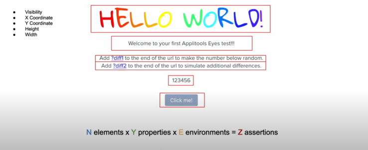
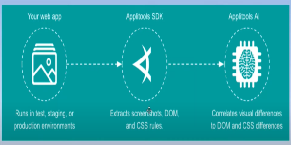

# Introduction to Visual Testing

## What is Visual Testing?

* A quality assurance activity aimed to verify GUI (graphical user interface)  
appears correctly to the user, this goes beyond traditional functional testing  
that we do, where we actually test functionality.
* Check characteristics (layout, color, shape, size, position, hide, overlap)  
of each elements on webpage

## Why it is important?

* Visual perfection can mean the difference between one of your customers loving or hating your  
product **(Company Brand)**.  
Example(As per survey):  
**38%** of people **will stop engaging** with a website if the content or layout are unattractive.  
**57%** of internet users say they **won't recommend a business** with a poorly designed website on
mobile.
* It affects the user experience

## Why can’t functional test cover visual issues?

* Test scripts will soon balloon in size due to checkpoint bloat.
* Traditional checkpoints (Visibility, Upper-left x, y coordinates, Height, Width, Background color).  

Example -  

`
10 visual elements * 5 assertion per element = 50 lines of assertion code
`




## Why visual testing should be Automated?

The Test Matrix is too big to cover manually.

* Web browsers
* Devices
* Operating systems
* Screen resolutions
* Responsive design
* L10n

### Test Matrix to cover Manually

* 5 operating systems: Windows, MacOS, Android, iOS, Chrome.
* 5 popular browsers: Chrome, Firefox, Internet Explorer (Windows only) Microsoft Edge
(Windows Only), and Safari (Mac only).
* 2 screen orientations for mobile devices: portrait and landscape.
* 10 standard mobile device display resolutions and 18 standard desktop/laptop display  
resolutions from XGA to 4G.

Total  

`
21*(20+18) = 21*38 = 798 Unique Screen Configurations to test(One web page excluding L10n Testing)
`


## Why Applitools Eyes?

* Al powered visual testing and monitoring tool
* Support various test tools/frameworks and languages(https://applitools.com/tutorials)
    * Selenium, Cypress, Appium, Perfecto, Coded IJI
    * Java, C#, JS, Python, php, Ruby
* Less code to write, less code to maintain
* Handles dynamic content
* Handles shifting content
* Ultrafast cross browser/device testing, validating all screens in seconds
* Automate PDFs
* Available on private and public cloud
* Integrates with your toolchain
    * Automation tools, Collaboration tools, CI/CD and more
* Build custom Visual Reports

* https://applitools.com/tutorials/sdks/selenium-java/quickstart


## How does it work?


Applitool Working - 



## What is baseline?
In visual testing, a **baseline** refers to the reference image or state of a user interface (UI) that is captured and stored when the application is in a known, correct state. The baseline serves as the "standard" to compare future versions of the UI to detect visual changes or regressions. Here's how it works:

### Key Concepts:
1. **Initial Baseline:** 
   - The first screenshot of a UI in its correct form is captured and saved.
   
2. **Comparison:** 
   - When the same UI is tested in subsequent runs, new screenshots are taken and compared against the baseline.
   
3. **Visual Differences:** 
   - Any pixel-level changes or discrepancies (e.g., layout shifts, color changes, missing elements) are highlighted.

4. **Approval or Rejection:** 
   - If changes are intentional (e.g., UI design updates), a new baseline can be approved and stored.
   - If changes are unintended, they are flagged as visual bugs or regressions.

### Benefits:
- **Improved Accuracy:** Catches subtle changes that traditional assertions may miss.
- **Efficiency:** Quickly identifies UI anomalies across various resolutions and browsers.
- **Reduced Maintenance:** Allows testers to manage intentional changes easily by updating baselines.

### Example Use Case:
If a button's color or position unexpectedly changes, visual testing will flag this change compared to the baseline. This ensures consistency across different testing environments.

### Tools and Best Practices for Managing Baselines in Visual Testing

---

### **Popular Visual Testing Tools:**
1. **Applitools Eyes**  
   - AI-powered visual testing tool that automatically captures and compares baselines.
   - Allows management of baselines across multiple browsers and devices.
   - Provides an intuitive interface for reviewing and accepting/rejecting changes.

2. **Percy (by BrowserStack)**  
   - Integrates with CI/CD pipelines for automated visual regression testing.
   - Provides a clear UI for baseline management and allows easy approval of new baselines.
   
3. **Cypress + Percy Plugin**  
   - Combines end-to-end testing with visual snapshots, making visual testing easy to manage in a single pipeline.

4. **Chromatic (for Storybook)**  
   - Great for component-based UI testing.
   - Automatically captures visual changes for each component and allows for baseline approvals.

5. **Visual Regression Tracker (VRT)**  
   - Open-source option with baseline management and test reports.
   - Allows manual or automated baseline updates.

---

### **Best Practices for Managing Baselines:**

1. **Capture Baselines at Stable Points:**  
   - Ensure the UI is in a stable, correct state before creating a baseline. Avoid capturing baselines during early development stages.

2. **Environment Consistency:**  
   - Always capture baselines and perform visual comparisons under the same conditions (e.g., resolution, browser, screen size, environment variables).

3. **Version Control for Baselines:**  
   - Store baselines in a version-controlled repository to ensure you can trace changes and revert if needed.

4. **Use Ignored Regions:**  
   - Ignore dynamic elements (e.g., ads, date-time stamps) to prevent unnecessary test failures due to non-UI-related changes.

5. **Approve Intentional Changes Quickly:**  
   - When intentional UI updates are made, promptly approve the new baselines to avoid false positives in future tests.

6. **Automate Baseline Updates:**  
   - Set up CI/CD pipelines to automate visual tests, but review changes before automatically updating baselines.

7. **Segment Your Baselines:**  
   - If your application has multiple pages or components, store baselines in segments (e.g., by page or feature). This makes it easier to manage and approve partial changes.

8. **Periodic Review:**  
   - Periodically review and clean up old or unnecessary baselines to keep your baseline set lean and relevant.

---

### **Managing Dynamic and Responsive UIs:**
- For dynamic UIs, consider tools that offer **smart diffing** (e.g., Applitools) that ignore minor pixel differences or allow setting thresholds.
- For responsive designs, capture separate baselines for different screen sizes to ensure coverage across devices.

These best practices ensure that visual regression testing is efficient, effective, and doesn’t create unnecessary overhead. 

# What is CheckPoint

In **visual testing**, a **checkpoint** refers to a specific point in your test where a screenshot of the user interface (UI) is captured and compared against the baseline to verify visual correctness. Checkpoints act as validation steps to ensure that the UI looks as expected at various stages of the application flow.

---

### **How Checkpoints Work:**

1. **Capture:**  
   - The system takes a screenshot at the checkpoint during the test run.
   
2. **Compare:**  
   - The captured screenshot is compared to the corresponding baseline image.

3. **Detect Changes:**  
   - Any visual differences are flagged as potential regressions or changes.

4. **Result:**  
   - If no differences are found, the test passes. If differences are detected, they can be approved (if intentional) or flagged as a bug.

---

### **Types of Checkpoints in Visual Testing:**

1. **Full Page Checkpoints:**  
   - Captures the entire page’s UI for comparison. This is useful for ensuring overall page layout consistency.

2. **Component-Level Checkpoints:**  
   - Captures specific components or regions of the page (e.g., buttons, headers, images).  
   - Useful for isolating changes to specific UI elements.

3. **Dynamic Checkpoints:**  
   - Allows setting checkpoints that ignore dynamic or non-deterministic content (e.g., timestamps, random ads).

4. **Responsive Checkpoints:**  
   - Designed to capture and compare UIs at different screen sizes or resolutions.

---

### **Why Checkpoints Are Important:**

- **Early Bug Detection:** Ensures that any UI changes are caught during test execution.
- **Confidence in UI Consistency:** Ensures the UI is stable across different test environments.
- **Granular Validation:** Helps identify which specific parts of the UI have changed, making debugging easier.

---

### **Example Use Case:**

Suppose you are testing the checkout flow on an e-commerce website. You can add checkpoints at:

1. **Homepage:** Ensure banners and buttons are displayed correctly.
2. **Product Page:** Check the layout and details of the product.
3. **Cart Page:** Verify item details and the "Proceed to Checkout" button.
4. **Order Confirmation:** Ensure the confirmation message is displayed correctly.

Each checkpoint ensures visual stability at critical steps in the user flow.

---

### **Checkpoint Management Tips:**

- **Use Meaningful Checkpoints:** Add checkpoints at important UI states where regressions are more likely to occur.
- **Avoid Too Many Checkpoints:** Overloading your tests with excessive checkpoints can slow down execution and increase false positives.
- **Combine Functional and Visual Checkpoints:** Ensure both UI correctness and underlying functionality are validated together for comprehensive coverage.

## what is ViewPort

A **viewport** refers to the visible area of a web page on a user’s screen. It is essentially the portion of the web page that the browser renders and displays to the user at any given time, excluding toolbars, tabs, and other browser UI elements.

---

### **Key Concepts of Viewport:**

1. **Browser Viewport (Web Context):**
   - The width and height of the part of the browser window that displays the web page.
   - Resizing the browser window changes the viewport size.
   - On mobile devices, the viewport is typically smaller compared to desktops, but users can zoom or scroll to view more content.

2. **CSS and Viewport:**
   - CSS properties like `width`, `height`, `max-width`, and `media queries` use the viewport as a reference to create responsive designs.
   - Example media query:
     ```css
     @media (max-width: 768px) {
         body {
             background-color: lightgray;
         }
     }
     ```
     This rule changes the background color if the viewport width is 768px or smaller.

3. **Viewport Meta Tag:**
   - In web development, the viewport meta tag is used to control how a web page is displayed on different devices:
     ```html
     <meta name="viewport" content="width=device-width, initial-scale=1.0">
     ```
   - This tag is crucial for making websites mobile-friendly by adjusting the page's scaling and layout for smaller screens.

4. **Viewport vs. Resolution:**
   - **Viewport size** refers to the visible area in the browser window.
   - **Screen resolution** is the number of pixels displayed on a device’s screen (e.g., 1920x1080). A high-resolution screen may display a smaller viewport on a small device (like mobile phones).

---

### **Viewport in Visual Testing:**  
In visual testing, viewport control ensures that screenshots are captured at specific viewport sizes to validate responsive designs. Some visual testing tools capture screenshots at different viewport sizes to ensure the UI renders correctly across devices.

For example, Applitools allows setting a viewport size for consistent visual comparison:
```python
eyes.open(driver, "Application Name", "Test Name", {"width": 1024, "height": 768})
```

---

### **Practical Uses of Viewport:**

1. **Responsive Design:** Ensures that content adapts to different screen sizes using breakpoints and viewport-based styles.
2. **Cross-Browser Testing:** Verifies the UI across various viewport sizes and devices (e.g., desktop, tablet, mobile).
3. **Scroll Handling:** Captures the full page or ensures scroll events function correctly when the viewport is resized.
