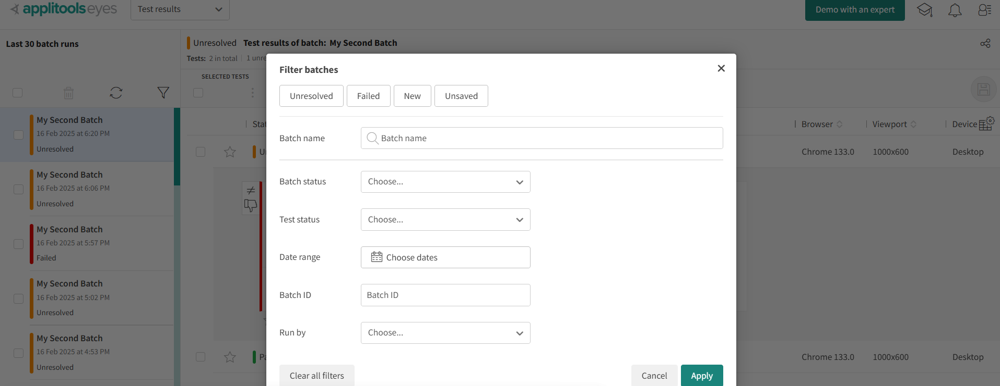
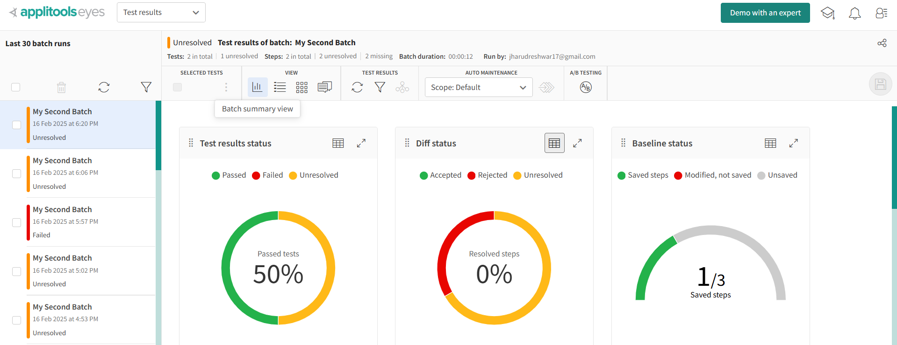
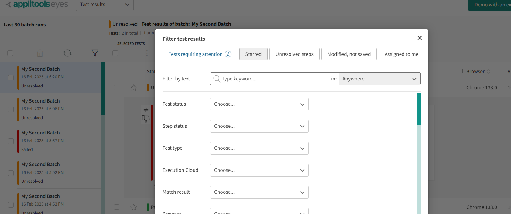
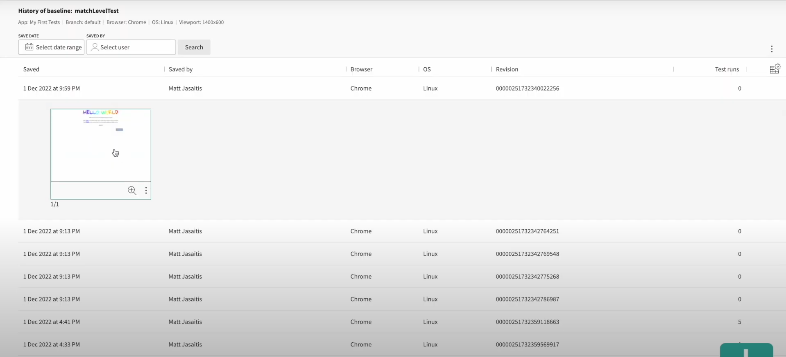
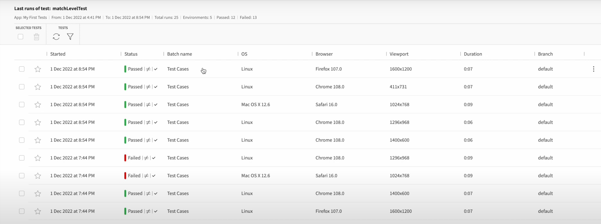

# Advanced Dashboard View

## Filter Batches

## Batch Summary View

This screen is particulary helpful when running a large quantity of tests, as you easily tell which environments were   
problematic without having to click through all of your test results

## Filter test results

## Test Results - Group Settings

Group will persist across multiple batches
e.g. browser

## Baseline History

## Last runs of test

