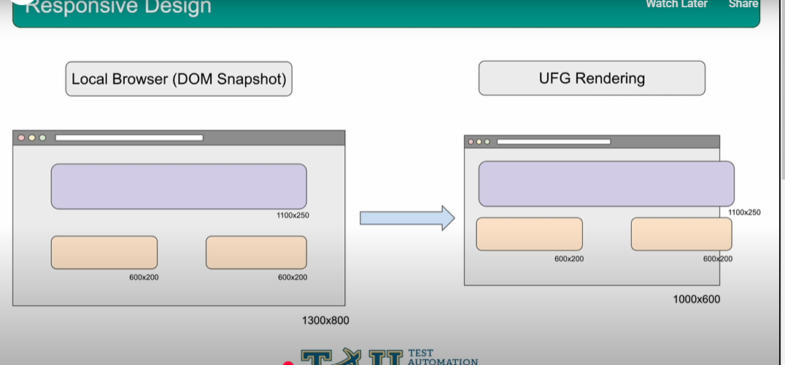

# Course Outline

1. Interesting Cases
2. A/B Testing
3. Expert Dashboard Tips
4. Expert Test Results Analysis
5. Accessibility Testing
6. Team Collaboration Tools
7. Execution Cloud

## Interesting Cases & How to Solve Them

1. Responsive design - LayoutBreakpoints
2. Lazy Loading - lazyLoad()
3. Displacements - Ignore Displacements

## Responsive Design

Responsive design is when your page changes the size of the elements on the page or the overall layout of the page based on the dimensions of the browser.

Q. How to design Responsive page?

* CSS Media Queries
* CSS % values
* JavaScript Event Listeners

To solve the above problems

## Layout Breakpoints

* Only needed for JS based responsive design
* Resizes the local driver to match widths
* Captures DOM snapshots at these widths
* UFG chooses best match DOM Snapshot

`eyes.check(Target.window().layoutBreakpoints(true));`

//    	suiteConfig.setLayoutBreakpoints(true);
