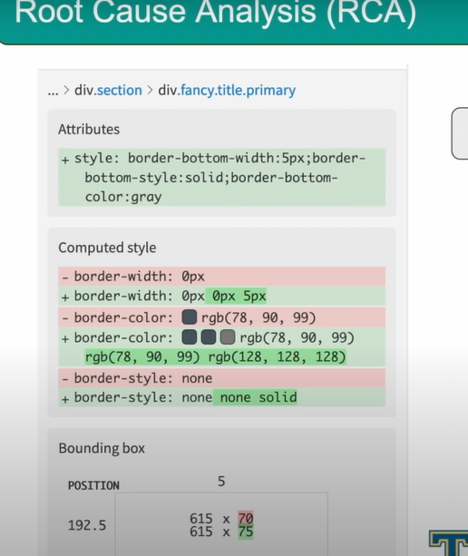

# Expert Test Result Analysis

> Root cause Analysis
Auto Maintenance

## How does RCA Work?

* Test run uploads HTML & CSS
* Compares HTML & CSS to baseline

## Why should I use RCA?

* No more checking the code manually
* Built right into the Applitools Test Manager
* Easily shareable

## What will RCA detect?

* Changes in tags
* Changes in attributes (i.e. "class")
* Changes in position
* Changes in CSS (i.e. color)
* Changes in Text

<!-- __________________________________________________ -->
## Accessibility Testing

* Learn about Applitools Contrast Advisor
* Set up our code to run accessibility checks
* Apply accessibility regions
* Review the status of our accessibility checks

##3 Accessibility - Contrast Advisor

* Accessibility Testing ensures website is accessbile to all visitors(including physically challenged/disabled people).

* Integrated directly into Applitools SDKs
* Uses a visual algorithm to identify elements
* Measures contrast score
* Displays status in Applitools Test Manager

### Available Standards & Levels

* Levels
    * AA
    * AAA
* Standards
    * WCAG 2.0
    * WCAG 2.1

### Why Contrast Advisor?

* Only checks visible elements
* Detect text within graphics
* Native mobile support

`        suiteConfig.setAccessibilityValidation(new AccessibilitySettings(AccessibilityLevel.AAA, AccessibilityGuidelinesVersion.WCAG_2_1));
`
