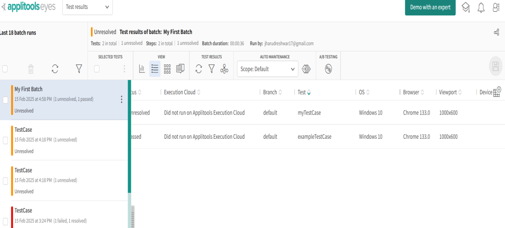

# Batching

Batching in **Applitools** is a way to group multiple visual tests together for better organization and easier reporting. It allows you to logically group related tests (e.g., different flows of the same application or different pages of the same app) into a single "batch" to view and analyze them together in the **Applitools Eyes dashboard**. 

### Why Use Batching?
1. **Better Organization:** Group related tests into one unit, making it easier to navigate results.
2. **Batch-Level Results:** You can see a summary of the entire batch's status (e.g., Passed, Failed).
3. **Easier Debugging:** If a failure occurs, it’s easier to identify patterns when you see all related tests together.
4. **Parallel Testing Support:** Allows you to run multiple tests in parallel while keeping the results grouped.

### How to Use Batching?
When you create a `BatchInfo` object in your code, you provide a name for the batch. You then associate this batch with your `Eyes` instance:

```java
import com.applitools.eyes.BatchInfo;
import com.applitools.eyes.selenium.Eyes;

public class TestCase {
    public void testBatching() {
        Eyes eyes = new Eyes();
        eyes.setApiKey(System.getenv("APPLITOOLS_API_KEY"));

        // Create and assign a batch
        BatchInfo myBatch = new BatchInfo("My First Batch");
        eyes.setBatch(myBatch);

        // Proceed with the test setup and visual validations
    }
}
```

This code will group all the tests under the batch name "My First Batch" in the Applitools dashboard.


```java
import io.github.bonigarcia.wdm.WebDriverManager;

import java.awt.Rectangle;

import org.junit.jupiter.api.*;
import org.openqa.selenium.By;
import org.openqa.selenium.WebDriver;
import org.openqa.selenium.WebElement;
import org.openqa.selenium.chrome.ChromeDriver;

import com.applitools.eyes.BatchInfo;
import com.applitools.eyes.selenium.Eyes;
import com.applitools.eyes.selenium.fluent.Target;

public class TestCase {
    static WebDriver driver;
    static BatchInfo myBatch;
    Eyes eyes;

    @BeforeAll
    public static void beforeAll() {
//    	WebDriverManager.chromedriver().setup();
//    	driver = new ChromeDriver();
    	myBatch = new BatchInfo("My First Batch");
    	driver = WebDriverManager.chromedriver().create();
    }
    
    @BeforeEach
    public void beforeEach(TestInfo testInfo) {
    	eyes = new Eyes();
    	eyes.setBatch(myBatch);
    	eyes.setApiKey(System.getenv("APPLITOOLS_API_KEY"));
    	
    	eyes.open(
    		    driver,
    		    "My First Tests",  // App name
    		    testInfo.getTestMethod().get().getName(),
    		    new com.applitools.eyes.RectangleSize(1000, 600)  // Correct way to set window size
//    		    new RectangleSize(width:1000, height:600)
    			);

    }
    
    @Test
    public void myTestCase() {
        driver.get("https://applitools.com/helloworld/?diff1");
//        WebElement numbers = driver.findElement(By.cssSelector("span.primary"));
//        WebElement button = driver.findElement(By.cssSelector("div.section:nth-child(3) > button:nth-child(1)"));
//        WebElement titleH = driver.findElement(By.cssSelector("div.fancy:nth-child(1) > span:nth-child(1)"));
//        WebElement titleD = driver.findElement(By.cssSelector("div.fancy:nth-child(1) > span:nth-child(11)"));
//
//        Assertions.assertEquals(numbers.isDisplayed(), true);
//        Assertions.assertEquals(numbers.getText(), "123456");
//        Assertions.assertEquals(numbers.getCssValue("color"), "rgba(78, 90, 99, 1)");
//
//        Assertions.assertEquals(button.isDisplayed(), true);
//        Assertions.assertEquals(button.getText(), "Click me!");
//        Assertions.assertEquals(button.getCssValue("color"), "rgba(255, 255, 255, 1)");
//
//        Assertions.assertEquals(titleH.isDisplayed(), true);
//        Assertions.assertEquals(titleH.getText(), "H");
//        Assertions.assertEquals(titleH.getCssValue("color"), "rgba(255, 0, 0, 1)");
//
//        Assertions.assertEquals(titleD.isDisplayed(), true);
//        Assertions.assertEquals(titleD.getText(), "D");
//        Assertions.assertEquals(titleD.getCssValue("color"), "rgba(70, 0, 255, 1)");
        eyes.check(Target.window());
    }

    @Test
    public void exampleTestCase() {
    	driver.get("https://example.com");
    	eyes.check(Target.window());
    }
    
    
    @AfterEach
    public void afterEach() {
    	eyes.closeAsync();
    }
    @AfterAll
    public static void afterAll() {
    	driver.close();
    }
}

```
Test case are grouped in Main area
