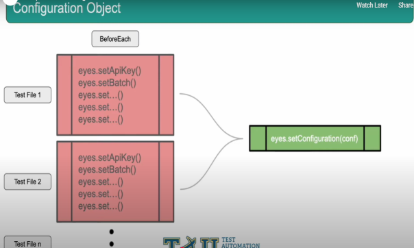
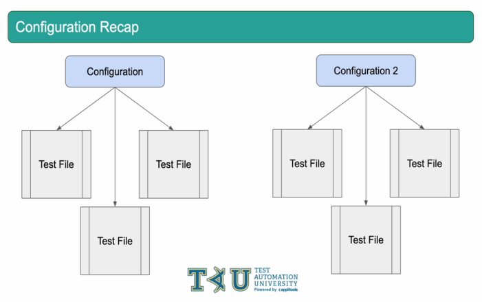

# Configuration


### Best Practices for Using Configuration Objects in Applitools

**1. Current Approach Challenges:**  
- In our simple test suite, we are setting options (e.g., API key, `BatchInfo`) directly on the `Eyes` object before each test case.
- While this works for small-scale testing, it’s not scalable when tests are spread across multiple files.
- **Maintenance Issue:**  
  - If any configuration value changes, we’d need to update all test files manually.  
  - This approach becomes difficult to manage and error-prone in larger test suites.

---

**2. Recommended Solution: Using Configuration Objects**  
- Instead of calling multiple `eyes.set()` methods in each test, create a single `Configuration` object that holds all configuration settings.
- Apply the configuration to the `Eyes` object using `eyes.setConfiguration()` in each test.
  
  **Benefits:**  
  - **Centralized Configuration:**  
    All settings can be updated in one place, making maintenance easier.
  - **Cleaner Code:**  
    Reduces repetitive code and simplifies test setup.  
  - **Flexibility for Multiple Configurations:**  
    - You can maintain different configurations for various scenarios (e.g., desktop vs. mobile tests).  
    - Pass in the relevant configuration as needed for each test.

---

**3. Example Usage:**  
- **Centralized Configuration File:** Create a configuration file to define shared settings:
  ```java
  import com.applitools.eyes.BatchInfo;
  import com.applitools.eyes.selenium.Configuration;

  public class ApplitoolsConfig {
      public static Configuration getDefaultConfig() {
          Configuration config = new Configuration();
          config.setAppName("My App");
          config.setViewportSize(new com.applitools.eyes.RectangleSize(1200, 800));
          config.setBatch(new BatchInfo("My Shared Batch"));
          return config;
      }
  }
  ```

- **Using the Configuration in Tests:**  
  ```java
  @BeforeEach
  public void setup() {
      eyes = new Eyes();
      eyes.setApiKey(System.getenv("APPLITOOLS_API_KEY"));
      eyes.setConfiguration(ApplitoolsConfig.getDefaultConfig());
  }
  ```

---

### Conclusion  
Using a `Configuration` object centralizes your settings, making the code cleaner and easier to maintain. This approach also provides flexibility for different testing scenarios, ensuring better scalability in large test suites.




As our test framework continues to grow, we could move this configuration object to another class and then reference it as needed in all of our files. Rather than having to set our API key, batch and other configuration options in each test, we can set all those values once and then pass the Configuration object around. For now, what we have here fits our purposes of highlighting the Configuration object and how it can be a helpful tool for writing easily maintainable code.




In Summary, The Configuration object is considered a best practice as it allows us to set up the Configuration for our Eyes SDK once and then pass that object around as needed. This can allow us to clean up our code and make our framework more scalable as it grows. Additionally, it provides us with the flexibility to set up multiple configurations for multiple environments further boosting the maintainability of our code.