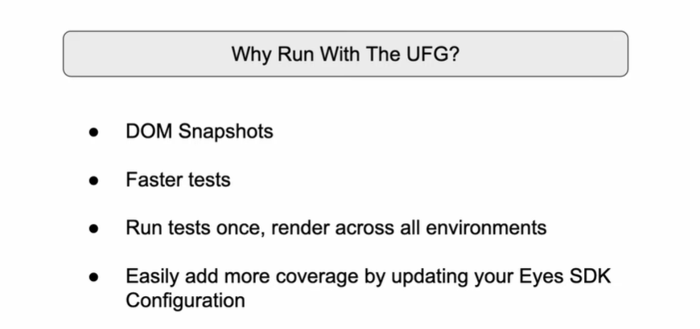

# Introduction to the Ultrafast Grid

The **Ultrafast Grid** is a feature provided by **Applitools** that enables **cross-browser and cross-device visual testing** at scale. Here's how it works and what it’s typically used for:

---

### **1. What is the Ultrafast Grid?**
The Ultrafast Grid is a cloud-based platform that allows developers and QA engineers to:
- Run visual tests across multiple browsers (e.g., Chrome, Firefox, Safari, Edge).
- Simulate various screen resolutions and devices (desktop, tablet, mobile).
- Capture screenshots from all these environments quickly without physically running the tests in each browser or device.

It takes a single snapshot from your local environment and sends it to the cloud, where Applitools renders it across multiple environments for visual comparison.

---

### **2. Key Features of the Ultrafast Grid:**
1. **Cross-Browser Testing:** Run tests in multiple browser types and versions without the need to install or maintain local setups.
   
2. **Cross-Device Testing:** Simulate different device resolutions and viewports (e.g., iPhone, Android devices, tablets).

3. **Parallel Testing:** Test all environments simultaneously, making the process faster and more efficient.

4. **Visual AI Engine:** Powered by Applitools Visual AI, which compares visual differences and detects regressions intelligently.

5. **Faster Feedback:** Developers can get feedback on how their application appears across different environments within minutes.

---

### **3. How Does It Work?**
1. **Snapshot Capture:** You capture snapshots during your test execution using the Applitools SDK.
2. **Cloud Rendering:** The snapshots are uploaded to the Ultrafast Grid, which simulates different browsers and devices.
3. **Visual Comparison:** The rendered screenshots are compared against the baseline to identify visual differences.
4. **Test Results:** Results are available in the Applitools dashboard, showing any visual changes or mismatches.

---

### **4. Benefits of Using the Ultrafast Grid**
- **Scalability:** Run hundreds of visual tests in parallel without slowing down local execution.
- **Reduced Maintenance:** No need to maintain local environments or complex test setups for every browser or device.
- **High Accuracy:** Applitools' AI ensures that only meaningful visual differences are flagged, reducing false positives.
- **Time Savings:** Instead of running tests in multiple browsers and devices one by one, all tests are completed at once.

---

### **5. Use Case Example:**
If you're testing an e-commerce site (like Amazon), you might want to verify:
- The homepage layout looks the same across Chrome, Firefox, Safari, and Edge.
- It renders correctly on mobile devices like iPhones and Android phones.
- Buttons, images, and text alignments remain consistent across all environments.

With the Ultrafast Grid, you can easily verify all these scenarios in parallel without running manual checks for each browser and device.

```java
import io.github.bonigarcia.wdm.WebDriverManager;

import java.awt.Rectangle;

import org.junit.jupiter.api.*;
import org.openqa.selenium.By;
import org.openqa.selenium.WebDriver;
import org.openqa.selenium.WebElement;
import org.openqa.selenium.bidi.module.Browser;
import org.openqa.selenium.chrome.ChromeDriver;

import com.applitools.eyes.BatchInfo;
import com.applitools.eyes.EyesRunner;
import com.applitools.eyes.TestResultsSummary;
import com.applitools.eyes.config.Configuration;
import com.applitools.eyes.selenium.BrowserType;
import com.applitools.eyes.selenium.ClassicRunner;
import com.applitools.eyes.selenium.Eyes;
import com.applitools.eyes.selenium.fluent.Target;
import com.applitools.eyes.visualgrid.model.DeviceName;
import com.applitools.eyes.visualgrid.model.ScreenOrientation;
import com.applitools.eyes.visualgrid.services.RunnerOptions;
import com.applitools.eyes.visualgrid.services.VisualGridRunner;

public class TestCase {
    static WebDriver driver;
    static BatchInfo myBatch;
    static Configuration suiteConfig;
	static EyesRunner testRunner;
    Eyes eyes;

    @BeforeAll
    public static void beforeAll() {
//    	WebDriverManager.chromedriver().setup();
//    	driver = new ChromeDriver();
    	myBatch = new BatchInfo("My First Batch");
    	driver = WebDriverManager.chromedriver().create();
    	
    	// Scale Configuration for multiple files
    	suiteConfig = new Configuration();
    	suiteConfig.setApiKey(System.getenv("APPLITOOLS_API_KEY"));
    	suiteConfig.setBatch(myBatch);
    	
    	// Add desktop browsers
    	suiteConfig.addBrowser(800, 600, BrowserType.CHROME);
    	suiteConfig.addBrowser(1600, 1200, BrowserType.FIREFOX);
    	suiteConfig.addBrowser(800, 600, BrowserType.SAFARI);

    	
    	// add mobile devices
    	suiteConfig.addDeviceEmulation(DeviceName.Pixel_2, ScreenOrientation.PORTRAIT);
    	suiteConfig.addDeviceEmulation(DeviceName.Nexus_10,ScreenOrientation.PORTRAIT);
    	
    	
    	// Runner
    	testRunner = new ClassicRunner();
    	testRunner = new VisualGridRunner(new RunnerOptions().testConcurrency(5));
    }
    
    @BeforeEach
    public void beforeEach(TestInfo testInfo) {
    	eyes = new Eyes(testRunner);
    	eyes.setConfiguration(suiteConfig);
    	
    	eyes.open(
    		    driver,
    		    "My First Tests",  // App name
    		    testInfo.getTestMethod().get().getName(),
    		    new com.applitools.eyes.RectangleSize(1000, 600)  // Correct way to set window size
//    		    new RectangleSize(width:1000, height:600)
    			);

    }
    
    @Test
    public void myTestCase() {
        driver.get("https://applitools.com/helloworld/?diff1");
//        WebElement numbers = driver.findElement(By.cssSelector("span.primary"));
//        WebElement button = driver.findElement(By.cssSelector("div.section:nth-child(3) > button:nth-child(1)"));
//        WebElement titleH = driver.findElement(By.cssSelector("div.fancy:nth-child(1) > span:nth-child(1)"));
//        WebElement titleD = driver.findElement(By.cssSelector("div.fancy:nth-child(1) > span:nth-child(11)"));
//
//        Assertions.assertEquals(numbers.isDisplayed(), true);
//        Assertions.assertEquals(numbers.getText(), "123456");
//        Assertions.assertEquals(numbers.getCssValue("color"), "rgba(78, 90, 99, 1)");
//
//        Assertions.assertEquals(button.isDisplayed(), true);
//        Assertions.assertEquals(button.getText(), "Click me!");
//        Assertions.assertEquals(button.getCssValue("color"), "rgba(255, 255, 255, 1)");
//
//        Assertions.assertEquals(titleH.isDisplayed(), true);
//        Assertions.assertEquals(titleH.getText(), "H");
//        Assertions.assertEquals(titleH.getCssValue("color"), "rgba(255, 0, 0, 1)");
//
//        Assertions.assertEquals(titleD.isDisplayed(), true);
//        Assertions.assertEquals(titleD.getText(), "D");
//        Assertions.assertEquals(titleD.getCssValue("color"), "rgba(70, 0, 255, 1)");
        eyes.check(Target.window());
    }

    @Test
    public void exampleTestCase() {
    	driver.get("https://example.com");
    	eyes.check(Target.window());
    }
    
    
    @AfterEach
    public void afterEach() {
    	eyes.closeAsync();
    }
    @AfterAll
    public static void afterAll() {
    	driver.close();
    	TestResultsSummary results = testRunner.getAllTestResults();
    	System.out.println(results);
    }
}

```

