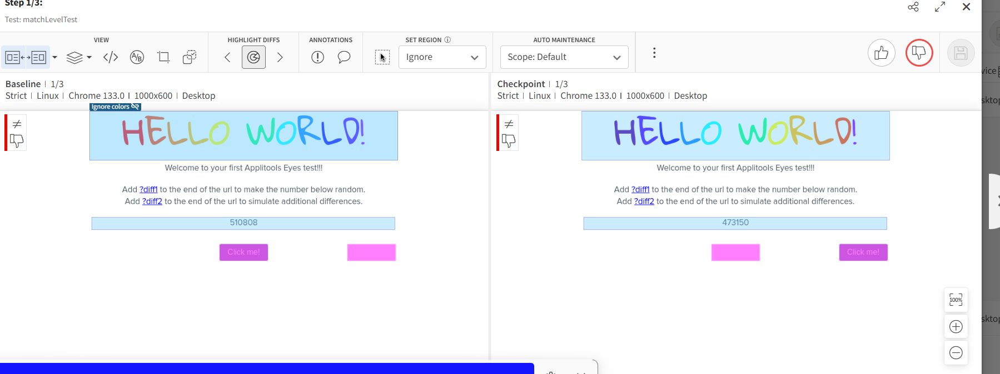
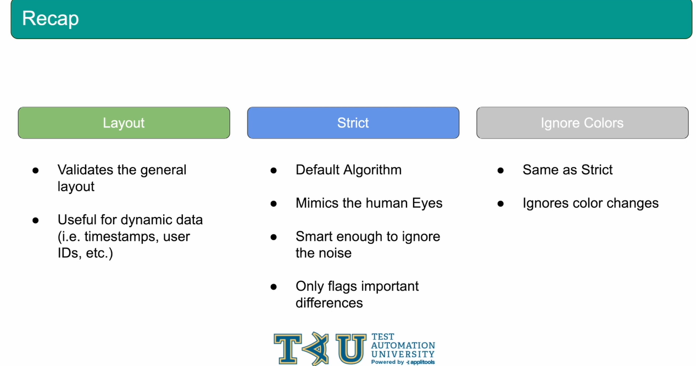

# Match Levels

## Strict Match Level

* Default Algorithm
* Mimics the human Eyes
* Smart enough to ignore the noise
* Only flags important differences


```java
import io.github.bonigarcia.wdm.WebDriverManager;

import java.awt.Rectangle;

import org.junit.jupiter.api.*;
import org.openqa.selenium.By;
import org.openqa.selenium.WebDriver;
import org.openqa.selenium.WebElement;
import org.openqa.selenium.bidi.module.Browser;
import org.openqa.selenium.chrome.ChromeDriver;

import com.applitools.eyes.BatchInfo;
import com.applitools.eyes.EyesRunner;
import com.applitools.eyes.TestResultsSummary;
import com.applitools.eyes.config.Configuration;
import com.applitools.eyes.selenium.BrowserType;
import com.applitools.eyes.selenium.ClassicRunner;
import com.applitools.eyes.selenium.Eyes;
import com.applitools.eyes.selenium.StitchMode;
import com.applitools.eyes.selenium.fluent.Target;
import com.applitools.eyes.visualgrid.model.DeviceName;
import com.applitools.eyes.visualgrid.model.ScreenOrientation;
import com.applitools.eyes.visualgrid.services.RunnerOptions;
import com.applitools.eyes.visualgrid.services.VisualGridRunner;

public class TestCase1 {
    static WebDriver driver;
    static BatchInfo myTestBatch;
    static Configuration suiteConfig;
	static EyesRunner testRunner;
    Eyes eyes;

    @BeforeAll
    public static void beforeAll() {
    	driver = WebDriverManager.chromedriver().create();
    	myTestBatch = new BatchInfo("My Second Batch");
    	myTestBatch.setSequenceName("Advanced Visual Testing");
    	
    	
    	// Scale Configuration for multiple files
    	suiteConfig = new Configuration();
    	suiteConfig.setApiKey(System.getenv("APPLITOOLS_API_KEY"));
    	suiteConfig.setBatch(myTestBatch);
    	
    	// Runner
//    	testRunner = new ClassicRunner();
    	testRunner = new VisualGridRunner(new RunnerOptions().testConcurrency(1));
    }
    
    @BeforeEach
    public void beforeEach(TestInfo testInfo) {
    	eyes = new Eyes(testRunner);
    	eyes.setConfiguration(suiteConfig);
    	
    	eyes.open(
    		    driver,
    		    "My second Tests",  // App name
    		    testInfo.getTestMethod().get().getName(),
    		    new com.applitools.eyes.RectangleSize(1000, 600)  // Correct way to set window size
    			);

    }
    
    @Test
    public void matchLevelTest() {
        // driver.get("https://applitools.com/helloworld/?diff1");
        driver.get("https://applitools.com/helloworld/?diff2");
        eyes.check(Target.window());
        }

    @Test
    public void exampleTestCase() {
    	driver.get("https://example.com");
    	eyes.check(Target.window().fully());
    }
    
    
    @AfterEach
    public void afterEach() {
    	eyes.closeAsync();
    }
    @AfterAll
    public static void afterAll() {
    	driver.close();
    	TestResultsSummary results = testRunner.getAllTestResults();
    	System.out.println(results);
    }
}

```

## Match Levels - Layout

* Validates the general layout
* Userful for dyanmic data (i.e. timestamps, user IDs, etc.)
* Some tests make sense to run the strict and others make sense to run with layout.

```java
import io.github.bonigarcia.wdm.WebDriverManager;

import java.awt.Rectangle;

import org.junit.jupiter.api.*;
import org.openqa.selenium.By;
import org.openqa.selenium.WebDriver;
import org.openqa.selenium.WebElement;
import org.openqa.selenium.bidi.module.Browser;
import org.openqa.selenium.chrome.ChromeDriver;

import com.applitools.eyes.BatchInfo;
import com.applitools.eyes.EyesRunner;
import com.applitools.eyes.MatchLevel;
import com.applitools.eyes.TestResultsSummary;
import com.applitools.eyes.config.Configuration;
import com.applitools.eyes.selenium.BrowserType;
import com.applitools.eyes.selenium.ClassicRunner;
import com.applitools.eyes.selenium.Eyes;
import com.applitools.eyes.selenium.StitchMode;
import com.applitools.eyes.selenium.fluent.Target;
import com.applitools.eyes.visualgrid.model.DeviceName;
import com.applitools.eyes.visualgrid.model.ScreenOrientation;
import com.applitools.eyes.visualgrid.services.RunnerOptions;
import com.applitools.eyes.visualgrid.services.VisualGridRunner;

public class TestCase1 {
    static WebDriver driver;
    static BatchInfo myTestBatch;
    static Configuration suiteConfig;
	static EyesRunner testRunner;
    Eyes eyes;

    @BeforeAll
    public static void beforeAll() {
    	driver = WebDriverManager.chromedriver().create();
    	myTestBatch = new BatchInfo("My Second Batch");
    	myTestBatch.setSequenceName("Advanced Visual Testing");
    	
    	
    	// Scale Configuration for multiple files
    	suiteConfig = new Configuration();
    	suiteConfig.setApiKey(System.getenv("APPLITOOLS_API_KEY"));
    	suiteConfig.setBatch(myTestBatch);
//    	suiteConfig.setMatchLevel(MatchLevel.LAYOUT);
    	
    	// Runner
//    	testRunner = new ClassicRunner();
    	testRunner = new VisualGridRunner(new RunnerOptions().testConcurrency(1));
    }
    
    @BeforeEach
    public void beforeEach(TestInfo testInfo) {
    	eyes = new Eyes(testRunner);
    	eyes.setConfiguration(suiteConfig);
    	
    	eyes.open(
    		    driver,
    		    "My second Tests",  // App name
    		    testInfo.getTestMethod().get().getName(),
    		    new com.applitools.eyes.RectangleSize(1000, 600)  // Correct way to set window size
    			);

    }
    
    @Test
    public void matchLevelTest() {
        driver.get("https://applitools.com/helloworld/?diff2");
        eyes.check(Target.window().layout());
        }

    @Test
    public void exampleTestCase() {
    	driver.get("https://example.com");
    	eyes.check(Target.window().fully());
    }
    
    
    @AfterEach
    public void afterEach() {
    	eyes.closeAsync();
    }
    @AfterAll
    public static void afterAll() {
    	driver.close();
    	TestResultsSummary results = testRunner.getAllTestResults();
    	System.out.println(results);
    }
}
```


## Match Levels - Ignore Colors

* Same as Strict
* Ignore color changes


```java
import io.github.bonigarcia.wdm.WebDriverManager;

import java.awt.Rectangle;

import org.junit.jupiter.api.*;
import org.openqa.selenium.By;
import org.openqa.selenium.WebDriver;
import org.openqa.selenium.WebElement;
import org.openqa.selenium.bidi.module.Browser;
import org.openqa.selenium.chrome.ChromeDriver;

import com.applitools.eyes.BatchInfo;
import com.applitools.eyes.EyesRunner;
import com.applitools.eyes.MatchLevel;
import com.applitools.eyes.TestResultsSummary;
import com.applitools.eyes.config.Configuration;
import com.applitools.eyes.selenium.BrowserType;
import com.applitools.eyes.selenium.ClassicRunner;
import com.applitools.eyes.selenium.Eyes;
import com.applitools.eyes.selenium.StitchMode;
import com.applitools.eyes.selenium.fluent.Target;
import com.applitools.eyes.visualgrid.model.DeviceName;
import com.applitools.eyes.visualgrid.model.ScreenOrientation;
import com.applitools.eyes.visualgrid.services.RunnerOptions;
import com.applitools.eyes.visualgrid.services.VisualGridRunner;

public class TestCase1 {
    static WebDriver driver;
    static BatchInfo myTestBatch;
    static Configuration suiteConfig;
	static EyesRunner testRunner;
    Eyes eyes;

    @BeforeAll
    public static void beforeAll() {
    	driver = WebDriverManager.chromedriver().create();
    	myTestBatch = new BatchInfo("My Second Batch");
    	myTestBatch.setSequenceName("Advanced Visual Testing");
    	
    	
    	// Scale Configuration for multiple files
    	suiteConfig = new Configuration();
    	suiteConfig.setApiKey(System.getenv("APPLITOOLS_API_KEY"));
    	suiteConfig.setBatch(myTestBatch);
//    	suiteConfig.setMatchLevel(MatchLevel.LAYOUT);
//    	suiteConfig.setMatchLevel(MatchLevel.CONTENT);
    	
    	// Runner
//    	testRunner = new ClassicRunner();
    	testRunner = new VisualGridRunner(new RunnerOptions().testConcurrency(1));
    }
    
    @BeforeEach
    public void beforeEach(TestInfo testInfo) {
    	eyes = new Eyes(testRunner);
    	eyes.setConfiguration(suiteConfig);
    	
    	eyes.open(
    		    driver,
    		    "My second Tests",  // App name
    		    testInfo.getTestMethod().get().getName(),
    		    new com.applitools.eyes.RectangleSize(1000, 600)  // Correct way to set window size
    			);

    }
    
    @Test
    public void matchLevelTest() {
        driver.get("https://applitools.com/helloworld/?diff2");
        eyes.check(Target.window().content());
        }

    @Test
    public void exampleTestCase() {
    	driver.get("https://example.com");
    	eyes.check(Target.window().fully());
    }
    
    
    @AfterEach
    public void afterEach() {
    	eyes.closeAsync();
    }
    @AfterAll
    public static void afterAll() {
    	driver.close();
    	TestResultsSummary results = testRunner.getAllTestResults();
    	System.out.println(results);
    }
}
```

## Match Level Regions

In practice , our pages are often much more complicated such that we need more than one of these match levels to achieve full coverage without unnecessary failures.
The way this works is by passing in selectors to the dot layout or dot content function.

This is the recommended best practice to use strict through the entire page and then use layout and ignore color regions to cover certain sections of the page as needed



```java
import io.github.bonigarcia.wdm.WebDriverManager;

import java.awt.Rectangle;

import org.junit.jupiter.api.*;
import org.openqa.selenium.By;
import org.openqa.selenium.WebDriver;
import org.openqa.selenium.WebElement;
import org.openqa.selenium.bidi.module.Browser;
import org.openqa.selenium.chrome.ChromeDriver;

import com.applitools.eyes.BatchInfo;
import com.applitools.eyes.EyesRunner;
import com.applitools.eyes.MatchLevel;
import com.applitools.eyes.TestResultsSummary;
import com.applitools.eyes.config.Configuration;
import com.applitools.eyes.selenium.BrowserType;
import com.applitools.eyes.selenium.ClassicRunner;
import com.applitools.eyes.selenium.Eyes;
import com.applitools.eyes.selenium.StitchMode;
import com.applitools.eyes.selenium.fluent.Target;
import com.applitools.eyes.visualgrid.model.DeviceName;
import com.applitools.eyes.visualgrid.model.ScreenOrientation;
import com.applitools.eyes.visualgrid.services.RunnerOptions;
import com.applitools.eyes.visualgrid.services.VisualGridRunner;

public class TestCase1 {
    static WebDriver driver;
    static BatchInfo myTestBatch;
    static Configuration suiteConfig;
	static EyesRunner testRunner;
    Eyes eyes;

    @BeforeAll
    public static void beforeAll() {
    	driver = WebDriverManager.chromedriver().create();
    	myTestBatch = new BatchInfo("My Second Batch");
    	myTestBatch.setSequenceName("Advanced Visual Testing");
    	
    	
    	// Scale Configuration for multiple files
    	suiteConfig = new Configuration();
    	suiteConfig.setApiKey(System.getenv("APPLITOOLS_API_KEY"));
    	suiteConfig.setBatch(myTestBatch);
//    	suiteConfig.setMatchLevel(MatchLevel.LAYOUT);
//    	For ignore color use content type as _IGNORE_COLOR not available
//    	suiteConfig.setMatchLevel(MatchLevel.CONTENT);
    	
    	// Runner
//    	testRunner = new ClassicRunner();
    	testRunner = new VisualGridRunner(new RunnerOptions().testConcurrency(1));
    }
    
    @BeforeEach
    public void beforeEach(TestInfo testInfo) {
    	eyes = new Eyes(testRunner);
    	eyes.setConfiguration(suiteConfig);
    	
    	eyes.open(
    		    driver,
    		    "My second Tests",  // App name
    		    testInfo.getTestMethod().get().getName(),
    		    new com.applitools.eyes.RectangleSize(1000, 600)  // Correct way to set window size
    			);

    }
    
    @Test
    public void matchLevelTest() {
        driver.get("https://applitools.com/helloworld/?diff2");
//        eyes.check(Target.window());
//        
//        eyes.check(Target.region(By.cssSelector("div.section:nth-child(1)")).content());
//        eyes.check(Target.region(By.cssSelector("div.section:nth-child(2) > p:nth-child(4)")).layout());
        
        eyes.check(Target.window().content(By.cssSelector("div.section:nth-child(1)")).layout(By.cssSelector("div.section:nth-child(2) > p:nth-child(4)")));
        
        
        }

    @Test
    public void exampleTestCase() {
    	driver.get("https://example.com");
    	eyes.check(Target.window().fully());
    }
    
    
    @AfterEach
    public void afterEach() {
    	eyes.closeAsync();
    }
    @AfterAll
    public static void afterAll() {
    	driver.close();
    	TestResultsSummary results = testRunner.getAllTestResults();
    	System.out.println(results);
    }
}

```

## Recap

