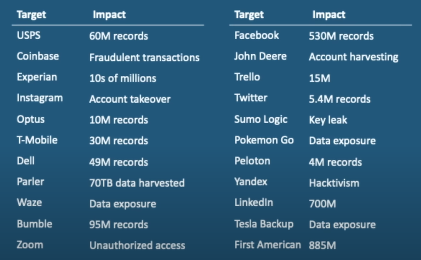
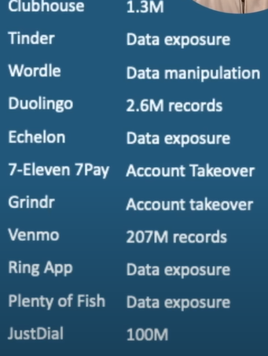
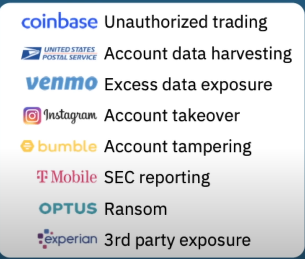

# API Security Fundamentals

```text
* Introduction
* Why API security?
* OWASP API Security Top 10
* API attack analysis
* 3 pillars of API security
* Best practices for securing APIs
```

> Some people call websites for machines  

## The Perfect API Storm

* 83% of all Internet traffic is API traffic
* API attacks will become the most frequent attack vector
* 4% of testing is Security

## What's being stolen?

APIs are connected to data transaction, personal information, coporate intellectual property.

## What Makes APIs Prime Targets

* Connect UIs to backend
* Provide direct access to data
* Can be easily discoverd

## How APIs Get Attacked

* Attackers look for APIs that are
    * Over-permissioned
    * Access unauthorized functions
    * Return too much information
    * Expose logic flaws.

## "classic" Cyber Attack

Recon => Infiltration => Weaponize => Lateral Movement => Privilege Escalation => BREACH

* API Attack
    Find vulerability => Breach

## Regulatory Compliance

* Security
    * Secure development & Operation of web apps/interfaces
    * Continuous, pre-prod vulnerability testing
    * Discover, review and remediation issues quickly

* Privacy
    * Protection of PII, PHI, Consumer data.
    * Breach notification requirements
    * Massive penalties for violations.

* Accessibility
    * Global push to make data accessbile
    * Healthcare Interoperability, OpenBanking
    * Penalties for "Information blocking"

## 2023 OWASP API Security Top 10

API1 Broken Object Level Authorization  
AP12 Broken Authentication  
AP13 Broken Object Property Level Authorization  
AP14 Unrestricted Resource Consumption  
AP15 Broken Function Level Authorization  
AP16 Unrestricted Access to Sensitive Business Flows  
AP17 Server Side Request Forgery  
AP18 Security Misconfiguration  
AP19 Improper Inventory Management  
API1O Unsafe Consumption of APIs  

## API Breaches





## API Attack Examples



* Examples highlight - 
    * Attacks are new/different
    * Difficult to detect
    * Something about API attacks gets through defenses
    * Need to involve Dev in Security

## OWASP API #1

API1 -Broken Object Level Authorization
* What is it?
    * Broken Authorization refers to flaws in logic/rules governing access
    * Most common and damaging API vulnerability
    * Very difficult to detect in runtime
    * Critical to test for BOLA in pre-production

* Examples, Risk Exposure
    * Significant risk of data loss
    * Example - can User A acces User B's data?
    * Fraudulent transactions
