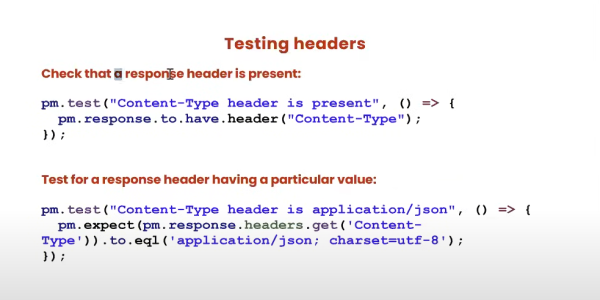
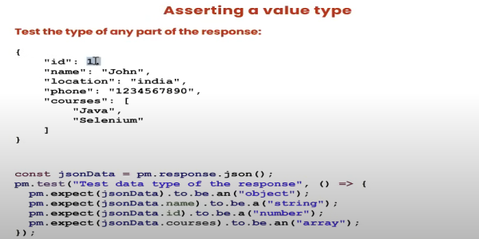
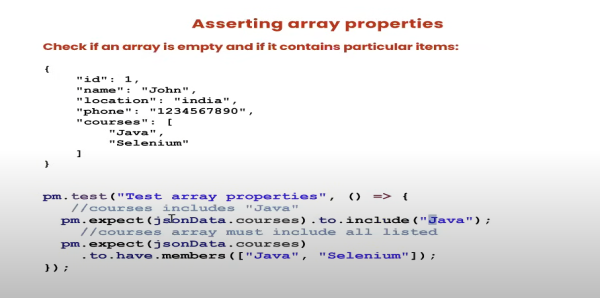

# API Response Validations and Different types of Assertions

> Response Validations

* Status code
* Headers
* Cookies
* Response Time
* Response body

We need to Test above.  
We need to add Assertion(Validation)  
Library provided by Postman => pm  
Postman Assertion function interanlly use JavaScript

Normal function  
Arrow Function

* Chai Assertion Library

```javascript
pm.test("Test Name", function(){
        // assertion;
    })
```

```javascript
pm.test("Test Name", ()=>{
    // assertion;

})
```

## Testing Status Code


## Testing Headers



## Testing cookies and Response times


## Testing Response body

* Asserting a value type



* Asserting Array properties



* Validating JSON Fields Response


* JSON Schema Validation
> Use JSON schema converter
e.g.
```json
{
    "page": 2,
    "per_page": 6,
    "total": 12,
    "total_pages": 2,
    "data": [
        {
            "id": 7,
            "email": "michael.lawson@reqres.in",
            "first_name": "Michael",
            "last_name": "Lawson",
            "avatar": "https://reqres.in/img/faces/7-image.jpg"
        }
    ],
    "support": {
        "url": "https://contentcaddy.io?utm_source=reqres&utm_medium=json&utm_campaign=referral",
        "text": "Tired of writing endless social media content? Let Content Caddy generate it for you."
    }
}
```

```json
{
  "$schema": "http://json-schema.org/draft-04/schema#",
  "type": "object",
  "properties": {
    "page": {
      "type": "integer"
    },
    "per_page": {
      "type": "integer"
    },
    "total": {
      "type": "integer"
    },
    "total_pages": {
      "type": "integer"
    },
    "data": {
      "type": "array",
      "items": [
        {
          "type": "object",
          "properties": {
            "id": {
              "type": "integer"
            },
            "email": {
              "type": "string"
            },
            "first_name": {
              "type": "string"
            },
            "last_name": {
              "type": "string"
            },
            "avatar": {
              "type": "string"
            }
          },
          "required": [
            "id",
            "email",
            "first_name",
            "last_name",
            "avatar"
          ]
        }
      ]
    },
    "support": {
      "type": "object",
      "properties": {
        "url": {
          "type": "string"
        },
        "text": {
          "type": "string"
        }
      },
      "required": [
        "url",
        "text"
      ]
    }
  },
  "required": [
    "page",
    "per_page",
    "total",
    "total_pages",
    "data",
    "support"
  ]
}
```