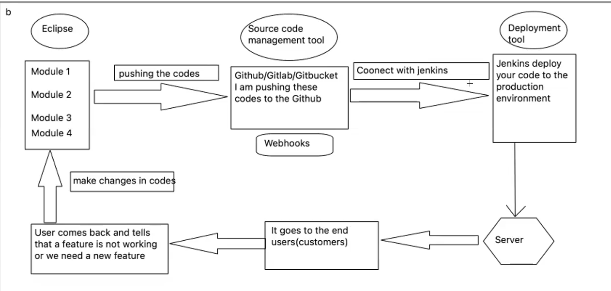

* Working of Maven Project



## What is WebHook

A **webhook** is a method for one application to send real-time data or notifications to another application as soon as an event occurs. It's essentially a "reverse" API — instead of an application requesting information from another (like in a traditional API call), a webhook allows the source application to **push** data to a destination URL automatically when certain events happen.

For example:
- A payment gateway can use a webhook to notify your application when a payment is successful.
- A GitHub repository can use a webhook to notify your system whenever there is a push or pull request.
  
### How it works:
1. **Event Trigger**: The source system (e.g., GitHub, payment provider) is set up to monitor certain events (e.g., new payment, commit, or issue update).
2. **HTTP Request**: Once that event happens, the source system sends an HTTP request (usually a POST request) to a pre-configured **URL** (your webhook endpoint).
3. **Data Handling**: The destination system (your application) receives the data in the form of a payload (usually in JSON format), processes it, and can take action (e.g., update a database, send a notification).

### Benefits:
- **Real-time communication**: Since webhooks push data when an event occurs, there's no need to poll or check constantly for updates.
- **Efficiency**: Webhooks only send data when necessary, reducing unnecessary API calls and processing.

### Example:
Suppose you're using a payment system. When a user completes a transaction, the payment system sends a webhook to your server with transaction details. Your server processes this data and updates the order status in your system.

In short, webhooks help enable real-time, event-driven integrations between different systems.


* Reqres.in

```java
package RestAssured;

import org.testng.Assert;
import org.testng.annotations.Test;

import io.restassured.RestAssured;
import io.restassured.response.Response;
import static io.restassured.RestAssured.*;
import static org.hamcrest.CoreMatchers.equalTo;
import static org.hamcrest.Matcher.*;
import static io.restassured.matcher.RestAssuredMatchers.*;

public class day1 {

 @Test(enabled = false)
 public void setup() {
  
  Response rep = RestAssured.get("https://reqres.in/api/users");
//  System.out.println(rep);
  int statusCode = rep.statusCode();
  Assert.assertEquals(statusCode, 200);
 }
 
 @Test(enabled = false)
 public void ListUsers() {
  given().get("https://reqres.in/api/users?page=2").then().statusCode(200).log().all();
 }
 
 @Test(enabled = true)
 public void SingleUser() {
//  given().get("https://reqres.in/api/users?page=2").then().statusCode(200).body("data.id[0]", equalTo(7));                                     
  given().get("https://reqres.in/api/users/2").then().statusCode(200).body("data.first_name", equalTo("Janet"));                                     
 }

 	@Test(enabled = true)
	public void ListResource() {
		given().get("https://requres.in/api/unknown").then().statusCode(200).log().all();
	}

  	@Test(enabled = true)
	public void SingleResource() {
		given().get("https://reqres.in/api/unknown/23").then().statusCode(200).body("data.id", equalTo(2)).log().all();
	}
	
	@Test(enabled = true)
	public void SingleResourceNotFound1() {
		given().get("https://reqres.in/api/unknown/23").then().statusCode(404).log().all();
	}
}
```