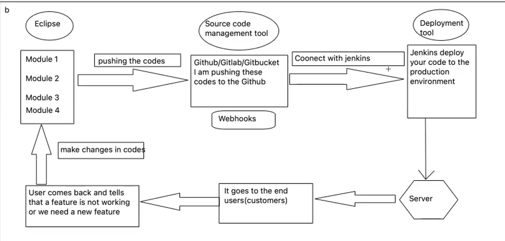

# What is API

Application Programming interface
APIs defines the methods and protocols used for communication between different
software systems. They enable developers to access and use the functionality and data
of external services or systems

e.g.
Customer goes in a hotel. Waiter gets an order. Waiter goes to the chef and gives
back the order to the customer

Here Waiter act as the API

## Few Basic Terms

1. **End points** - APIs give specific URLs that relate to different functionalities or
resources in the server.

2. **Request and Responses** - APIs uses HTTP requests sent by client and return responses
from the server.

3. **Status Codes** - Status codes provides the information about the outcome of an API request.

4. **Payloads** - Payloads contain data sent in the body of an API request and response,
usually in formats like JSON or XML.

There are two types of services in API

1. **Web Services** - A web service is a **method of communication** between the two electronic
devices over a **network.**
It only supports XML
e.g Wifi, Bluetooth, Airdrop

2. **Rest Services** - Rest stands for REPRESENTATIONAL STATE TRANSFER. It is an ARCHITECTURAL STYLE FOR DESIGNING NETWORKED APPLICATIONS.
Style for designing network application.
Mainly based on URI - Uniform resource Identifier
URL is a part of URI
URL specifies where a resource is located and the protocol used to retrieve it.

## Difference between Web application and Web Services

Web application is meant for humans to read
whereas web services are meant for computers to read
e.g. Web application like Whatsapp is meant for the humans.
And Web Services are meant for computers.

## What kind of information??

WSDL(Web Services Description Language)  
Its work is to describe how a web service works, what kind of messages it can send and
understand and how to send and receive those messages.

**Web services only support XML**

## There are three parts of URL

1. **'Base URL'** - The base URL is the **root or primary URL** from which other URLs derives or appended.
It typically represents the main entry point for a web application or service  
e.g. https://www.google.com

2. **Resource URL** - Each resource URL **uniquely identifies a specific a resource** or a collection
of related resources.
e.g. https://www.google.com/books/Gullivertravels

3. **Parameterized URL** - It is a URL that includes (also called as query parameters) to provide
information or instructions to the server.
Ex:- <https://www.google.com/books/Gullivertravels?**hhkjehjnjkbenjhhjgjbnmvjbvkjbfn/jhe/898789/huh>**

Rest services support not only xml but also json, html.

REST services are based on HTTP Methods:

1. GET - If we want to see some data then we will use get method.
2. POST - If we want to create some data then we will use post method
3. PUT - Put method is used to update or create a resource.
4. PATCH - Patch method is used for **partial modification** to a resource
5. DELETE - If we want to delete something or some data that is already present or
you have created

## HTTP Status Codes

These are 3 digit numbers returned by a server in response to client's request.

100-199 => Informational message
200-299 => Successful
300-399 => Redirection
400-499 => Client error
500 and above => Server error

404 - File not found
400 - Bad request
402 - Payment Gateway
201 - Successfully created
505 - http version not supported

## Difference between HTTPS and HTTP

The primary difference between **HTTP** (HyperText Transfer Protocol) and **HTTPS** (HyperText Transfer Protocol Secure) is **security**. Here's a detailed breakdown:  

### 1. **Encryption**  
- **HTTP**: Data is transmitted in plain text, making it vulnerable to interception by attackers.  
- **HTTPS**: Data is encrypted using **TLS (Transport Layer Security)** or the older **SSL (Secure Sockets Layer)**. This ensures secure transmission between the client (browser) and the server.  

### 2. **Authentication**  
- **HTTP**: Does not verify the identity of the server, so users cannot be sure they are communicating with the intended website.  
- **HTTPS**: Uses a **digital certificate** issued by a trusted Certificate Authority (CA) to authenticate the server and establish trust.  

### 3. **Data Integrity**  
- **HTTP**: Data can be intercepted or altered by attackers during transmission.  
- **HTTPS**: Ensures data integrity; encrypted data cannot be tampered with during transmission without detection.  

### 4. **SEO and Trust**  
- **HTTP**: May be flagged as "Not Secure" by modern browsers, discouraging users.  
- **HTTPS**: Is prioritized by search engines for SEO and inspires user trust, as browsers display a padlock icon.  

### 5. **Port Number**  
- **HTTP**: Uses **port 80** by default.  
- **HTTPS**: Uses **port 443** by default.  

### Use Case Recommendations  
- **HTTP**: Suitable for non-sensitive, public websites (e.g., informational blogs).  
- **HTTPS**: Essential for sites handling sensitive information like login credentials, payment details, or personal data.  

**In summary**, HTTPS provides a secure, encrypted, and authenticated communication channel, which is essential for most modern web applications.

* Working of Maven Project

## What is WebHook

A **webhook** is a method for one application to send real-time data or notifications to another application as soon as an event occurs. It's essentially a "reverse" API — instead of an application requesting information from another (like in a traditional API call), a webhook allows the source application to **push** data to a destination URL automatically when certain events happen.

For example:
- A payment gateway can use a webhook to notify your application when a payment is successful.
- A GitHub repository can use a webhook to notify your system whenever there is a push or pull request.
  
### How it works:
1. **Event Trigger**: The source system (e.g., GitHub, payment provider) is set up to monitor certain events (e.g., new payment, commit, or issue update).
2. **HTTP Request**: Once that event happens, the source system sends an HTTP request (usually a POST request) to a pre-configured **URL** (your webhook endpoint).
3. **Data Handling**: The destination system (your application) receives the data in the form of a payload (usually in JSON format), processes it, and can take action (e.g., update a database, send a notification).

### Benefits:
- **Real-time communication**: Since webhooks push data when an event occurs, there's no need to poll or check constantly for updates.
- **Efficiency**: Webhooks only send data when necessary, reducing unnecessary API calls and processing.

### Example:
Suppose you're using a payment system. When a user completes a transaction, the payment system sends a webhook to your server with transaction details. Your server processes this data and updates the order status in your system.

In short, webhooks help enable real-time, event-driven integrations between different systems.

