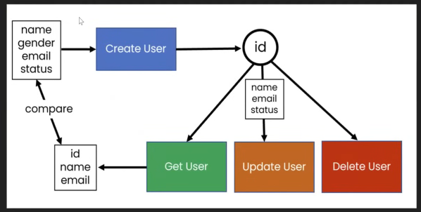

# API Chaining

The response of one request becomes input of another request

We need to store response in differnet variables and then refer that variable to another request.


## https://gorest.co.in/



### Create user

```javascript
var random = Math.random().toString(36).substring(2)
// console.log(random)

var useremail = "jim"+random+"@gmail.com"
var username = "jim"+random;

pm.environment.set("email_env",useremail)
pm.environment.set("name_env", username)
```
