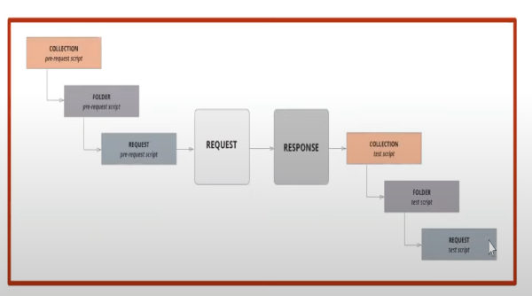

# Topics

1. Variables
2. Method - set, get, unset
3. Simple books API - Script

# Script in Postman

* Pre-request Scripts
* Tests Scripts

* Flow

`Pre-Request Script => Request => Response => Request`




```javascript
pm.test("Status code is 200", function () {
    pm.response.to.have.status(200);
});
```

## Postman Variables

We can create variables at following levels(scope i.e. based on accessbility level)  

* Global - It can be accessed everywhere within the workspace.
It can be created in Global section or through **pre-request** script
e.g. `pm.globals.set("userid","2")`

* Collection - It is accessbile within the collection.
It can be created in Collection or by pre-request script.
e.g. `pm.collectionVariables.set("userid_collect", "2")`

* Environment - It is accessbile in all collection, but we need to switch to particular environment.
It can be created in Environment section or through pre-request script
e.g. `pm.environment.set("userid_qa_env","2")`

* Local - It is created in pre-request script and it can be used during runtime.  
It is accessbile only within that particular request.
e.g. `pm.variables.set("url_local","https://reqres.in/api")`
* Data - It can created in data files. e.g. csv files

Variable types - 

* Default type
* Secret type


Workspace => Collections => requests

## Getting variables in Test script from pre-request script

e.g.   
`pm.globals.get("variable_name")`
`pm.environment.get("variable_name")`
`pm.collectionVariables.get("variable_name")`


## Delete a variable

`pm.globals.unset("variable_name")`
`pm.environment.unset("variable_name")`
`pm.collectionVariables.unset("variable_name")`


## Simple Books API

https://github.com/vdespa/introduction-to-postman-course/blob/main/simple-books-api.md

* List of Books

```javascript
pm.test("Status code is 200", function () {
    pm.response.to.have.status(200);
});

const jsondata = pm.response.json();
// console.log("jsondata",jsondata)
const count = jsondata.length;
// console.log(count)
for(var i = 0;i<count;i++){
    var js1 = jsondata[i]
    if(js1.name=="The Vanishing Half")
    {
        var iid = js1.id;
        console.log(iid)
        pm.environment.set("id1", iid);
    }
}
```

* Get All orders

```javascript
pm.test("Status code is 200", function () {
    pm.response.to.have.status(200);
});

const jsondata = pm.response.json();
var count = jsondata.length;
console.log("count",count)
for(var i=0;i<count;i++){
    var biid = jsondata[i];
    if(biid = jsondata[i]);
    if(biid.timestamp == "1734545392370"){
        var bookid = biid.id;
        pm.environment.set("orders",bookid)
    }
}
```
