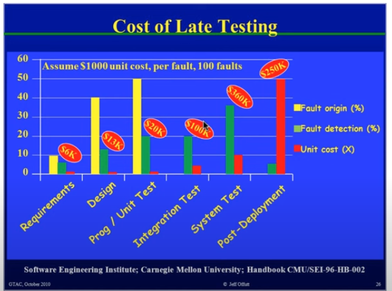

# Software Testing : Motivation
Meenakshi D'Souza, IIIT,Bangalore
* Expensive Error

## Software in this century
### Need for testing

* Software is ubiquitous:  
Finance, telecommunication, home and building automation,  
process control, transportation, social networking, toys etc.  
* Such software should be of very high quality: offer good  
performance in terms of **response time**, processing capacity  
and also have **no errors.**
* It is no longer feasible to shut down a malfunctioning system in order to restore safety.
* We are dependent on systems for continuous functioning and
consequences of failure can be disastrous.

## Some popular errors: 
### Ariane 5
* Ariane 5 rocket exploded in June 1996 36 seconds after it was launched.
* https://www.youtube.com/watch?v=PK_yguLapgA
* Reason: Software error
* Exception occurred during conversion of a 64-bit floating  
point number into a 16-bit integer, backup software also failed  
due to same reason.
* Rocket failed due to incorrect data transmission regarding
altitude.

### Therac 25
* Six patients died due to an overdose of radiation caused from  
Therac 25, a medical linear accelerator that is used to treat  
tumors.
* The main cause of error was a race condition caused by wrong  
sequence of commands causeg by the software operating the   
accelerator.

### Intel Pentium Bug
* Intel lost an estimated $475 million due to a defective
pentium chip.
* The chip made mistakes while dividing floating point numbers
within a certain range.
* For example, 3145727 x 4195835 / 3145727 should return
4195835. A flawed Pentium will return 4195579!
* Intel had to replace most of 3 to 5 million defective chips in
circulation.

## Some more expensive error
* NIST report: The Economic Impacts of Inadequate
Infrastructure for Software Testing (2002):
    * Inadequate software testing costs the US alone between $22
and $59 billion annually.
    * Better approaches could cut this amount in half.
* Huge losses due to web application failures.
    * Financial services : $ 6.5 million per hour (just in USA!)
    * Credit card sales applications : $ 2.4 million per hour (in USA)
    * In Dec 2006, amazon.coms BOGO offer turned into a double
discount
* 2007: Symantec says that most security vulnerabilities are due
to faulty software.

## Testing in this century
* **Agile methodologies** insist on developers unit testing their
code thoroughly. Testing is not a testers job alone.
* **Embedded safety critical, control software** has to be tested
with extra care to meet requirements.
* **Enterprise software** is very complex— large data bases, critical
server requirements etc.
* **Web applications** are available to more users, need to be
correct.
* **Free software** is also expected to be correct!

## Cost of Testing
* Cost of Late Testing

## Testing: Facts and Myths
* **Fact:** Testing can be used to find errors in software, cannot be
used to show that a software is correct.
* **Fact:** Testing cannot be replaced by software reviews,
inspections, quality audits etc.
* **Fact:** Testing cannot be fully automated, needs human
intervention.
* **Myth:** It is wrong to say that "My code is correct and doesn't
need to be tested"

> Pareto Principle - The 80% of the defects comes from the 20% of the code.

## Testing goals based on process maturity
* Level 0: There is no difference between testing and
de-bugging.
* Level 1: The purpose of testing is to show correctness.
* Level 2: The purpose of testing is to show that software
doesn't work.
* Level 3: The purpose of testing is not to prove anything
specific, but to reduce the risk of using the software.
* Level 4: Testing is a mental discipline that helps all IT
professionals develop higher quality software.

## Testing process : Level 0 thinking
* Testing is the same as debugging.
* Does not distinguish between incorrect behavior and mistakes
in the program.
* Does not help develop software that is reliable or safe.

## Testing process : Level 1 thinking
* Purpose is to show correctness. CorrectneSs is impossible to
achieve.
* What do we know if no failures? Good software or bad tests?
* Test engineers have no:
    * Strict goal
    * Real stopping rule
    * Formal test technique

## Testing process : Level 2 thinking
* Purpose is to show failures.
* Looking for failures is a negative activity. Puts testers and
developers into an adversarial relationship.
* What if there are no failures?
* Many software companies are in this level.

## Testing process : Level 3 thinking
* Testing can only show the presence of failures.
* Whenever we use software, we incur some risk.
    * Risk may be small and consequences unimportant.
    * Risk may be great and consequences catastrophic.
* Testers and developers cooperate to reduce risk.

## Testing process : Level 4 thinking
* A mental discipline that increases quality. Testing is only one
way to increase quality.
* Test engineers can become technical leaders of the project.
* Primary responsibility to measure and improve software
quality.
e.g. Microsoft

## This course vs. Testing process levels
* We will deal with technical aspects of testing that will help
with level 3 and 4 thinking.
* This course will help you write
    * **test objectives.**
    * Define/ understand how to plan and achieve coverage in code,
design and requirements.
* Teach you the **algorithmic aspects** of testing.