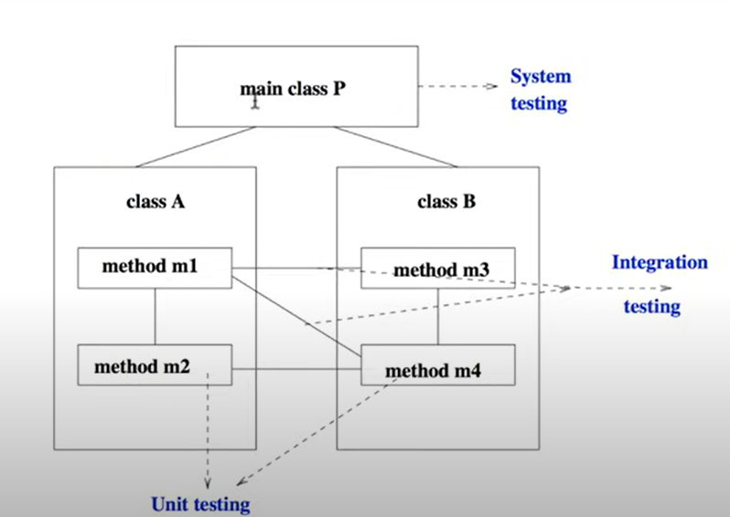

# Software Testing : Terminologies

## Outline
1. Verification, validation and testing.
2. Testing terms.
3. Testing: Classification.
4. Test activities.

## Verification, Validation and Testing
As per IEEE-STD-610,
* **Validation:** The process of evaluating software at the **end of software development** to ensure   
compliance with intended
usage. i.e., checking of the software meets its requirements.
* **Verification:** The process of determining whether the products of a given phase of the software   
development process fulfill the requirements established at the **start of that phase.**

Testing, as we will see in this course, deals mainly with verification.

## Other related areas
* Formal methods/verification: Model checking, theorem
proving, program analysis.
* Modelling and simulation.
* Accreditation.

>> Safety critical. They need to be certified .  

## Software: Faults, failures and errors
* **Fault**-  A static defect in the software. It could be a missing function or a wrong function in code.
* **Failure** - An external incorrect behavior with respect to the requirements or other description of   
the expected behavior. A failure is a manifestation of fault when software is executed.
* **Error** -  An incorrect internal state that is the manifestation Of some fault.

## Historical perspective
* The terms **bug** and **fault** was used by Edison:
"It has been just so in all of my inventions. The first step is an intuition, and comes with a burst,   
then difficulties arise, this thing gives out and [it is] then that bugs, as such little faults and   
difficulties are called, show themselves and months of intense watching, study and labor are requisite."

* The term **error** was used by **Ada Lovelace:**
"An analyzing process must equally have been performed in  
order to furnish the Analytical Engine with the necessary  
operative data; and that herein may also lie a possible source  
of **error.** Granted that the actual mechanism is unerringin its processes,   
the cards may give it wrong orders

We will use these terms synonmously in this course:  
fault, failure, error. bug. defect  
will all mean the same.

## Test case
* A **test case** typically involves **inputs** to the software and **expected outputs**.
* When test cases are executed and results recorded, if the **actual** output   
matches the expected output, the test case is said to have **passed**.   
Otherwise, the test case is said to have **failed**.
* A failed test cases indicates an error.
* A test case also contains other parameters like test case id, traceability details etc.

## Types of Testing
There are different types/levels of testing, based on the phase of  
software development lifecycle that they are applied to:
* Unit Testing: Done by developer during coding.
* Integration Testing: Various components are put together and  
testing. Components could be software components or  
software and hardware components.
* System Testing: Done with full system implementation and  
platform in which the system will be running.
* Acceptance Testing: Done by end customer to ensure that the  
delivered prqducts meets the committed requirements.
* A related term is **beta testing** which is done in a so-called  
beta version of the software by end users, after release.

Some additional types of testing are:
* Functional Testing: Done to eryure that the software meets  
its specified functionality.
* Stress Testing: Done to evaluate how the system behaves  
under peak/unfavourable conditions/inputs.
* Performance Testing: Done to ensure the speed and response  
time of the system.
* Usability Testing: Done to evaluate the user interface,  
aesthetics etc.
* Regression Testing: Done after modifying/upgrading a  
component, to ensure that the modification is working  
correctly and other components are not damaged by the  
modification.

## Testing Methods
* **Black-box testing:** A method of testing that examines the
functionalities of software/system without looking into its
internal design or code.
* **White-box testing:** A method of testing that tests the internal structure of 
the design or code of a software.

