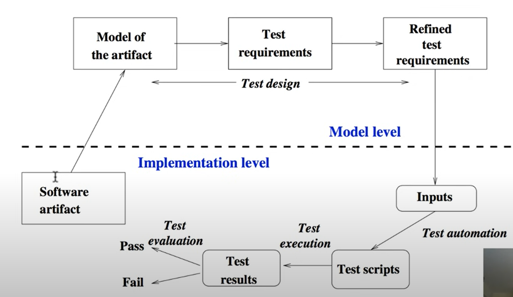

# Outline
* Testability
* Model based testing
* Test design based on criteria

## Testability
### Observability and Controllability
* Two terms related to testability.
* **Observability** deals with
How easy it is to observe the behavior of a program in terms  
of its outputs, effects on the environment and other hardware  
and software components.

* **Controllability** deals with  
How easy it is to provide a program with the needed inputs, in  
terms of values, operations, and behaviors.

## Model for detecting faults through observing failures
* RIPR model: Four conditions necessary for a failure to be observed
are:  
    * Reachability: The location(s) in the program that contain the 
    fault must be reached.
    * Infection: The state of the program must be incorrect.
    * Propagation: The infected state must cause some output or final state of the   
    program to be incorrect.
    * Reveal: The tester must observe part of the incorrect portion of the program state.

Consider the code segment below:  
input x, y;  
if (x < 10){
z = x+1;  
if (y < z)  
---error ---;
} 

* Reachability: True, any value of x can reach the first if
statement. x < 10 will reach the second if statement.

* Infection: x != 10 will test the first if statement. y < x+1 will
test the second if statement.

* Propagation: x < 10 and y < z will result in reaching the
error statement.

## Model based testing
* Model based testing involves working with a model of the
software artifact and deriving test cases from the model.
* The model could be based on
    * A formal, mathlematical notation (like finite state machines,
graphs, logical formulas etc.),
    * A language that supports several entities for modelling (like
UML, SysML, Simulink, Stateflow etc.). It may or may not  
have formal semantics.
* A model could not only be for code, but also for requirements,
design etc.
* Testing with models for requirements and design helps in early
detection of errors.

### Model based testing : Process
