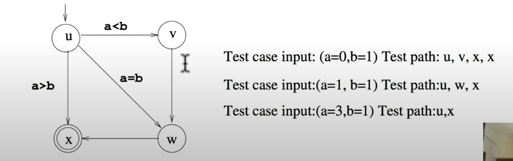

# Basics of graphs : As used in testing
## Graphs : History
* Graph theory, the study of graphs is said to have originated in  
1736 with Euler's problem about traversing through the
bridges of Königsberg, a city in Russia.
* Graphs have applications in several different areas including  
Computer Science, Sociology, Physics, Chemistry and Biology.
* We will consider graphs as models of software artifacts and  
use them to design test cases.

## Graph
* A graph is a tuple G = (V,E) where
    * V is a set of **nodes/vertices.**
    * E ⊆ (VxV) is a set of edges.
* Graphs can be **directed** or **undirected.**
* In an undirected graph, the pair of vertices constituting an edge is unordered, i.e., whenever (u,v) ∈ E   
then (v,u) ∈ E and vice versa.
* In a directed graph, the pair of vertices constituting an edge is ordered.


* Graphs can be finite or infinte. Finite (infinite) graphs have a
finite (infinite) number of vertices.
* We will use finite graphs throughout our course.
* The degree of a vertex is the number of edges that are
connected to it. Edges connected to a vertex are said to be  
incident on the vertex.

* For many graphs, there are designated special vertices like
**initial** and **final** vertices.
* These vertices indicate beginning and end of a property that
the graph is modeling.
* Typically there is only one initial vertex, but, there could be
several final vertices.
* Initial vertex represents the beginning of a computation (of a
piece of code) and the computation ends in one of the final  
vertices.


## Graphs in Testing - Coverage Criteria
* Graphs are very popularly used structure for testing.
* Graphs can come from different software artifacts:
    * Control flow graphs
    * Data flow graphs
    * Call graphs
    * Designs modelled as finite state machines and statecharts.
    * Use case diagrams
    * Activity diagrams
* Most of these graphs will have labels associated with vertices
and/or edges. Labels or annotations could be details about  
the software artifact that the graphs are modelling.
* Tests are intended to cover the graph in some way.

## Graphs in Testing - CFG example #1
```
if (x < y){
    y:=0;
    x:=x+1;
}
else{
    x:=y+1;
}
z:=x+1
```


## Graphs in Testing - CFG example #2

if (x < y){
    y:=0;
    x:=x+1;
}
else{
    x:=y+1;
}
z:=x+1;


## Paths in Graphs
* A **path** p is a sequence of vertices V1, V2, ... , Vn such that
(Vi, Vi+l) belongsTo E for 1 <= i <= n— 1.
* **Length** of a path is the number of edges that occur in it. A
single vertex path has length 0.
* **Sub-path** of a path is a sub-sequence of vertices that occur in
the path.
* For e.g., for the undirected graph given in slide 3, u, w, x, u, v is a path. A sub-path of this   
path is w, x, u and the length of this sub-path is 2.

## Reachability in graphs
* A vertex v is **reachable** in a graph G if there is a path from one of the initial   
vertices of the graph to v.
* An edge e = (u, v) is **reachable** in a graph G if there is a pathl from one of the initial   
vertices to the vertex u and then to v through the edge e.
* A sub-graph G/ of a graph G is reacshable if one of the  
vertices of G/ is reachable from an initial node in G.

## Algorithms for paths and reachability
* Depth First Search (DFS) and Breadth First Search (BFS) are  
two well-known algorithms that can be used for reachability in  
graphs.
* Apart from DFS and BFS, in graphs that have parameters  
associated with vertices or edges, we can ask for specific  
reachability of certain vertices, edges etc.
* Most such problems can be solved bsing a modification of
DFS/BFS algorithms.

## Test paths in graphs
* A test path is a path that starts in an initial vertex and ends in a final vertex.  
Note: Initial and final vertices capture the beginning and
ending of paths, respectively, in the corresponding graph.
* Test paths represent execution of test cases.
    * Some test paths can be executed by many test cases (Feasible paths).
    * Some test paths cannot be executed by any test case
(Infeasible paths).

## Visiting and Touring
* A test path p visits a vertex v T v occurs in the path p. A
test path p visits an edge e if e occurs in the path p.
* A test path p tours a path q if q is a sub-path of p.
* Since each vertex/edge is a sub-path, we can also say that a
test path tours an edge or a vertex.
* Consider the path u, w, x, u, v in the graph of slide 3 again. It
visits the vertices u, w, x and v, and the edges  
(u, w), (w, x), (x, u) and (u, v). It also tours the path w, x, u.

## Tests and test paths
* When a test case t executes a path, we call it the **test path** executed by t, denoted by path(t).
* Similarly, the set of test paths executed by a set of test cases T is denoted by path(T)


## Reachability and test paths
* The notion of reachability that we defined earlier was purely
syntactic.
* A particular vertex/edge/sub-graph can be reached from an
initial vertex if there is a test case whose corresponding path  
can be executed to reach the vertex/edge/sub-graph
respectively.
* Test paths that are infeasible will correspond to unreachable
vertices/edges/sub-graphs.
* Several different test cases can execute the same path.

## Graphs in testing
* We use graphs in test case design as follows:
    * Develop a model of the software artifact as a graph.
    * Such graphs could contain several paramaters apart from
vertices and edges:
        * Designated initial and (set of) final states.
        * Vertices/edges labelled with statement(s), predicates etc.
        * Vertices/edges labelled with data values that can be defined and/or used.
    * Use one or more reachability algorithms (typically) in graphs to design test cases.

## Graph coverage criteria
* **Test requirement** describes properties of test paths.
* **Test Criterion** are rules that define test requirements.
* **Satisfaction:** Given a set TR of test requirements for a
criterion C, a set of tests T satisfies C on a graph iff for every test requirement in t BelongsTo TR,   
there is a test path in path(T)
that meets the test requirement t.
* For example, the set of test cases below in the graph satisfy
**branch coverage** at the node u in the graph.


## Two different coverage criteria on graphs
We will consider two different coverage criteria for designing test cases based on graphs:  
* Structural Coverage Criteria: Defined on a graph just in terms
of vertices and edges.  
* Data Flow Coverage Criteria: Requires a graph to be
annotated with references to variables and defines criteria  
requirements based on the annotations.