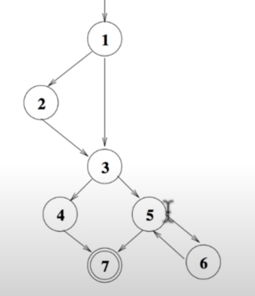

## Graph coverage criteria - Overview
* We look at graphs as structures and look at the following two
coverage criteria over graphs.
    * Structural coverage criteria.
    * Data flow coverage criteria.
* Later, we consider software artifacts (code, design elements
and req requirements) modelled as graphs and see how these  
coverage criteria apply to them.
* Focus of this lecture: Structural coverage criteria.

## Structural coverage criteria over graphs
* Node/vertex coverage.
* Edge coverage.
* Edge pair coverage.
* Path coverage
    * Conlplete path coverage.
    * Prime path coverage.
    * Complete round trip coverage.
    * Simple round trip coverage.

## Node/Vertex coverage
* **Node coverage** requires that the test cases visit each node in
the graph once.
* **Node Coverage:** Test set T **satisfies node coverage** on graph G iff for every syntactically  
reachable node n ∈ G, there is some path p in path( T) such that p visits n.
* Simpler definition: TR(Test requirement) contains each reachable node in G.

## Edge coverage
* **Edge Coverage:** TR contains each reachable path of length up to 1, inclusive, in G.
* Edge coverage is slightly stronger than node coverage.
* Why "length up to 1" ?
It allows edge coverage for graphs with one node and no
edges.
* Allowing length up to 1 allows edge coverage to subsume
node coverage.

## Node and edge coverage - Example

* Node coverage - TR = {1,2,3} , test path = [1,2,3].
* Edge coverage - TR = {(1,2),(1,3), (2,3)}, test paths = {[1,2,3],[1,3]}.
* Note - Node coverage and edge coverage are different only when there is an edge in   
another sub-path between a pair of nodes, like the above graph

## Covering Multiple Edges - Edge-Pair Coverage
* **Edge-Pair Coverage (EPC):** TR contains each reachable path
of length up to 2, inclusive, in G.
* Paths of length up to 2 correspond to pairs of edges.
* Again, the phrase "length up to 2" ensures edge-pair coverage holds for graphs with   
less than 2 edges.

* TR = {[1,4,5], [2,4,5],[3,4,5],[1,4,6],[2,4,6],[3,4,6]}.
* Test paths are the same as above.

## Covering Multiple Edges, contd.
* An extension of edge-pair coverage is to consider all paths.
* **Complete path coverage:** TR contains all paths in G.
* Unfortunately, this is can be an infeasible test requirement.
Also, it may not be a useful test requirement.
* **Specified path coverage:** TR contains a set S of paths, where S is specified by   
the user/tester.

## Coverage criteria seen so far:
* Node coverage - TR = {1,2,3,4,5,6,7},  
Test paths - {[1,2,3,4,7],[1,3,5,6,5,7]}.

* Edge coverage - TR = {(1,2),(1,3),(2,3),(3,4),(4,7),(3,5),(5,6),(6,5),(5,7)}  
Test paths - {[1,2,3,4,7],[1,3,5,6,5,7]}.

* Edge-pair coverage - TR = {[1,2,3],[1,3,4],[1,3,5],[2,3,4],[2,3,5],[3,4,7],...},

Test paths - {[1,2,3,4,7],[1,2,3,5,7],[1,3,4,7],[1,3,5,6,5,7]}.

* Complete path coverage - TR = {[1,2,3,4,7],[1,2,3,5,7]}

## Complete and Specified Path Coverage
* If a graph contains a loop, it has an infinite number of paths
and hence complete path coverage is infeasible.
* What will be a good notion of specified path coverage in the
presence of loop?
* Loops have boundary conditions and repeated executions.
Effective test cases will not execute the loop for every
iteration.
* Ideally, we need to have test cases that cover the loop:
    * Execute the loop at its boundary conditions— skip the loop
execution.
    * Execute the loop once for normal iterations.
* The notion of **prime paths** came into existance for working
with loops.

## Prime Paths in Graphs
* A path from node ni to nj is simple if no node appears more
than once, except possibly the first and last node.
    * No internal loops.
    * A loop is a simple path.
* A prime path is a simplb path that does not appear as a
proper subpath of any other simple path.

## Simple paths and prime paths - Example

## Prime path coverage
* Prime path coverage: TR contains each prime path in G.
* Ensures that loops are skipped as well as executed.
* By touring all paths of length 0 and 1, it **subsumes** node and
edge coverage.
* May or may not subsume edge-pair coverage.

## Prime path coverage vs. edge-pair coverage

* In graphs where there are self loops, edge-pair coverage
requires the self loop to be visited.
* For e.g., in the above graph, TR for edge-pair coverage will
be {[1, 2, 3], [1, 2, 2], [2, 2, 3], [2, 2, 2]}.
* Some of these are prime paths/simple paths.
* TR for prime path coverage for the above example is
{[1,2,3],[2,2]}.

## Prime path coverage and loops in graphs

Prime paths capture the notion of covering a loop well.
* There are nine prime paths.
* They correspond to
1,3,5,7 - Skipping the loop,
1,3,5,7 - Executing the loop once, and
6,5,6 - Executing the loop more than once.

## Implementing test requirements for prime path coverage
* Prime paths, by definition, do not have internal loops.
* In many cases, it might be impossible to mee the test
requirement of prime path coverage without internal loops.
* That is, test paths that meet prime path coverage TR need to
have internal loops to make prime path coverage feasible.

## Touring, side trips and detours
* Tour: A test path R tours sub-path q if q is a sub-path of p.
* Tour with side trips: A test path p tours sub-path q with
sidetrips iff every edge in q is also in p in the same order.
o The tour can include a sidetrip, as long as it comes back to
the same node.
* Tour with detours: A test path p tours sub-path q with
detours iff every node in q is also in p in the same order.
The tour can include a detour from node n, as long as it
comes back to the prime path at a successor of n.