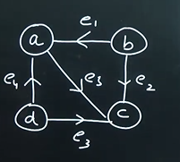

# DSA - Graphs
.png>)

G(V,E)
where V is set of nodes/vertex
E is set of edges

V = {a,b,c,d}
E = {e1,e2,e3,e4}

e1 => {a,b}
e1 => {b,a}

e1 has two end points a and b
If order doesnot matter then it is undirected graph

 