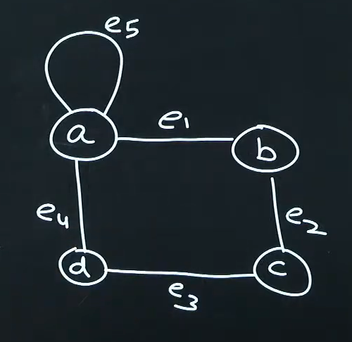
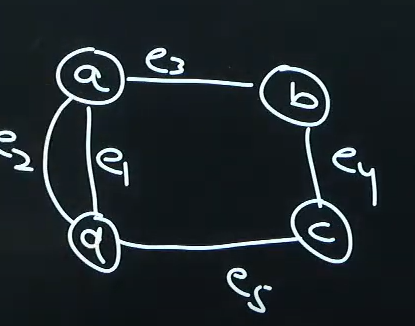
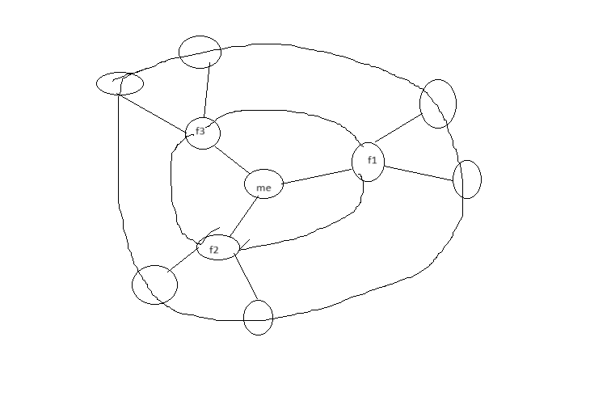

# DSA - Graphs
`endArrow=none;`

.png>)

G(V,E)
where V is set of nodes/vertex
E is set of edges

V = {a,b,c,d}
E = {e1,e2,e3,e4}

e1 => {a,b}
e1 => {b,a}

e1 has two end points a and b
If order doesnot matter then it is undirected graph

 

 e1 = (b,a)
 * Directed edge
 * Undirected edge
 * Loop - If end point are same for an edge  
 
 * Parallel Edges -   
 

 * Simple Graph - No Loop and No parallel edges
 * Google Map - Graph
 * Facebook  
 

 ## Traversal Algorithm
 1. Breadth First search
 2. Depth First search

 * Visit
 * Explore

 ### Depth First Search
 * Source - Starting node