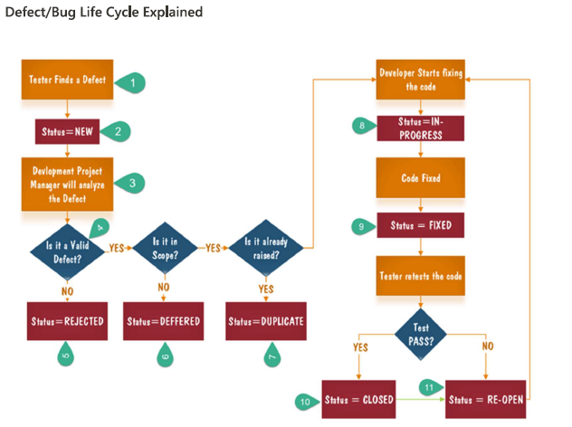

## What is Bug?
A bug is the consequence/outcome of a coding fault

## What is Defect in Software Testing?
A defect in software testing is a variation or deviation of the software application from end user's requirements or original business requirements.

## What is bug Report in Software Testing?
It is a detailed document about bugs found in the software application

## What is Defect Management Process?
Defect Management is a systematic process to identify bugs and fix bugs.

## Explain the different stages in defect management cycle ?
1. Discovery
2. Categorization - It helps the software developers to prioritize their tasks
3. Defect Resolution - It is a step-by-step process of fixing the defects
4. Verification - After the development team fixes the resolved the defect, the testing team verifies that the defects are actually resolved
5. Closure - Once a defect has been resolved and verified, the defect status is changed to closed
6. Defect Reporting - It is a process in which test managers prepare and send the defect report to the management team. Defect reporting helps to better communicate, track, and explain the defects in detail.

## What is Defect/Bug life cycle?
It is nothing but the specific set of states that a defect or bug goes through in its entire life cycle.
e.g. New, Assigned, open, fixed etc

## What is Defect Status?
## What are different states that a defect can have in a project, Explain?
1. New
2. Assigned
3. Open
4. Fixed
5. Pending Retest
6. Retest
7. Verified
8. Reopen
9. Closed
10. Duplicate
11. Rejected
12. Deferred
13. Not a bug

## Explain Defect/Bug life cycle.

Duplicate Defect
1. Same defect is logged by other tester
2. Defect is already fixed  

Defect cannot be fixed
1. When cost of defect is more than the actual defect
2. When technology itself is not supporting
3. When there is a minor defect in the root of the product

Issue is not replicated/works fine for me
1. Build mismatch
2. Platform mismatch
3. Improper defect report

Deferred/postpone
1. When it is a minor defect and received during the end of the release
2. When it is a minor defect and it is not affecting the customer business workflow
3. When it is minor defect and customer does not want the feature in this release
4. When it is a defect but customer is planning to do lot of requirement changes in the particular feature

## What is the Difference between Severity and Priority
| Severity | Priority | 
| -------- | -------- | 
| Severity is the degree of impact that a defect has on the operation of the product | Priority is the order in which the developer should resolve a defect |
| It is categorized into 5 types - Blocker, Critical, Major, Minor | Priority is categorized into three types - High, Medium, and Low |
| Severity Indicates the seriousness of the defect on the product functionality | Priority indicates how soon the bug should be fixed |
| Severity levels of the defects are determined by the QA Engineer | Priority of defects is decided in consultation with the manager/team/client |

