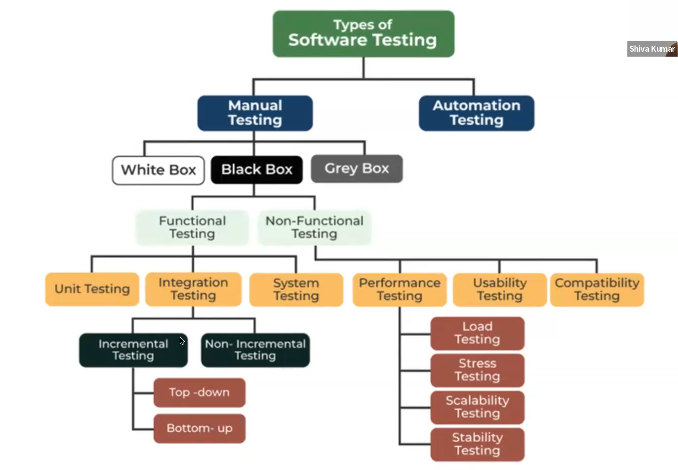

## Types of Testing


## Levels of Testing
1. Unit Testing
2. Integration Testing
3. System of Testing
4. User Acceptance Testing

## Incremental Integration Testing - 
Incrementally adding the module and testing the
data flow between the modules is called as Incremental Integration Testing.
### Types of Incremental Integration Testing
#### Topdown approach - 
Incrementally adding the modules and testing the data
flow between the modules and ensure that the module we are adding is child
of the previous module is called Topdown Incremental Integration Testing.
#### Bottom up approach - 
Incrementally adding the modules and testing the
dataflow between the modules and ensure that the module we are adding is
the parent of previous module is called as Bdttom up approach.
## Non Incremental Integration Testing/Big Bang Method
We go for Non Incremental Integration testing when it is difficult to identify which is parent module and child module , when multiple modules are there, when there is shortage of time.

## Sandwich Testing - 
Combination of Topdown and bottom up incremental
integration testing is called called sandwich Testing.

## System Testing 
It is an end to end testing done by test engineer.  
Why System testing? To check when we navigate through all the features and check whether **end feature** is working as expected or not

## Blackbox testing
It is performed by testers  
Testing the application when application is ready  
**Types - Functional and Non functional**

### Functional Testing 
We test functionality of an application with respect to customer requirements

**Types of functional testing**
1. Component Testing
2. Integration Testing
3. System Testing
4. Smoke Testing
5. Sanity Testing
6. Regression Testing
7. User Acceptance Testing

### 1. Component Testing (Type - Blackbox =>functional testing)
Testing each and every component of an application rigorously or thoroughly against customer requiremnt specification is called component testing  
e.g. Text box field, radio button, buttons, hyperlink etc  
**Types of component tesitng**
1. Over Testing/Exhaustive Testing - Here we enter more data
2. Under Testing - Here we enter less data
3. Optimized Testing - Here we enter proper data which makes sense.

**Optimized testing** can be of two types - Positive testing  and Negative testing


### 2. Integration Testing (Type - Blackbox =>functional testing)
Testing the data flow or interface between two or more modules  
Types of Integration Testing  
1. Incremental Integration Testing.
2. Non Incremental Integration testing.

**Under Incremental Integration testing we have 2 types**  - topdown , bottom up  

**Topdown approach** - Incrementally adding the modules and testing the data flow  between the modules and ensure that the module we are adding is child of  
the previous module is called Topdown Incremental Integration Testing.  
e.g.
```
Gmail - Compose and Sent items
Compose is a parent module and sent items is a child module.
Data flow is happening from parent to child
```
**Bottom up approach** - Incrementally adding the modules and testing the dataflow between the  
modules and ensure that the module we are adding is the parent of previous module is called as
Bottom up approach.

**Non Incremental Integration Testing**  or **Big Bang Method**
Testing the data flow between multiples modules and check whether the dataflow is happening correctly or not.

### 3. System Testing (Type - Blackbox =>functional testing)
It is end to end to testing where we check whether end feature is working or not.
**Scenarios**:

**Positive scenario**:  
Signup to Flipkart, Login, click on mobiles feature, click on Samsung. Select of the mobile, add to cart, click
on buy now. Select the payment option as phonepe and complete payment. Check if payment is successful.

**Negative scenario:**  
Login to Flipkart, search for accessories, select a watch. Add to cart, click on buy now. Select payment
method as debit card, Generate OTP, enter OTP in reverse order, check if OTP is accepted or not.

### 4. Smoke Testing or Build verification testing or positive testing (Type - Blackbox =>functional testing)
Testing the basic and critical features of an application before doing thorough
Testing is called as Smoke Testing.  
Here we take only 1-2 hours.

Why Smoke Testing - To check whether build is testable or not.

First day itself while Smoke Testing if we find Blocker or critical defect,  
communicate to developer, so that developer will get sufficient time to fix the  
defect.  

We are doing Smoke testing, indirectly we are ensuring that build is installed  
properly or not. 

**It is a High Level testing.**  
It is also called and wide testing.  
This is a shallow and wide testing.  
This can be done by both developers and testers.      
Smoke testing is a subset of acceptance testing  

**Types of Smoke testing**  
Formal Smoke Testing  - we document the bug  
Informal Smoke Tesing - we don't document anything  

### 5. Sanity Testing (Type - Blackbox =>functional testing)
Sanity Testing is a **deep and narrow Testing**.   
Here we do both **positive and negative testing.**  
**This testing is done in detail.**  
We are taking more time here.  
It is usually done by when Tester finds a
bug and developer has fixed it, we do sanity testing to make sure that other features
are working by Testing thoroughly, we test each and every feature and check data
flow and end to end features - this is how we do deep testing. This time we have more clarity on features   

3-4 Hours  
After finding a bug , because it might have introduced new bugs in old features, so we do deep and narrow testing.  

Sanity Testing is done for **stable** builds.  

**Sanity testing is a subset of regression testing**
### Retesting  
When developers fix the bug , we need to do mandatory retesting. It can happen that developers has not fixed the bug or fixed some other bug. We are only checking that particular defect which we found while doing testing.


### Adhoc testing(Negative, Out of box, random testing)
Testing the application or software randomly without looking into requirements is
called as Adhoc Testing.   
Why Adhoc testing?
1) Chances are there customer/end users might use the software randomly and
they might find defects in order to avoid that, Adhoc testing should be done.
2) The intention is to break the software, so we should do Adhoc testing(To find
maximum defects).

### 6. Regression Testing (Release Candidate Testing) (Type - Blackbox =>functional testing)
**Testing the old features** so that any new changes like adding a feature, modifying
a feature, deleting a feature or fixing a defect is not introducing a new defect in old features.  

To check that we do Regression testing on the old features.(Here we test
the new changes first and then we test for old features, these old features are
tested by looking into old test cases, which are already used earlier) 
 
**Why Regression Testing** - To check if new changes made has introduced any
defect in old features or not.

**Types of Regresssion Testing** -   

1. **Unit Regression Testing** - Testing only the changes made is called as Unit
Regression testing(Here we test only new feature added, because we are sure it
is not affecting old features).  

e.g. Addition of FAQ modules in a application for flipkart having Login, Add to cart, Search modules will not affect these. 
So I will be only doing Unit Regression Testing.

2. **Regional Regression Testing** - Testing the changes made and the impacted
modules affected because of this change is called as Regional Regression testing.  
**How do we know which all areas are impacted?**
By doing **impact analysis meeting**, in this meeting we cross verify with Business
Analyst and check which all areas(modules) are impacted because of this new
change made.  

3. **Full Regression Testing** - If the new changes made is largely impacting other
modules(more areas), we go for Full Regression Testing.  

IOW , If majority of modules are getting impacted then we go for full regression testing.  

By conducting Full Regression Testing, we can save a lot of time.    
e.g. let's say 9 out 10 modules are impacted , then go for full Regression testing.  

Both Manual Testing and Automation Testing can be done for Full Regression testing.

With test cases, I will test old features - Functional Testing, Integration Testing, System Testing

Regression testing acts between bridge between Manual testing and Automation testing.  

### 7. Acceptance Testing(User Acceptance Testing)  (Type - Blackbox =>functional testing)
It is an end to end testing, done by the customers where in they use software for
real time business for some particular period of time and check whether software
can handle all the real time business, scenarios and situations. This is called as
Acceptance Testing.  

Why acceptance testing?
1) To get confidence on the product or software.
2) To ensure that application meets the business requirements.
3) To make sure that software company is not developing wrong features.

**Types of Acceptance Tesing**  

Alpha Testing - Acceptance Testing done in company environment.  

Beta Testing - Acceptance Testing done in customer énvironment.

**Functional testing key points**
1. It is done before Non-functional testing
2. It validates/checks functionality of the software.
3. Functionality describes what software does
4. Works on customer requirements.

## Types of Non Functional Testing
Here we check whether it is according to customer expectations  
Types -   
1. Compatibility Testing  
2. Usability Testing  
3. Performance Testing  


### 1. Compatibility Testing(Cross browser Testing) ( Type - Blackbox => Non functional testing)
**Testing the functionality of an application or software for different hardware and
software configurations is called Compatibility Testing.** 

**Why Compatibility Testing** - Tester might have tested software in one platform,  
chances are there the users will use the software in different platforms and the  
software might not work and this will spread bad name in the market and software  
usage will go down, to avoid that we do compatability testing.  

To ensure all the features is consistently working for all platforms, we will do
compatibility testing

Different platforms - Different OS, Browsers.  

How tester will do compatibility testing  

1) Initially Testers will test for base platform i.e. Lets say among the browsers   
chrome, firefox, safari, according to market research chrome is widely used,  
hence we will consider chrome as the base platform and start the software in  
Chrome first and later we will test for other browsers.  

2) Same process is applicable for OS also.

### 2. Usability Testing
Testing the user friendliness of an application is called as usability testing.  

**Why usability testing**  
To ensure software is in simple language, easy to access, easy to navigate and  
look and feel of the application should be good.  
GUI Testing is a part of Usability Testing.

### 3. Performance Testing (Type - Non functional testing)
**Testing the stability and response time of an application by applying load is called as Performance testing.**  

Why performance testing - To check how is the response time and stability of an
application when load is applied.  

Stability means checking how the many users can software can accept(ability to
withstand designed number of users).  

Response Time means time taken by server to respond to user query

#### Types of Performance Testing  
1. Load Testing - By applying within limit. let's say app can accept 100 users.
e.g. so now I am putting like 8,99 users. We will be using tool Jmeter.

2. Stress Testing - Applying more load  
e.g. I will put 150 users.

3. Scalability Testing - Applying more load and check where exactly software crashes
Here I want to know the limit.

4. Volume Testing - testing the database of large volume of data  
e.g. Here I will be testing only a complete software

5. Soak Testing - Endurance testing by applying load continuously for long time  

Performance testing will be mostly done for e-commerce applicatin, client-server application.
We will not be doing Performance testing. 
