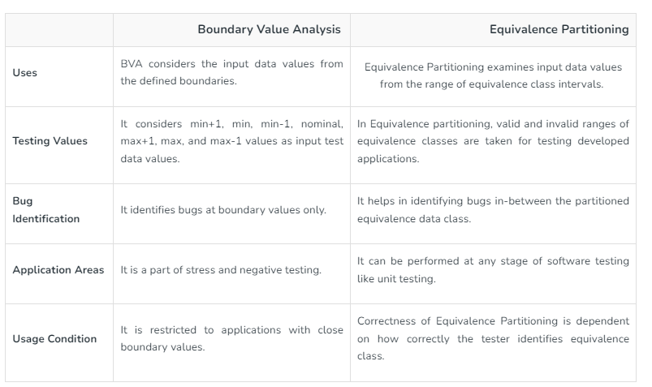

## Requirement Traceability Matrix
It is also called as requirement Traceability matrix(RTM) or Cross reference matrix (CRM)  

It is a document through which we are ensuring that each and every requirement has minimum test cases.  

Types of Requirement traceability matix:
1) Forward Traceability matrix
2) Backward Traceability matrix
3) Bi-directional Traceability matrix

**Advantages of RTM:**
1) Ensures complete requirements are documented.
2) It helps in analyzing the root cause of any defect.
3) Applications can be developed according to the requirements.

## Test case Design Technique
1. Error Guessing
2. Equivalence class Partitioning/Equivalence Partioning (EP/ECP)
3. Boundry value analysis
4. Decision Table Technique
5. State Transition Diagram

### 1. Error guessing
* Here, Test Engineer will guess the error and derive more scenarios. It basically means apart from entering positive input we should enter all other inputs. 

* Error Guessing technique is also applied to all of the other testing techniques to produce more effective and workable tests. 

* It is also called experience-based testing. which has no specific method of testing. It comes from skills and experience/expertise of an individual to find possible flaws. 

* **When or Where to use?** - So this method works especially well for complicated or software systems which doesn't have clear specifications. 

* **Advantage of Error guessing** – We can identify the potential issues before the execution of formal test cases. 

Example: Assume there is an "Amount" text field and the requirement says that it
accepts + integer only.  

Now we will have to enter only invalid inputs such as -10, abc, 10@ etc and try to
guess more errors in this case.

### 2. Equivalence Class Partitioning -   
Here, when the input is in range of values especially **when it is a big range of numbers**   
we divide it in equal partitions.  

let us say, there is an "Amount" text field and the requirement says that    
**it can accept numbers between 1 to 500**.  

In this case what we can do is  
instead of entering all numbers, we can divide this range into equal classes i.e.   
-100 to O, O to 100, 100 to 200, 200 to 300, 300 to 400, 400 to 500 & 500 to  
600 .  

After this try entering any 1 value from each of this class.   

Example if you enter 150 for the class 100 to 200, need not enter other values in range of 100  
to 200, if it is accepting, then test case is pass, if it is not accepting, then test  
case is fail. Likewise we can only test only 7 scenarios/values(which includes 5  
positive & 2 negative scenarios) and ensure that our **test case coverage is achieved**.    

**Amount text field requirement accepts between 1-500**  
Class 1 => 0 to -100  => Negative 
Class 2 => 1 to 100  => Enter one value for this class e.g. 50  
Class 3 => 100 to 200  => Enter one value for this class e.g. 123  
Class 4 => 200 to 300  => Enter one value for this class e.g. 267
Class 5 => 300 to 400  => Enter one value for this class e.g. 343
Class 6 => 400 to 500  => Enter one value for this class e.g. 444
Class 7 => 500 to 600  => Negative

Question => When we have boundry value analysis why we are going for Equivalence class partitioning?  
So if we don't go for numbers in the range of 1-499 we will miss out many values. There might be defect.   So for this region we are not going for Boundry value analysis.

### 3 Boundary Value Analysis — 
It is a process of testing extreme boundaries of  
the given component.  

For each variable range we check-   
* Minimum value. 
* Just above the minimum. 
* Nominal Value. 
* Just below Max value. 
* Max value. 

Lets say, here you need values between the range A to B.  

We need tests for A,A+ & A- similarly B, B+ & B- . 

So here we will have 4 positive scenarios and 2 negative scenarios. 

Since the boundaries are covered, our test case coverage is good and 
no need to test for other values. That means we are not doing over testing or under testing.

Apart from BVA to make our test coverge good we apply Equivalence class partitioning.

**Advantages** - Easy to understand, Test cases are less, cost effective(less)     

### 4. Decision Table Technique —   
In this Technique, we check for multiple
conditions, combinations and Rule criterias.  
Formula = 2^ no of conditions = total no of rules or scenarios
This is based on condition, combination and Rules.  

Example 1 :
Requirement- Customer wants to order from Swiggy,
New customer - 15%  
Repeat customer - 10%  
Coupon code - 30%  
No of test cases = 2^no of conditions = 2^3 = 8

|Condition   |R1   |R2   |R3   |R4   |R5   |R6   |R7   |R8   |
|---|---|---|---|---|---|---|---|---|
|  new customer - 15% |  T |T   |T   |T   |  F |F   |F   |F   |
|  old customer - 10% |  T |T   |F   |F   | T  |T  | F  | F  |
|  coupon code | T  | F  |T   | F  | T |  F |T   | F  |
|Result| NA| NA| 45%|15% |40% |10% |NA|NA|

NA  will become my negative test cases  
A customer can only be new or old. He cannot be both
2^3 = 8 test cases

**Login Page**

| Condition  |Rule1   |Rule2   |Rule3   |Rule4   |
|---|---|---|---|---|
| Username  | F  |F   |T   |T   |
| Password  |  F | T  | F  | T  |
|  Output | F  | F  | F  | T  |

### 5) State Transition Diagram 
This technique is used to check for different screens of a software.  
 It is basically a pictorial representation of the scnarios  
Example: Let's say a person has to withdraw cash from an ATM machine, we can derive 4 scenarios
for this.
1) When he enters the correct pin for the first time, he withdraws the cash.
2) When he enters the wrong pin for the first time and the correct pin for the second time, he
can withdraw the cash.
3) When he enters the wrong pin for the first and second time and enters the correct pin for the
third time, he can withdraw the cash.
4) When he enters the wrong pin for all attempts l,e,. first, second & third attempt, the card gets  
blocked and he cannot withdraw the cash.   
These scenarios customers can write in a pictorial way and present how scenarios we can derive
here.
