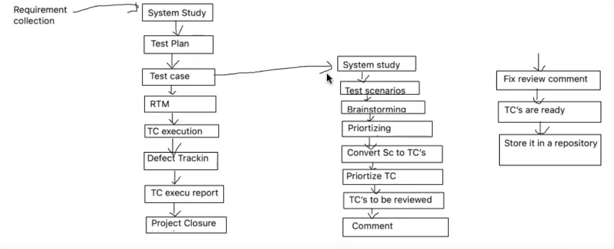

## STLC

STLC stands for Software Testing Life Cycle, and it represents the series of
activities performed during the testing process of a software application or system.  

**System Study:** Customer give requirements in the form of CRS. BA will convert  
CRS to SRS and BA will explain how each and every feature works for the entire  
team. BA will also explain customer business scenarios to teammates. Every Test  
Engineer will understand requirements, while understanding requirements, if they  
find any issues, they will talk to BA and clarify the doubts. This complete process  
of understanding the requirements is called System study.

**Test Plan:** It is a document which derives all the future testing activities.   
Test plan document consists of information regarding how TE are required to test in future,  
which features are to be tested by which Test Engineers, what types of testing to  
be done on project in future, roles and responsibilities of every Engineer working  
on project, which Test cases management tool to use, which defect tracking tool to  
use in future will be maintained in Test plan document.

**Test case:** Once the Test plan is completed, every TE will start writing Test cases  
from their assigned modules, where the TE will follow the procedure to write the  
Test cases. First do System study for assigned modules, later identify all the  
possible scenarios, document it and conduct brainstorming meetings to have good  
coverage, later once scenarios are ready, TE will write Test cases by applying 
  Test  
case design Technique in Test case Template and get it reviewed by reviewers. If  
there is any problem in Test cases, it will be fixed by TE and later it will be  
approved by Test Lead. Finally Test case will be Test case repository.

**Prepare Traceability matrix** — It is a document which ensures that each and  
every requirement has got at least 1 Test case. There are 3 types of Traceability  
matrix.   
They are:  
1)**Forward Traceability Matrix** — It is used to map requirements to the test
cases. This is done before Test case execution. Here we are ensuring that the
product developments are going in the right direction.  

**2) Backward Traceability Matrix** — It is used to map Test cases to the
requirement. This is done after Test case execution. Here we are ensuring that
we are not going against/developing products against customer requirements.  

**3) Bi-directional Traceability Matrix** — It is a combination of both Forward
Traceability Matrix and Backward Traceability Matrix.

**Test case execution:** In this stage, developers will give the build to Test  
Engineers and Test Engineers will start to test the build by executing the Test  
cases against the application where in TE will do Smoke testing, Functional  
Testing, Integration Testing, System Teiting etc. Since Test Engineers are testing  
the application by looking into Test cases, it is called Test case execution. 
  Here,  
we follow the procedure to execute the test cases.

**Defect Tracking:** While executing the test cases, if the Test engineer finds any  
defects, he will login to Defect tracking tool and prepare defect report and  
communicate to developer with unique åefect id. Developer will fix the defect and  
TE will retest the defect and if the defect is really fixed. He will close the   bug or TE  
will re-open the bug. This is called Defect Tracking.  

**Test case execution report:** TL's will prepare Test case execution report/test  
case summary report for every build/feature/test cycle/ end of eery Release. This  
report consists of how Test cases are written, executed, not executed, pass or fail.  
This report will be sent to Management team, Development team, Testing team,
customers  

**Release Retrospect meeting or Project closure meeting:** Once Testing is  
completed, at the end of the Project, Test manager will do this meeting called as  
Release Retrospect meeting where in he will invite all the Test engineers who has  
worked on project and discuss about the mistakes and achievements done by Test  
engineers, while working on project.  