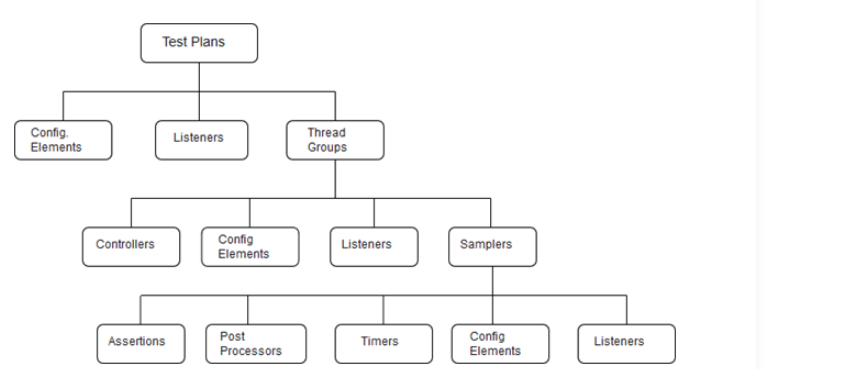

# Performance Testing Tools

> Topic

1. Load Runner
2. IBM -Rational Performance tester
3. Jmeter
4. BlazeMeter
5. Neo Load

## Load Runner

**LoadRunner** is a performance testing tool. It is widely used for testing applications by simulating real-life user loads and analyzing system behavior under load. Originally developed by **Mercury Interactive**, LoadRunner is now owned by **Micro Focus**.

### Key Features of LoadRunner

1. **Performance Testing**: Simulates thousands of concurrent users to identify system performance under varying load conditions.
2. **Protocol Support**: Supports a wide range of protocols (HTTP/HTTPS, Web Services, SAP, Oracle, etc.) for testing diverse applications.
3. **Components**:
   - **Virtual User Generator (VuGen)**: Used to create and edit scripts that simulate user actions.
   - **Controller**: Manages and executes test scenarios by controlling the load distribution.
   - **Analysis**: Provides detailed performance analysis and reports to identify bottlenecks.
4. **Integration**: Can integrate with Continuous Integration (CI) tools like Jenkins for automated performance testing.
5. **Cloud and Hybrid Testing**: Supports performance testing in cloud environments.

### Common Use Cases

- Testing website performance under peak traffic.
- Measuring database performance under a high number of transactions.
- Analyzing application behavior during stress and scalability testing.

* It's a paid tool and very costly

## IBM - Rational Performance tester

**Rational Performance Tester (RPT)** is a performance testing tool developed by **IBM**. It is part of the IBM Rational Software suite and is designed to test the scalability and performance of web-based and server-based applications. It provides features for automating performance tests and identifying system bottlenecks.

### Key Features of Rational Performance Tester (RPT)

1. **Automated Performance Testing**:
   - Simulates multiple user interactions with the application under test to measure performance under load.
   - Automates the creation, execution, and analysis of performance tests.

2. **Protocol Support**:
   - Supports various protocols such as HTTP, HTTPS, SOAP, and database communication protocols.

3. **Test Recording and Playback**:
   - Provides a user-friendly interface to record user interactions and generate scripts automatically.
   - Scripts can be replayed to simulate multiple users accessing the system concurrently.

4. **Integration with Other Tools**:
   - Integrates seamlessly with other IBM Rational tools like Rational Functional Tester and Rational Quality Manager.
   - Can be incorporated into DevOps pipelines for continuous testing.

5. **Dynamic Data Handling**:
   - Supports parameterization and correlation to use dynamic data during test execution.

6. **Analysis and Reporting**:
   - Offers detailed reporting and real-time analysis to identify system bottlenecks.
   - Provides visual insights, such as graphs and charts, to evaluate application performance.

7. **Scalability Testing**:
   - Helps test applications for scalability by simulating an increasing number of users or transactions.

8. **Cloud Testing**:
   - Can test applications deployed on cloud infrastructure.

### Use Cases

- Verifying the performance of web and enterprise applications.
- Measuring response times, throughput, and resource utilization under load.
- Stress testing applications to identify breaking points.
- Identifying bottlenecks in applications, databases, or network layers.

### Comparison with Other Tools

- Compared to tools like **LoadRunner** or **JMeter**, RPT is known for its integration with the IBM ecosystem and ease of use in enterprises already utilizing IBM Rational products.
- It may not be as widely used as open-source tools (e.g., **JMeter**) due to licensing costs but is favored in enterprise environments that require comprehensive performance testing with IBM support.

## Jmeter

**JMeter** is an open-source performance testing tool developed by the **Apache Software Foundation**. It is widely used for testing the performance, scalability, and load of web applications, APIs, and other server-based applications. JMeter is known for its flexibility, ease of use, and robust features for both beginners and experienced testers.

---

### **Key Features of JMeter**

#### 1. **Open-Source and Free**

   - JMeter is completely free to use and open-source, making it an attractive choice for organizations and individuals.

#### 2. **Protocol Support**

   - Primarily designed for **web applications**, it supports a variety of protocols, including:
     - HTTP/HTTPS
     - FTP
     - JDBC (Database)
     - SOAP/REST (Web Services)
     - SMTP, POP3, IMAP (Mail protocols)
     - TCP

#### 3. **Performance Testing**

   - Simulates multiple users to test application performance under load.
   - Performs stress, load, and endurance testing to determine the scalability and reliability of applications.

#### 4. **User-Friendly Interface**

   - Provides a graphical user interface (GUI) for creating and managing test plans, making it accessible to beginners.
   - Supports script creation through recording user actions.

#### 5. **Extensibility**

   - Allows users to extend its functionality using custom plugins or Java code.
   - Supports integrations with CI/CD tools like Jenkins for automated testing.

#### 6. **Test Plans**

   - Uses a tree-based structure to define test plans, including elements like Thread Groups, Samplers, Listeners, and Timers.

#### 7. **Distributed Testing**

   - Supports distributed or remote testing by utilizing multiple machines to generate higher loads.

#### 8. **Reporting and Analysis**

   - Provides detailed and customizable reports in real-time.
   - Supports graphs, charts, and logs to analyze performance metrics like response time, throughput, and error rates.

#### 9. **Cross-Platform**

   - Being Java-based, JMeter runs on multiple platforms, including Windows, macOS, and Linux.

#### 10. **Community and Plugins**

   - Has a large and active community offering extensive documentation, tutorials, and plugins to enhance functionality.

---

### **Use Cases of JMeter**

- **Web Application Testing**: Analyze website performance under different user loads.
- **API Testing**: Test RESTful and SOAP APIs for response times and reliability.
- **Database Performance**: Measure query execution times using JDBC connections.
- **File Server Testing**: Validate FTP server performance.
- **Mail Server Testing**: Test email servers using SMTP, POP3, and IMAP protocols.
- **Mobile App Performance**: Simulate mobile traffic using HTTP or HTTPS.

---

### **Advantages of JMeter**

- **Cost-Effective**: Free and open-source.
- **Ease of Use**: Simple GUI for creating and managing test plans.
- **Scalability**: Distributed testing for generating massive loads.
- **Community Support**: Extensive online resources and plugins.

---

### **Limitations of JMeter**

1. **Browser Simulation**:
   - JMeter does not simulate the real behavior of a browser (e.g., JavaScript execution, rendering).
   - Tools like **Selenium** are better for front-end testing.

2. **Memory Usage**:
   - High resource consumption during large-scale tests.

3. **Steep Learning Curve**:
   - While the GUI is user-friendly, mastering advanced features (e.g., correlation and custom scripting) requires effort.

---

### **JMeter vs. Other Tools**

- **JMeter vs. LoadRunner**: 
  - JMeter is free, whereas LoadRunner is a paid enterprise tool with more comprehensive features.
  - LoadRunner offers better reporting and monitoring for large organizations.

- **JMeter vs. Gatling**:
  - JMeter is GUI-based and easier for beginners, while **Gatling** is script-based and optimized for handling high loads with lower resource consumption.

---

### Conclusion

JMeter is an excellent tool for performance and load testing, particularly for organizations looking for a cost-effective, versatile solution. Its open-source nature and wide range of features make it a popular choice in the software testing community.

## BlazeMeter

**BlazeMeter** is a **cloud-based performance testing platform** that extends and enhances the capabilities of Apache JMeter. It provides a more user-friendly and enterprise-ready solution for load and performance testing, with additional features for scalability, collaboration, and integration into CI/CD pipelines. BlazeMeter supports a wide range of testing scenarios, including web, mobile, APIs, and microservices.

---

### **Key Features of BlazeMeter**

#### 1. **Cloud-Based Testing**

   - BlazeMeter runs tests on the cloud, allowing you to generate load from multiple global locations.
   - Eliminates the need for local hardware to generate heavy loads.

#### 2. **JMeter Compatibility**

   - Fully compatible with JMeter test scripts, making it easy to scale existing JMeter tests.
   - Provides additional features like advanced reporting and collaboration.

#### 3. **Protocol Support**

   - Supports HTTP/HTTPS, SOAP, REST APIs, WebSockets, FTP, and more.
   - Extends support to newer technologies like GraphQL, and even mobile performance testing.

#### 4. **Real-World User Simulation**

   - Simulates real-world user behavior by generating traffic from multiple geographic locations.
   - Enables performance testing for global user bases.

#### 5. **Scalability**

   - Supports testing with millions of concurrent virtual users, scaling well beyond what JMeter can handle on local machines.

#### 6. **Test Creation and Execution**

   - Offers a user-friendly interface for creating, executing, and managing tests.
   - Allows importing test scripts from JMeter, Gatling, and other tools.
   - Supports scriptless testing through its "Mock Services" and API test features.

#### 7. **Integration with CI/CD Pipelines**

   - Integrates with Jenkins, Bamboo, GitLab, CircleCI, and other CI/CD tools for automated performance testing.
   - Enables continuous testing during the development lifecycle.

#### 8. **Reporting and Analysis**

   - Provides detailed and visual reports with metrics like response time, error rate, throughput, and more.
   - Supports real-time monitoring and post-test analysis to identify bottlenecks.

#### 9. **Collaboration**

   - Allows teams to share test results and collaborate through its cloud platform.
   - Enables centralized test management for distributed teams.

#### 10. **Browser and Mobile Testing**

   - Supports browser-based and mobile testing for better simulation of real-world scenarios.

#### 11. **Load Generation Locations**

   - Load can be generated from multiple data centers across the globe, simulating geographically distributed users.

#### 12. **Mock Services**

   - Provides mocking capabilities to test APIs without depending on live environments.

---

### **Use Cases for BlazeMeter**

- Load testing websites and web applications for scalability under peak traffic.
- Stress testing APIs and backend services to identify performance bottlenecks.
- Running performance tests as part of a CI/CD pipeline for continuous delivery.
- Mobile app performance testing.
- Simulating global user traffic to test response times and latency.

---

### **Advantages of BlazeMeter**

1. **Ease of Use**: Intuitive interface and easy setup for beginners and teams.
2. **Scalability**: Can handle massive load testing scenarios using cloud infrastructure.
3. **Integration**: Works seamlessly with JMeter, Gatling, Jenkins, and other tools.
4. **Global Reach**: Supports load generation from multiple global locations.
5. **Real-Time Analytics**: Provides actionable insights during and after test execution.
6. **Enterprise Ready**: Designed for collaboration and large-scale testing needs.

---

### **Limitations of BlazeMeter**

1. **Cost**:
   - BlazeMeter is a paid platform, with pricing based on the number of virtual users and test duration.
   - May not be ideal for small teams or individuals with tight budgets.
   
2. **Dependency on Cloud**:
   - Requires internet connectivity to run tests and access results.

3. **Learning Curve**:
   - While easier than JMeter for some tasks, advanced features may still require training.

---

### **Comparison with Other Tools**

- **BlazeMeter vs. JMeter**:
  - BlazeMeter extends JMeter's capabilities, offering cloud scalability, real-time reporting, and collaboration tools.
  - JMeter is free but requires significant setup for distributed or large-scale testing.

- **BlazeMeter vs. LoadRunner**:
  - BlazeMeter is cloud-native, while LoadRunner is more traditional, with powerful enterprise features.
  - BlazeMeter is better suited for teams already using JMeter or looking for a modern, agile solution.

- **BlazeMeter vs. Gatling**:
  - BlazeMeter supports Gatling scripts and offers a GUI for easier management.
  - Gatling is script-heavy but highly optimized for large loads with minimal resource usage.

---

### Conclusion

BlazeMeter is a powerful, cloud-based performance testing platform ideal for modern, agile, and distributed teams. It offers a user-friendly experience, scalability, and robust integrations, making it a popular choice for enterprise performance testing. While it comes with a cost, the features and convenience often justify the investment, especially for teams needing large-scale, geographically distributed load testing.

## Neo Load

**NeoLoad** is an enterprise-grade **performance testing tool** developed by **Tricentis**. It is designed to test and monitor the performance, scalability, and reliability of web and mobile applications. NeoLoad specializes in load testing by simulating real-world traffic and integrating seamlessly with DevOps pipelines, enabling continuous performance testing.

---

### **Key Features of NeoLoad**

#### 1. **Protocol Support**

   - Supports a wide range of protocols, including:
     - HTTP/HTTPS
     - WebSockets
     - SOAP/REST APIs
     - GWT, Citrix, Oracle, and more.
   - Includes out-of-the-box support for SAP, Microsoft Dynamics, and other enterprise applications.

#### 2. **User-Friendly Interface**

   - Provides an intuitive, graphical user interface (GUI) for creating, executing, and analyzing performance tests.
   - Offers a drag-and-drop design for test scenarios, reducing the need for scripting.

#### 3. **Real-World Traffic Simulation**

   - Simulates a variety of user behaviors and workloads, including peak and average traffic.
   - Supports testing across different network conditions (e.g., 3G, 4G, 5G).

#### 4. **Test Automation and CI/CD Integration**

   - Integrates with CI/CD tools like Jenkins, Bamboo, Azure DevOps, GitLab, and more.
   - Allows for automated performance testing as part of the continuous delivery process.

#### 5. **Dynamic Test Design**

   - Supports parameterization and correlation to handle dynamic data and session variables.
   - Automatically detects and updates dynamic parameters in test scripts.

#### 6. **Cloud and On-Premise Testing**

   - Supports hybrid testing environments, including cloud and on-premise options.
   - Enables load generation from multiple geographic locations via cloud infrastructure.

#### 7. **Monitoring and Analysis**

   - Offers built-in application and server monitoring tools.
   - Provides detailed reports with metrics like response times, throughput, error rates, and server resource usage.
   - Includes dashboards for real-time performance monitoring.

#### 8. **Collaboration**

   - Enables teams to collaborate on test design, execution, and analysis through shared repositories and version control.

#### 9. **Scriptless Testing**

   - Features a **no-code** approach for test creation, making it accessible to non-technical users.
   - Advanced users can customize scripts using JavaScript or Groovy for complex scenarios.

#### 10. **Scalability**

   - Supports large-scale load testing with thousands or millions of virtual users.
   - Efficiently uses resources to handle high levels of concurrent user simulations.

---

### **Use Cases of NeoLoad**

1. **Load Testing**:
   - Analyze application performance under heavy traffic or peak load conditions.
   
2. **Stress Testing**:
   - Determine application behavior under extreme stress and identify breaking points.

3. **Endurance Testing**:
   - Evaluate application stability over prolonged periods of continuous use.

4. **API Testing**:
   - Test RESTful and SOAP APIs for performance and reliability.

5. **Mobile Testing**:
   - Simulate mobile app performance under varying network conditions.

6. **Enterprise Applications**:
   - Performance test complex enterprise solutions like SAP and Oracle.

---

### **Advantages of NeoLoad**

1. **Ease of Use**:
   - Intuitive GUI and scriptless test creation make it beginner-friendly.

2. **Enterprise Focus**:
   - Designed for large-scale applications and enterprise use cases.

3. **Comprehensive Monitoring**:
   - Combines performance testing with server and application monitoring.

4. **Collaboration and Reusability**:
   - Shared repositories and version control promote team collaboration and script reuse.

5. **DevOps and CI/CD Ready**:
   - Integrates seamlessly into modern DevOps workflows for continuous testing.

---

### **Limitations of NeoLoad**

1. **Cost**:
   - NeoLoad is a commercial tool and may be expensive for small teams or individual testers.
   
2. **Resource Intensive**:
   - Requires substantial hardware resources for large-scale on-premise testing.

3. **Learning Curve**:
   - While scriptless, mastering advanced features (e.g., dynamic correlation and custom scripting) requires expertise.

4. **Limited Open-Source Community**:
   - Unlike JMeter, NeoLoad has less community-driven support and plugins due to its commercial nature.

---

### **Comparison with Other Tools**

#### **NeoLoad vs. JMeter**

- **Ease of Use**: NeoLoad's GUI and scriptless testing are more user-friendly than JMeter's XML-based test plans.
- **Cost**: JMeter is free, while NeoLoad is a paid tool.
- **Scalability**: NeoLoad handles large-scale enterprise testing more efficiently.

#### **NeoLoad vs. LoadRunner**

- **User-Friendliness**: NeoLoad is more user-friendly with modern features for DevOps integration.
- **Cost**: LoadRunner is costlier for similar enterprise features.
- **Protocol Support**: LoadRunner supports more protocols out of the box.

#### **NeoLoad vs. BlazeMeter**

- **On-Premise Support**: NeoLoad offers stronger on-premise testing capabilities.
- **Cloud Flexibility**: BlazeMeter excels in cloud-based testing and JMeter compatibility.

---

### Conclusion

NeoLoad is an excellent choice for organizations looking for an **enterprise-grade performance testing tool** that is easy to use, highly scalable, and integrates seamlessly into DevOps processes. While it comes with a cost, its robust features, collaboration tools, and support for modern testing environments make it ideal for businesses focused on large-scale, enterprise applications.

```
In real world => To create production environment it will be too costly.
Replicate the server
```

## Questions
1. What is the difference between production, staging, developers and testers environment
2. What is Mock Server?

* Apache JMeter is a powerful open-source tool designed for performance and load testing. Here's a list of things you can test with JMeter, grouped by common categories:

---

### **1. Performance Testing**
- **Load Testing:** Evaluate how the system performs under a specific load, such as:
  - Number of concurrent users.
  - Volume of requests in a given time frame.
- **Stress Testing:** Push the system to its limits by increasing load until it breaks to find the breaking point.
- **Spike Testing:** Test how the system handles sudden spikes in traffic or load.
- **Soak Testing (Endurance):** Check system stability over a prolonged period of sustained load.

---

### **2. Web Application Testing**
- **HTTP Requests:**
  - Simulate GET, POST, PUT, DELETE, etc.
  - Test the performance of static and dynamic web pages.
- **Session Management:**
  - Test session handling by sending cookies or session tokens.
- **Authentication:**
  - Test login functionality (Basic Auth, OAuth, Token-based).
- **Form Submissions:**
  - Test how forms behave under load (e.g., search queries, data entry).

---

### **3. API Testing**
- Test REST and SOAP APIs for:
  - Response times under load.
  - Functional correctness (status codes, response structure).
  - Parameterized tests (dynamic data input).
- Evaluate:
  - Headers, payload, and query parameters.
  - Throughput and latency of API endpoints.

---

### **4. Database Testing**
- Simulate SQL queries (via JDBC Connection):
  - Load test complex queries.
  - Analyze database performance under concurrent access.
  - Test response time for read/write operations.

---

### **5. File and Data Testing**
- Test bulk file uploads or downloads:
  - Evaluate upload/download speeds and errors.
  - Simulate large files or multiple files (e.g., images, CSVs, JSON).
- Analyze data processing pipelines:
  - Data ingestion into systems.

---

### **6. FTP and Mail Testing**
- **FTP Servers:**
  - Upload and download files.
  - Test connection handling with concurrent users.
- **SMTP/IMAP/POP3 Servers:**
  - Test email sending and receiving under load.

---

### **7. Distributed Testing**
- Test how a system behaves when accessed by users from multiple geographical locations by using JMeter in distributed mode.

---

### **8. Integration Testing**
- Simulate workflows across multiple systems:
  - E.g., User submits a form → API processes data → Backend updates a database.

---

### **9. Mobile Application Testing**
- Test the performance of mobile apps by recording requests/responses from the app to the backend server.
- Simulate mobile-specific network conditions like 3G, 4G, and low bandwidth.

---

### **10. Cloud and Microservices Testing**
- Test the scalability and elasticity of cloud applications.
- Simulate API calls to microservices to check inter-service communication performance.

---

### **11. Streaming and Multimedia Testing**
- Evaluate performance for streaming services (e.g., video or audio streams).
- Test large data transfer (e.g., via WebSockets or similar protocols).

---

### **12. Network Protocol Testing**
- Evaluate the performance of TCP, UDP, and JMS (Java Messaging Service) protocols.
- Test custom protocols with plugins or scripting.

---

### **13. Third-Party Integrations**
- Test the response times and reliability of third-party services integrated into your application (e.g., payment gateways, messaging services).

---

### **14. Custom Use Cases**
- Simulate workflows or specific business scenarios, such as:
  - User registrations and shopping cart processes.
  - Simultaneous access to restricted content.
  - Simulating different user types (admins, regular users).

---

### **Key Metrics Collected in JMeter**
- Response time (min, max, average, median).
- Throughput (requests/second).
- Error rates (percentage of failed requests).
- Latency (time taken for the server to start responding).
- Bandwidth usage.

---

JMeter can cover a wide range of testing scenarios, but its efficiency depends on how well the test plan is designed and the extent of your knowledge of the system under test. Let me know if you want help setting up a specific use case!


#  Major components of JMeter:
1. Test Plan
2. Thread Group
3. Controllers
4. Listeners
5. Timers
6. Configuration Elements
7. Pre-Processor Elements
8. Post-Processor Elements



## Test Plan

A test plan can be visualized as your JMeter script for running tests. A test plan consists of test elements such as thread groups, logic controllers, sample-generating controllers, listeners, timers, assertions, and configuration elements.

A test plan consists of all steps which execute the script. Everything which is included in a test plan is executed in a sequence which is top to bottom or as per the defined sequence in the test plan. 

## Thread Group

As the name implies, thread group represents the group of threads JMeter will use during the test. Thread group elements are the beginning points of any test plan. The controls provided by a thread group allow you to:

Set the number of threads.
Set the ramp-up period.
Set the number of times to execute the test.