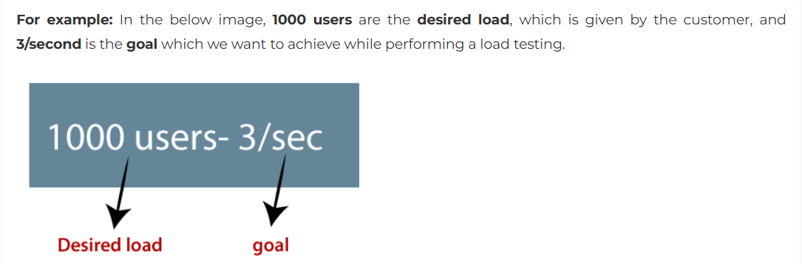

# What is performance testing?

Performance testing is the practice of evaluating how a system performs in terms of responsiveness and   
stability under a particular workload. Performance tests are typically executed to examine speed, robustness,   
reliability, and application size. The process incorporates performance indicators such as:

* Browser, page, and network response times
* Server request processing times
* Acceptable concurrent user volumes
* Processor memory consumption; number and type of errors that might be encountered with app

## Performance testing types

Different types of performance testing are conducted throughout the development lifecycle to ensure that the application meets performance requirements and user expectations. Here are the primary types of performance testing:

* **Load tests** simulate the number of virtual users who might use an application. In reproducing realistic usage and load conditions based on response times, this test can help identify potential bottlenecks. It also enables you to understand whether it’s necessary to adjust the size of an application’s architecture.

* **Unit tests** simulate the transactional activity of a functional test campaign; their goal is to isolate transactions that could disrupt the system.

* **Stress tests** evaluate the behavior of systems during peak activity. These tests significantly and continuously increase the number of users during the testing period.

* **Soak tests** increase the number of concurrent users and monitor the behavior of the system over a more extended period. The objective is to observe whether intense and sustained activity over time shows a potential drop in performance levels, making excessive demands on the resources of the system.

* **Spike tests** seek to uncover implications to the system operations when activity levels are above average. Unlike stress testing, spike testing considers the number of users and the complexity of actions performed (hence the increase in several business processes generated).

* **Volume tests** focus on assessing the system’s ability to handle a large volume of data. They evaluate how the application performs when subjected to a significant amount of data input, such as large databases or files, ensuring that performance does not degrade as data volume increases.

* **Endurance Tests:** Endurance tests assess the system’s stability and performance over an extended period under a consistent workload. They aim to uncover any memory leaks, performance degradation, or other issues that may occur when the application runs continuously for hours, days, or even weeks.

* **Compatibility tests** assess the application’s performance across different environments, platforms, devices, and configurations. They ensure that the application performs optimally on various operating systems, browsers, network conditions, and hardware setups, providing a consistent user experience across different environments.

* **Regression tests** assess whether recent changes to the application code have impacted its performance negatively. They help ensure that new features, updates, or fixes do not introduce performance regressions or degrade the overall system performance compared to previous versions.

* **Endurance tests** assess the system’s stability and performance over an extended period under a consistent workload. They aim to uncover any memory leaks, performance degradation, or other issues that may occur when the application runs continuously for hours, days, or even weeks, ensuring long-term reliability and robustness.

* **Scalability tests** evaluate how well the application can scale up or down to accommodate changes in workload or user demand. They assess the system’s **ability to maintain performance levels as the number of users, transactions, or data volume increases** or decreases, helping identify scalability limitations and bottlenecks.

* **Resilience tests** evaluate the application’s ability to withstand and recover from failures or disruptions gracefully. They simulate various failure scenarios, such as network outages, server crashes, or database failures, to assess how the application responds and recovers without data loss or significant downtime.

* **Reliability tests** assess the system’s stability, availability, and resilience under real-world conditions, simulating failure scenarios and adverse conditions. They validate the system’s ability to maintain consistent performance and functionality over time, ensuring reliable operation in production environments.

* **Stability** - Even under the peak load , the server should not fail.

* **Benchmarking** -
* **Resource utilization** - 
* **Ramp-up/down Testing** - 

# What is the performance testing process?

While testing methodology can vary, there is a generic framework you can use to identify weaknesses and ensure that everything will work properly in various circumstances.

* **Identify the testing environment.** Before you begin the testing process, it’s essential to understand the details of the hardware, software, and network configurations you’ll be using. Comprehensive knowledge of this environment makes it easier to identify problems that testers may encounter.
* **Identify performance acceptance criteria:** Before conducting the tests, you must clearly define the success criteria for the application, as it will not always be the same for each project. When you are unable to determine your success criteria, it’s recommended that you use a similar application as the benchmark.
* **Define planning and performance testing scenarios.** To carry out reliable tests, it’s necessary to determine how different types of users might use your application. Identifying key scenarios and data points is essential for conducting tests as close to real conditions as possible.
* **Set up the testing environment.** Begin by configuring the testing environment to mirror the production setup. This includes setting up servers, databases, and network configurations to closely replicate real-world conditions. Ensure that the application under test (AUT) is deployed in this environment. Integrate monitoring tools to collect performance metrics during testing.
* **Implement test design.** Develop test scripts and scenarios based on predefined objectives and acceptance criteria. These scripts should emulate various user interactions and system behaviors. Ensure that the test design aligns with identified key scenarios and data points for realistic testing. Cover different types of tests such as load testing, stress testing, and scalability testing.
* **Run and monitor tests.** Execute the prepared test scripts in the configured environment. Monitor system performance metrics in real-time to evaluate response times, throughput, and resource utilization. Keep a close eye on the test environment for any anomalies or performance bottlenecks. Continuously observe test progress and note any deviations from expected behavior.
Analyze, adjust and re-do the tests. Analyze and consolidate your test results. Once the necessary changes are completed, tests should be repeated to ensure the elimination of any other errors.

# Performance testing success metrics

Clearly define the critical metrics you will be looking for in your tests. These metrics generally include:

**Memory usage:** Use of a computer’s physical memory for processing.  
**Network bandwidth:** Number of bits per second used by the network interface.  
**Disk I/O busy time:** Time the disk is busy with read/write requests.  
**Private memory:** Number of bytes used by a process that cannot be shared with others.  
**Virtual memory:** Amount of virtual memory used.  
**Page faults:** Number of pages written or read to disk to resolve hardware page defects.  
**Page fault rate:** Overall processing rate of faulty pages by the processor.  
**Hardware interrupts:** Average number of hardware interruptions the processor receives/processes each second.  
**Disk I/O queue length:** Average read/write requests queued for the selected disk during a sampling interval.  
**Packet queue length:** Length of the output packet queue.  
**Network throughput:** Total number of bytes sent/received by the interface per second.  
**Response time:** Time taken to respond to a request.  
**Request rate:** Rate at which a computer/network receives requests per second.  
**Pooled connection reuse:** Number of user requests satisfied by pooled connections.  
**Max concurrent sessions:** Maximum number of sessions that can be simultaneously active.  
**Cached SQL statements:** Number of SQL statements handled by cached data instead of expensive I/O operations.  
**Web server file access:** Number of access requests to a file on a web server every second.  
**Recoverable data:** Amount of data that can be restored at any time.  
**Locking efficiency:** Efficiency of table and database locking mechanisms.  
**Max wait time:** Longest time spent waiting for a resource.  
**Active threads:** Number of threads currently running/active.  
**Garbage collection:** Rate at which unused memory is returned to the system.  

