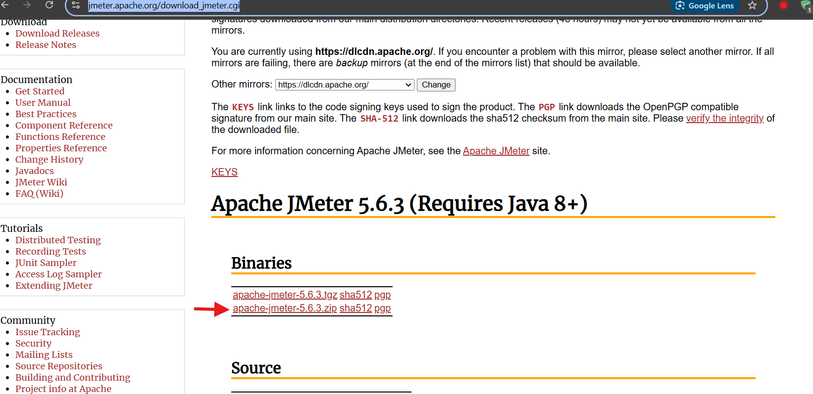
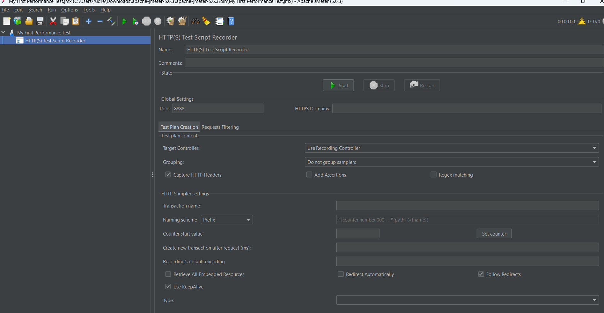
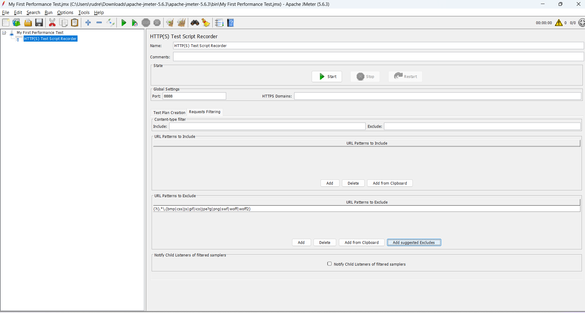
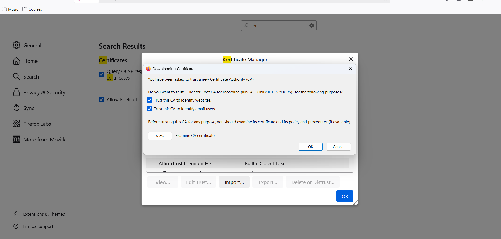

# Installation
https://jmeter.apache.org/download_jmeter.cgi

* Download the binary zip file

* unzip >> Navigate to bin folder >> double click on Jmeter batch file

## Steps
* Right click the test >> Add >> Non-Test Elements >> HTTPS Test Script recorder >> click

Click on "Add suggested excludes"

Click on start button

Add the certificaties in firefox browser
* settings >> search >> type certificates >> click on import >> navigate to apache folder bin and select `ApacheJMeterTemporaryRootCA.crt` >> click open >> click ok and again ok

