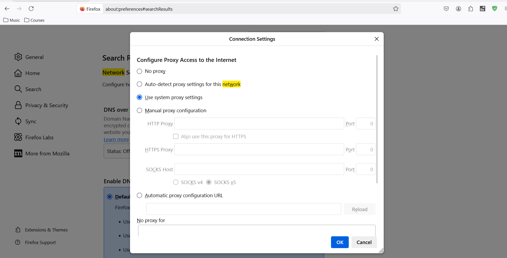
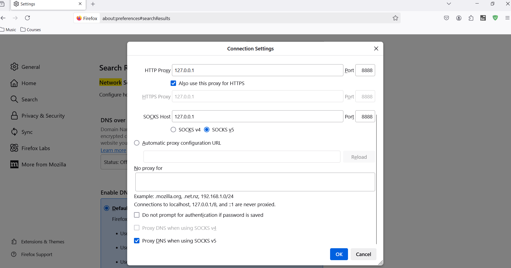
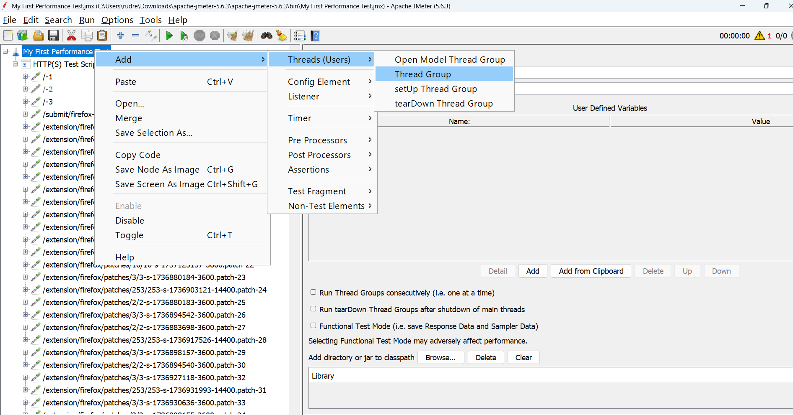
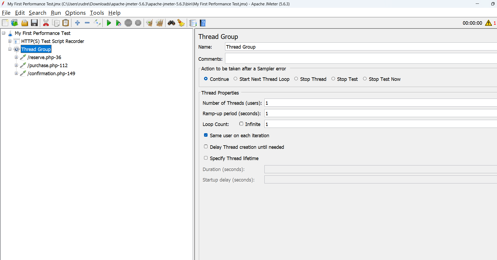
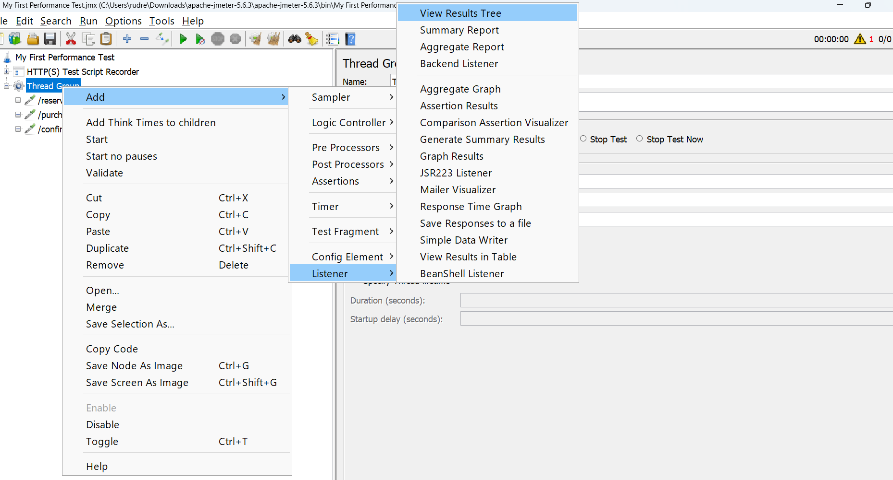

# Installation
https://jmeter.apache.org/download_jmeter.cgi

* Download the binary zip file

* unzip >> Navigate to bin folder >> double click on Jmeter batch file

## Steps
* Right click the test >> Add >> Non-Test Elements >> HTTPS Test Script recorder >> click

Click on "Add suggested excludes"

Click on start button

Add the certificaties in firefox browser
* settings >> search >> type certificates >> click on view certificates >> import >> navigate to apache folder bin and select `ApacheJMeterTemporaryRootCA.crt` >> click open >> click ok and again ok

* search network >> settings

* select Manual proxy configuration
* for `HTTP Proxy` enter 127.0.0.1
* enter port as 8888 as in Jmeter
* select the checkbox `also use this proxy for HTTPS` 

* Now go to Jmeter
* click on start
* enter the url blazedemo.com >>  purchase flight >> enter the details
* stop recording

* create thread group

* cut and paste the .php files in thread group

* Add Listener

