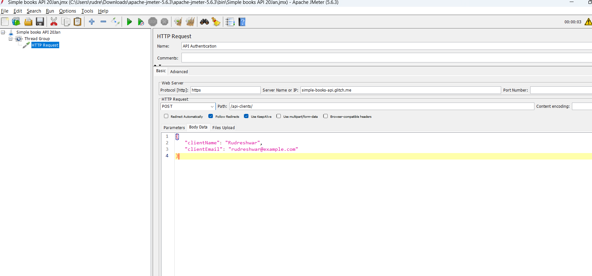
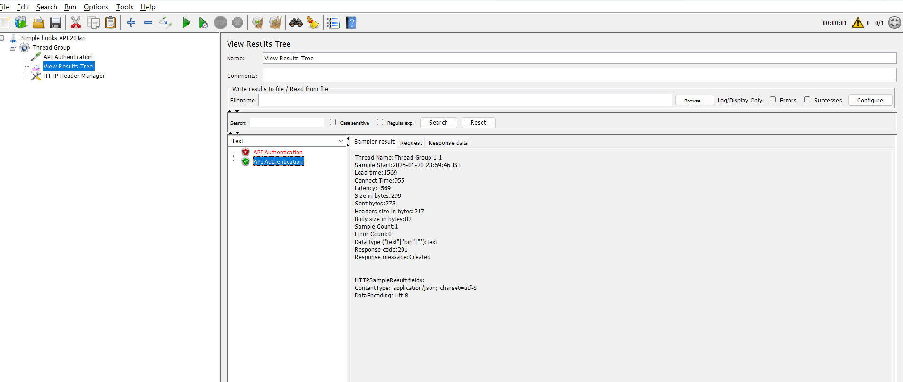

# Performance Test - https://the-internet.herokuapp.com/login

## Add the response assertion - 

e.g. Welcome to the Secure Area 


## Add cookie manager - 


## Cookie Manager
A **Cookie Manager** is a tool or component that helps manage cookies within a web application or a testing environment. Cookies are small pieces of data stored on the user's browser by websites, and they are often used to maintain user sessions, store preferences, or track user behavior.

### Features of a Cookie Manager
1. **Viewing Cookies**: Displays all cookies set by a web application, including details like name, value, domain, expiration date, and flags (e.g., `HttpOnly` or `Secure`).
2. **Adding Cookies**: Allows users to manually add cookies to a browser or application for testing purposes.
3. **Deleting Cookies**: Enables the removal of specific or all cookies from the browser.
4. **Editing Cookies**: Provides the capability to modify the values or properties of existing cookies.
5. **Exporting/Importing Cookies**: Allows saving cookies to a file or importing them from a file for reuse.
6. **Testing Cookie Behavior**: Useful in quality assurance (QA) testing to simulate different user sessions or test application behavior under various cookie scenarios.

### Types of Cookie Managers
- **Browser-Based Cookie Managers**: Built into browsers like Chrome, Firefox, and Edge, or available as browser extensions. They provide basic cookie viewing and management.
- **Development/Testing Tools**:
  - Tools like **Postman** or **Selenium** have cookie management features for automating web testing.
  - Testers can programmatically interact with cookies, such as adding or deleting them, using code.
- **Server-Side Cookie Managers**: Integrated into backend systems to manage cookies programmatically on the server side.

### Example Usage in Testing
1. **Selenium WebDriver**: 
   - `driver.get_cookies()`: Retrieves all cookies.
   - `driver.add_cookie({'name': 'test', 'value': '123'})`: Adds a cookie.
   - `driver.delete_cookie('test')`: Deletes a specific cookie.
2. **Postman**: Manages cookies during API testing by viewing, adding, and deleting cookies associated with a request.

### Benefits
- **Debugging**: Helps identify issues related to user sessions or application behavior.
- **Testing**: Simulates various scenarios, such as expired cookies or multiple user sessions.
- **Security**: Verifies cookie-related security attributes like `HttpOnly`, `Secure`, and `SameSite`.

Would you like to explore how to implement or use a cookie manager in a specific tool or programming language?


# Simple Books API



* Add the HTTP Header manager


```
Name - Content-type
value - application/json
```