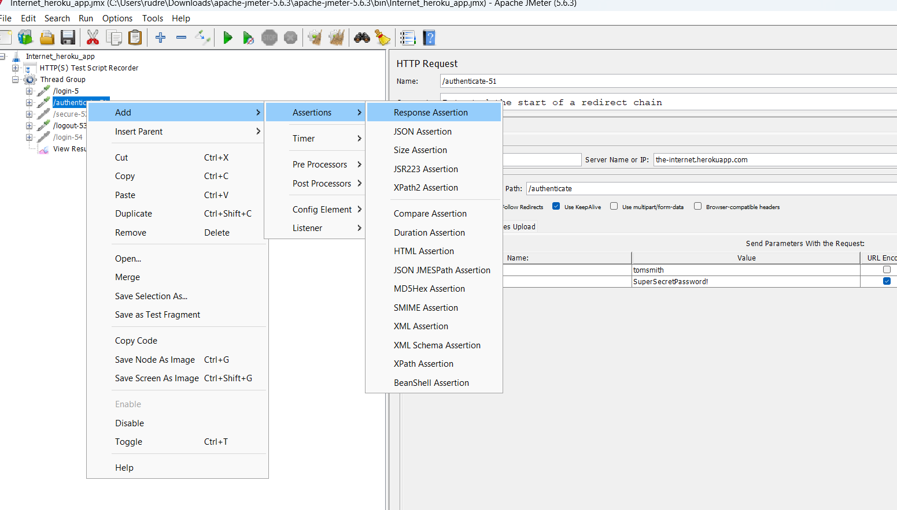

# Performance Test - https://the-internet.herokuapp.com/login

## Add the response assertion - 

e.g. Welcome to the Secure Area 



## Add cookie manager - 


## Cookie Manager
A **Cookie Manager** is a tool or component that helps manage cookies within a web application or a testing environment. Cookies are small pieces of data stored on the user's browser by websites, and they are often used to maintain user sessions, store preferences, or track user behavior.

### Features of a Cookie Manager
1. **Viewing Cookies**: Displays all cookies set by a web application, including details like name, value, domain, expiration date, and flags (e.g., `HttpOnly` or `Secure`).
2. **Adding Cookies**: Allows users to manually add cookies to a browser or application for testing purposes.
3. **Deleting Cookies**: Enables the removal of specific or all cookies from the browser.
4. **Editing Cookies**: Provides the capability to modify the values or properties of existing cookies.
5. **Exporting/Importing Cookies**: Allows saving cookies to a file or importing them from a file for reuse.
6. **Testing Cookie Behavior**: Useful in quality assurance (QA) testing to simulate different user sessions or test application behavior under various cookie scenarios.

### Types of Cookie Managers
- **Browser-Based Cookie Managers**: Built into browsers like Chrome, Firefox, and Edge, or available as browser extensions. They provide basic cookie viewing and management.
- **Development/Testing Tools**:
  - Tools like **Postman** or **Selenium** have cookie management features for automating web testing.
  - Testers can programmatically interact with cookies, such as adding or deleting them, using code.
- **Server-Side Cookie Managers**: Integrated into backend systems to manage cookies programmatically on the server side.

### Example Usage in Testing
1. **Selenium WebDriver**: 
   - `driver.get_cookies()`: Retrieves all cookies.
   - `driver.add_cookie({'name': 'test', 'value': '123'})`: Adds a cookie.
   - `driver.delete_cookie('test')`: Deletes a specific cookie.
2. **Postman**: Manages cookies during API testing by viewing, adding, and deleting cookies associated with a request.

### Benefits
- **Debugging**: Helps identify issues related to user sessions or application behavior.
- **Testing**: Simulates various scenarios, such as expired cookies or multiple user sessions.
- **Security**: Verifies cookie-related security attributes like `HttpOnly`, `Secure`, and `SameSite`.

Would you like to explore how to implement or use a cookie manager in a specific tool or programming language?


# Simple Books API


* Add the HTTP Header manager


```
Name - Content-type
value - application/json
```

## Post Processor
In Apache JMeter, **Post-Processors** are used to process the response received from a server after a request is made. They allow you to extract, manipulate, or process data from the server's response, which can then be used in subsequent requests or assertions.

### Key Features of Post-Processors:
1. **Response Data Handling**: Extract data such as session IDs, tokens, or any dynamic values from the server's response.
2. **Dynamic Behavior**: Make subsequent requests dynamic by using extracted data.
3. **Customization**: Modify or process the response data according to test requirements.

---

### Commonly Used Post-Processors in JMeter:

1. **Regular Expression Extractor**:
   - Extracts data from the response using **regular expressions**.
   - Example Use Case: Extracting a token like `auth_token=abcd1234` from the response.

2. **JSON Extractor**:
   - Extracts data from **JSON responses** using JSONPath expressions.
   - Example Use Case: Extracting a value like `{"token": "abcd1234"}` using the path `$.token`.

3. **XPath Extractor**:
   - Extracts data from **XML or HTML responses** using XPath queries.
   - Example Use Case: Extracting the value of an XML tag `<userId>12345</userId>`.

4. **CSS/JQuery Extractor**:
   - Extracts data using CSS selectors (works with HTML responses).
   - Example Use Case: Extracting a value from an HTML element like `<div class="price">100</div>` using a CSS selector `.price`.

5. **BeanShell PostProcessor**:
   - Executes custom Java code to process the response.
   - Example Use Case: Applying complex logic or transformations on the response data.

6. **JSR223 PostProcessor**:
   - Similar to BeanShell but supports other scripting languages (like Groovy).
   - Example Use Case: Performing advanced operations with better performance than BeanShell.

7. **Debug PostProcessor**:
   - Outputs JMeter variables and properties to the log for debugging purposes.
   - Example Use Case: Debugging the extracted values and ensuring correct behavior.

---

### How to Add a Post-Processor in JMeter:
1. Right-click on the HTTP Request or sampler.
2. Navigate to **Add** → **Post-Processor**.
3. Select the desired Post-Processor (e.g., Regular Expression Extractor, JSON Extractor).

---

### Example Workflow with a Post-Processor:
1. **Scenario**:
   - Login API returns a response containing a session token.
   - You need this token for subsequent API requests.

2. **Steps**:
   - Add an HTTP Request sampler for the Login API.
   - Add a JSON Extractor as a Post-Processor to extract the session token.
   - Use the extracted token in subsequent API requests by referencing it as `${variable_name}`.

---

Post-Processors are essential in JMeter for handling dynamic and dependent test scenarios, enabling robust and flexible performance testing.


`$..accessToken`

* JSON Extractor


* submit a request

