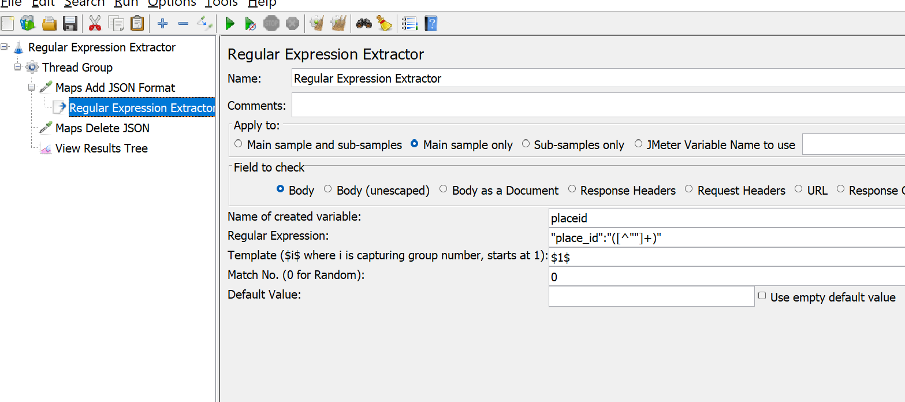
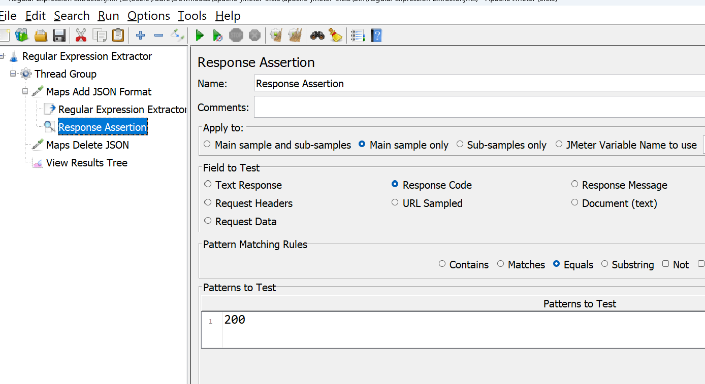
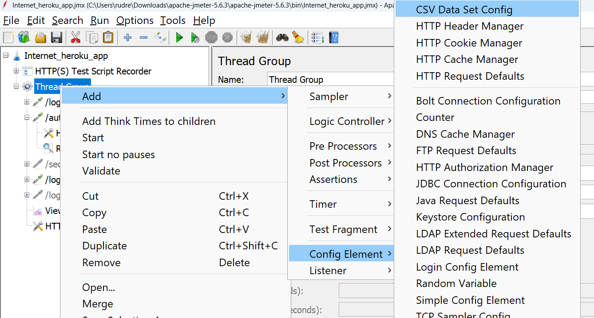
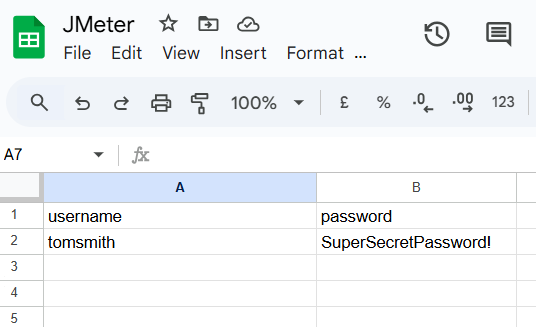
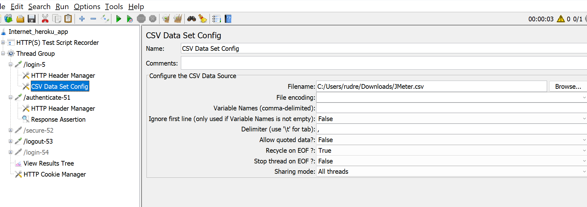
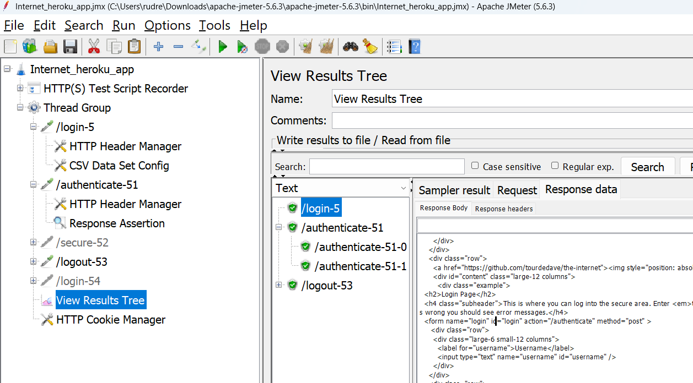

# Regular Expression Extractor

The **Regular Expression Extractor** in JMeter is a post-processor used to extract specific values or information from the server's response using **regular expressions**. These extracted values can then be used later in the test plan, such as in subsequent requests, assertions, or even for debugging purposes.

### Key Features of Regular Expression Extractor:
1. **Extracts Data Dynamically**:
   - It can extract dynamic data like session tokens, CSRF tokens, user IDs, or any other response values required in the test.
   
2. **Uses Regular Expressions**:
   - A flexible and powerful method for pattern matching and capturing data from response bodies, headers, or other parts of the server's response.

3. **Variable Storage**:
   - The extracted data is stored in a JMeter variable, which can be referenced in later steps using the syntax `${variable_name}`.

---

### Configuration Options:
1. **Name of the variable to store the result**:
   - The name of the variable where the extracted value will be stored.

2. **Regular Expression**:
   - A pattern to define what to extract. For example:
     - To extract a session ID from a response like `SessionID=abcd1234efgh5678`, you can use the regular expression: `SessionID=(\w+)`.

3. **Template**:
   - Specifies which group from the regular expression to use.
     - `$1$` means the first captured group.
     - `$2$` means the second captured group, and so on.

4. **Match No.**:
   - Specifies which occurrence to extract if there are multiple matches:
     - `0` to extract all matches.
     - `1` for the first match.
     - `2` for the second match, and so on.

5. **Default Value**:
   - A fallback value if no match is found.

---

### How to Use Regular Expression Extractor:
1. Add it as a **Post-Processor**:
   - Right-click on a request (e.g., HTTP Request) → Add → Post Processors → Regular Expression Extractor.

2. Configure Fields:
   - **Apply to**: Choose whether the extractor should apply to the main sample, sub-samples, or specific content like headers or body.
   - Define the **regular expression** and other required fields.

3. Reference the Extracted Variable:
   - Use `${variable_name}` in subsequent requests or assertions.

---

### Example:
#### Scenario:
- Response Body: 
  ```html
  <html>
    <body>
      <p>Your session ID is: abcd1234efgh5678</p>
    </body>
  </html>
  ```

#### Steps:
1. Add a Regular Expression Extractor.
2. Configure it as follows:
   - **Name of variable**: `sessionID`
   - **Regular Expression**: `Your session ID is: (\w+)`
   - **Template**: `$1$`
   - **Match No.**: `1`
   - **Default Value**: `NOT_FOUND`
3. Use `${sessionID}` in subsequent requests.

#### Result:
- If the extraction is successful, `${sessionID}` will contain `abcd1234efgh5678`. If not, it will contain `NOT_FOUND`.

---

### Tips:
- Test your regular expressions using online tools like [regex101](https://regex101.com/) before adding them to JMeter.
- Enable **Debug Sampler** to verify extracted variables during test execution.
- Always provide a default value to handle scenarios where the pattern does not match.




## Response Assertion

* Response code


## Read Data From CSV file



Give the path of file CSV created



* Set the CSV data config in login



