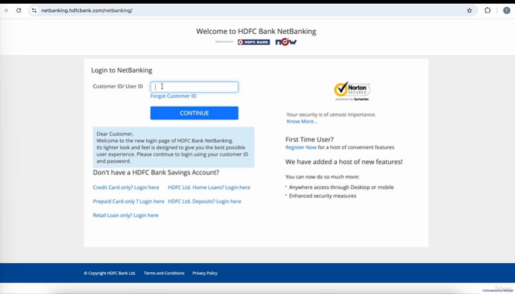
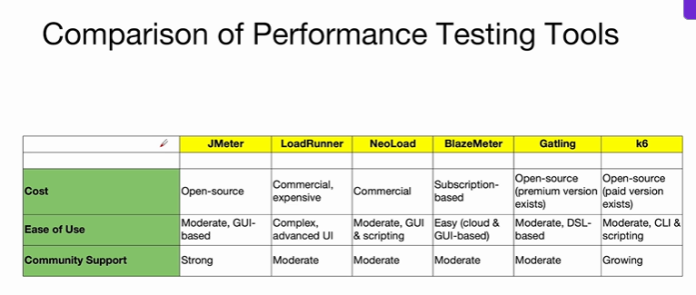
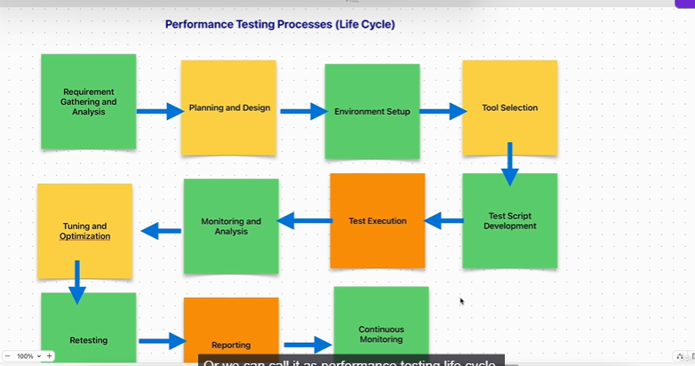
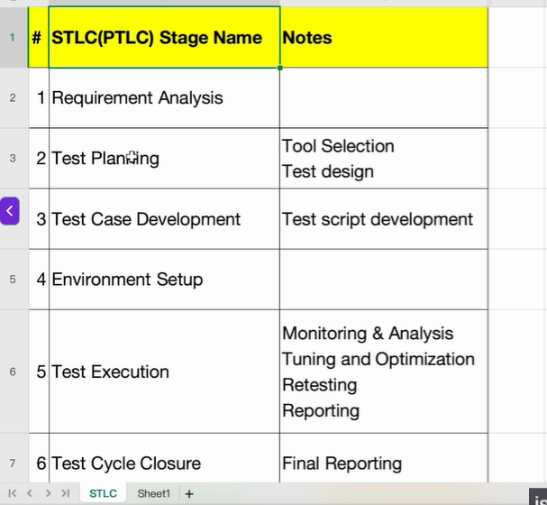
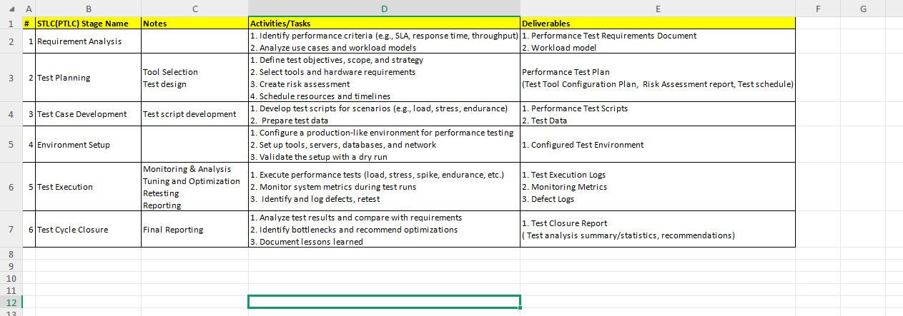
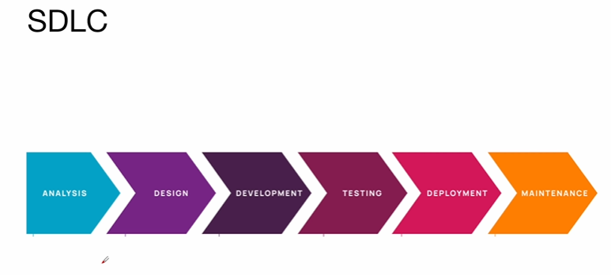

# Essentials of Performance Testing

## Introduction to Performance Testing
* Checking how well something works under pressure

> When the same functional testing is done by lot of users at the same time, then it is called performance testing  
> e.g. Login, fund transfer, mobile top-up => Normal functional testing

* Basically we will be simulating the user load by using tools like JMeter. These tools will create virtual users and apply the load to the system

* Example - I will search the product, then add the product, do the checkout and make the payment => This is normal functional testing
  * When this is done by multiple users - 100 users, 1000 users, 10000 users

=> Real life scenario  
* Online shopping on black friday or diwali sale
* Online Exam platforms
* Booking a movie ticket or train tickets

**Analogy** - Suppose you are organizing a party at your house for 50 people. can kitchen can handle for everyone, music and sound system.
You need to plan accordingly.  

## Why do we need performance testing
* Websites will be slow and users become unhappy
* 

## What is Performance Testing?
* Performance testing is the process of measuring an application's speed, stability and scalability under different conditions to ensure it performs well handling various loads.

* How fast or well it work under different load

Speed, stability and scalability  

## Types of Performance Testing
* **Load Testing** - Testing with **expected** user load
  * Testing on a regular day
* **Stress testing** - Test **beyond** normal user load
  * On black friday sale
  * Diwali sale
  * Viral event on social media
* **Spike Testing** - Sudden, sharp increase in user load
  * Ticket booking suddenly on a website
* **Endurance Testing**
  * Normal load but extended period of time
  * We check if there is any memory leak
* **Scalabilty Testing**
  * Scale up and scale down the user load
  * To determine how well the system scales up or scales down
  * Cloud based system - resources will be added dynamically
* **Volume Testing** - 
  * Processing large volume of data
  * Whatspp - exchanged millions of message per minute
  *  It's a kind of database testing
*  **Benchmark testing**
   *  Compare against benchmark/pre-defined standard
   *  Comparing with competitor's product
   *  Zomate vs Swiggy
   *  Releazing a new smartphone - Testing against other mobile brands

## Major Performance tools in the market
* Jmeter - created by Apache and open source
* LoadRunner - By HP, paid
* NeoLoad
* BlazeMeter - Wrapper of JMeter
* Gatling
* k6 - Grafana labs

* Jmeter is platform independent

## Why performance Testing is needed?
* It takes months to find a customer... seconds to lose one.
* Online Banking
  * You are doing a transactions - suppose it takes extended time.

## Key Concepts in Performance Testing - Metrics and Measurements

* Virtual users - These are generated by performance testing tool
* Bottlenecks - It is a resource that limits or restict the system performance
* Scalability - Capacity of the system to scale up or scale down
* Latency - Delay
* Througput
* Response Time - How quickly system reacts to user requests
* Saturation - Saturation occurs when a resource is subjected to a load more than it can handle
* Memory Utilization - Percent of memory utilized whenever a certain request is getting processed
* Concurrent users - Multiple users are using the system but they are performing different tasks at the same time
* Simultaneous users -  These users are doing same task at the same time.
* Think time - 
  * Think time is whenever you are navigating through a website and performing a certain task like clicking on the menu or clicking on a button, you will take some time to think that time is called think time.
* Peak time - The anticipated busiest time for the server is called peak time
  * e.g theme park - On public holidays or weekend people will come
* Peak load - Highest expected laod duing a peak hour or a peak load

## Performance Testing Process(Life Cycle) - Part 1
We have 11 steps

* **Phase 1 - Requirement Gathering and Analysis** - 
  * In this phase we will identify the performance goals such as response time, throughput, resource utilization.
  * And we will also **understand the application architecture** and user load and expected usage pattern.
    * To troubleshoot any performance issue, you need to understand the application architecture
* **Phase 2 - Planning and Design**
* **Phase 3 - Environment setup**
  * Mirrors the production environment
  * As close as possible to get realistic performance tool
* **Phase 4 - Tool selection** -  It is based on open or paid, based on skill set of the team
* **Phase 5 - Test Script Development**
* **Phase 6 - Test Execution**
  * By gradually increase the load
* **Phase 7 - Monitoring and Analysis**
* **Phase 8 - Tuning and Optimization**
  * Coordinate with developers
  * Optimize the database or infrastructure
* **Phase 9 - Retesting**
  * Rerun the performance tests
* **Phase 10 - Reporting**
  * Document the test results
  * Provide the detailed report to stakeholder
* **Phase 11 - Continuous Monitoring**
  * Adjust the test scripts according to changing demands

## Performance Testing Life Cycle(or Software Testing Life Cycle) - Part 2

How we can fit the PTLC in STLC  

## Evaluating Performance Across the Software Development Life Cycle

