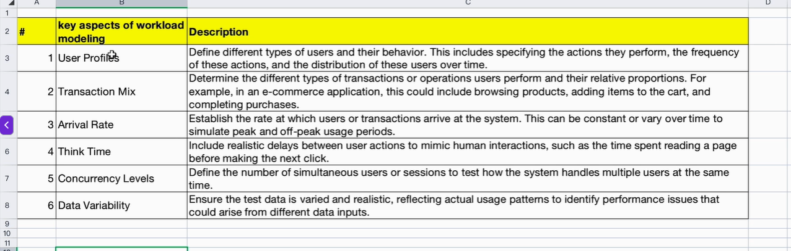
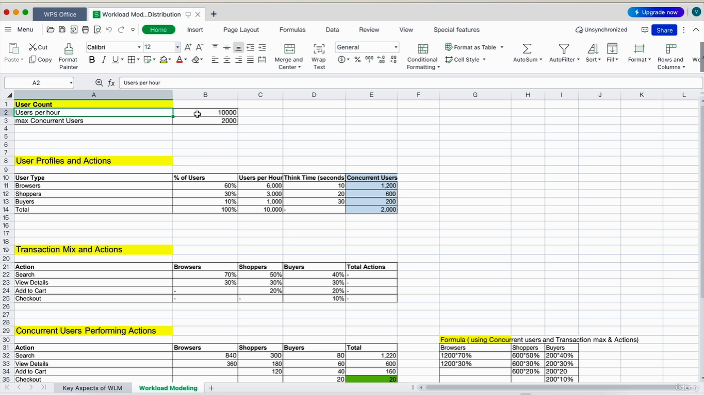
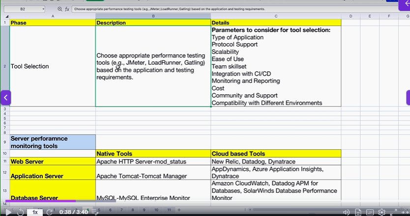
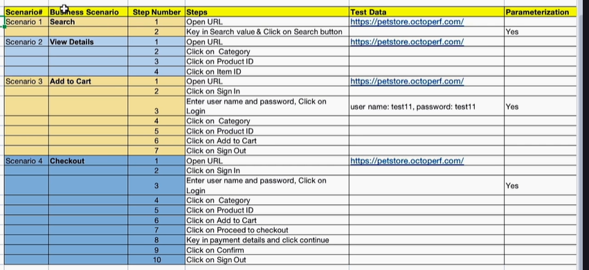

# Section 4 - Performance testing Live Project - Web Application (End to End)

```txt
My idea is to give you a confidence to handle the performance testing project independently in your

organization.

By the end of this lecture series, you should be confidently able to handle the performance testing

project in your organization.

```
## 42. Project-Planning and Design (phase 2 - part 3)Performance Test Plan Creation

Refer Attached Document - 4.2X+Performance+Test+plan-+Template (1).docx


## 43. Project Planning and Design Workload Modeling Phase 2 - Part 4

* **Workload Modeling**
  * Workload modeling in performance testing involves **creating a simulation of the anticipated real-world usage of an application or system**
  * > Here we will try to simulate the real world usage of an application
* It is a critical step to ensure that the performance tests accurately reflect how the application will behave under various conditions.
  * > So basically in workload modelling , we will try to mimic the actual usage of the application or the system


**=> Key Aspects involved in Workload Modelling**






File attached - 4.2E+Workload+Modelling+and+User+Load+Distribution.xlsx

## 44. Project-Test Environment Setup (phase 3)

> Environment setup is one of the important thing and we need to do it properly to get the realistic performance test result.  

> If the test environment is significantly different from the production environment, then our performance testing result may not be accurate and we may not be able to get a realistic performance test Results in environment setup.


## 45. Project-Test Tool Selection (phase 4)



## 46. Project-Performance Test Script Development Phase 5 



```
And each of these scenario we might want to do different types of tests such as load test, stress test,

spike test, endurance test that we will decide later.

First thing is to record a script for each business scenario.

Then we can do various types of performance testing on these scripts by adjusting the user load.
```

* Adjust the delay time so that script will run quickly

## 46. Project-Performance Test Script Development Phase 6 - Parameterization
