## How to do Remote and Distributed Testing in JMeter

1. **Why Remote(Distributed) testing is required?**
   1. **To simulate load from different geographic locations to get more realistic performance parameters such as response time**
    > All the users will not be accessing the application from the same location.  
   2. JMeter client may not be able to handle heavy user load due to infrastructure or hardware limitations
2. **Architecture of Remote(Distributed) Testing in JMeter**
   1. Works based on Master-Slave Mechanism
   2. Master distributes requests across worker Nodes(Slave machines)
3. **Pre-Requisites**
   1. Master and slave machines must have Java installed(Preferably same version of Java)
   2. Master and Slave machines must have same version JMeter installed
   3. Master and Slave machines must be connected to each other in same subnet
4. **Required Configurations**
   1. Go to JMeter -> bin folder -> Open jmeter.properties file -> Add Remote Hosts IP under Remote Host section(ex: remote_hosts = ip address1, ip address2). Save and close the file
   2. Restart the JMeter -> Go to Run -> Remote Start -> Select the Remote Host to run the test
   3. Go to JMeter -> bin folder -> Run the file : create-rmi-keystore.sh (On windows double click, on MAC open terminal and go to the file path and use command : sh create-rmi-keystore.sh.), provide answers to questions displayed. Then rmi_keystore.jks file will be created.
   4. Copy above rmi_keystore.jks file to JMeter -> bin folder in all remote host machines.
   5. Go to JMeter -> bin folder and start the JMeter server using jmeter-server file.(Double click on windows, on MAC open terminal go to the file path and run command - sh jmeter-server.sh)
5. Execution using Command Line
   1. Windows
   2. `jmeter -n -t "path to jmx file" -l "path to result file.csv" -R "IP_of_Remote_Host"`


Note - Number of threads provided in test plan will be run each remote host


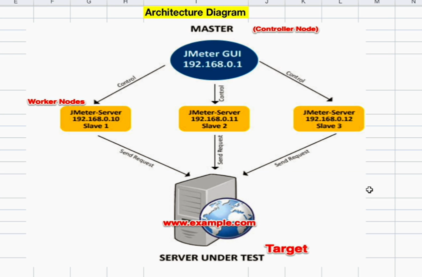


Search for "remote host" in JMeter.properties file located in bin folder of JMeter

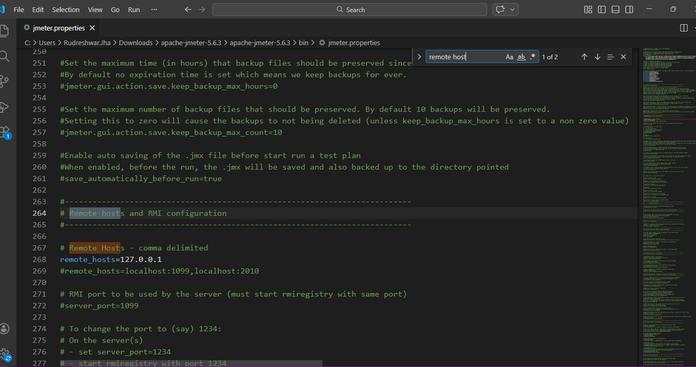


change the remote_hosts and give local IPv4 address of your laptop

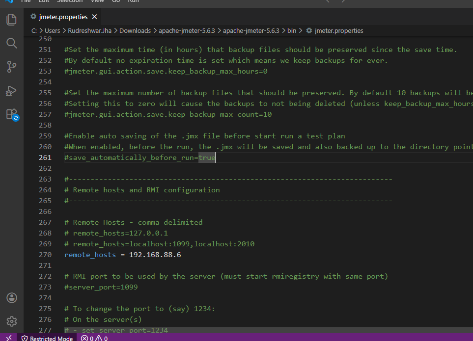

and then restart JMeter and navigate to run . you will find remote start option available

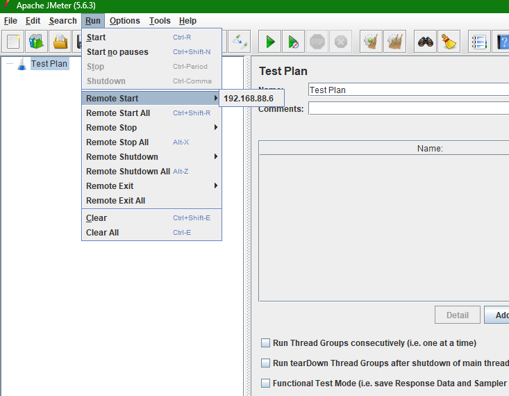


Now double click the following file and open using bash  

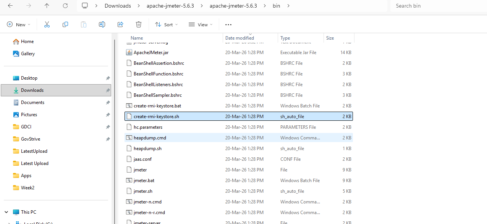

rmi_keystore.jks file would be generated  

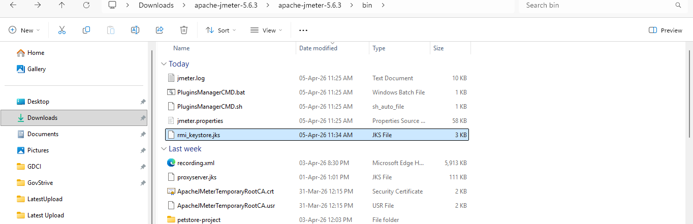

>copy these files to Jmeter bin folder in all remote host machine.  
>Now I am using my local machine only as a remote host.  
>That is why I do not need to copy it anywhere.
> And it is already in the jmeter bin folder.  
> If when you are using a multiple machines in real time, you will be using multiple machines.  
> I do not have multiple machines right now.  
> But in reality we will be using multiple machine that time.  
> You need to copy this file to your multiple machines within the Jmeter bin folder.  
> To make this, uh, remote or distributed testing work, uh, since I am using my local system as remote system, I do not need to copy it again.  


now double click on jmeter-server.bat file  

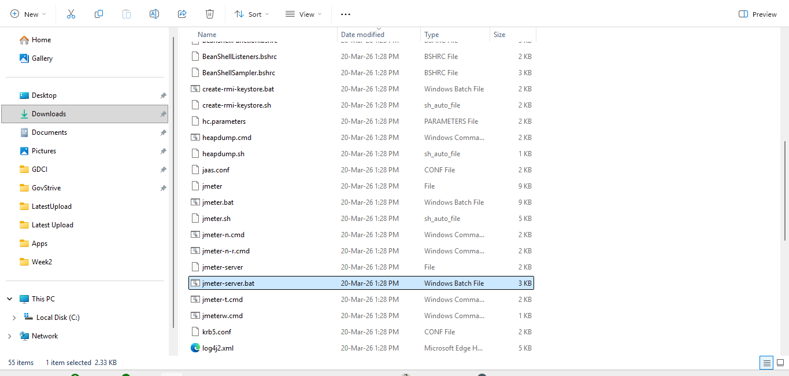

run a simple using remote run for www.blazedemo.com
you will see the server terminal showing starting and ending timings

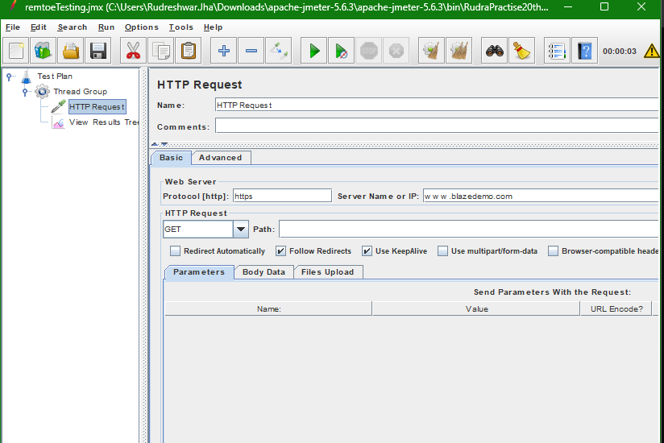


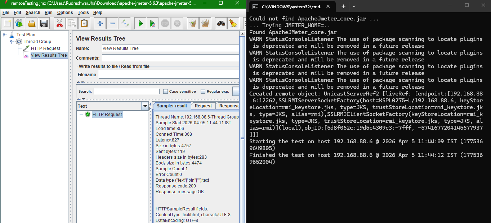

```
Starting the test on host 192.168.88.6 @ 2026 Apr 5 11:44:09 IST (1775369649805)
Finished the test on host 192.168.88.6 @ 2026 Apr 5 11:44:12 IST (1775369652004)
```

change back to this (but why?)

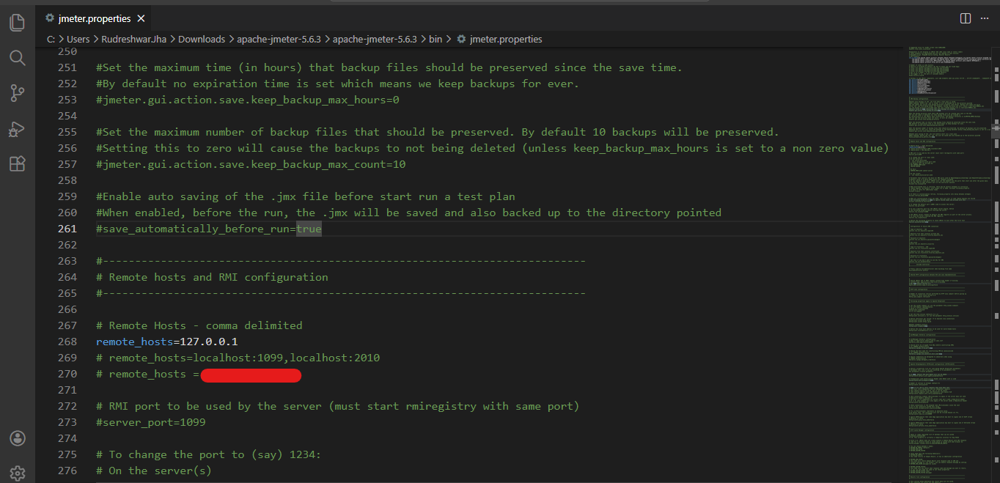

## How to use HTTP Authorization Manager for Basic Authentication


https://the-internet.herokuapp.com/basic_auth

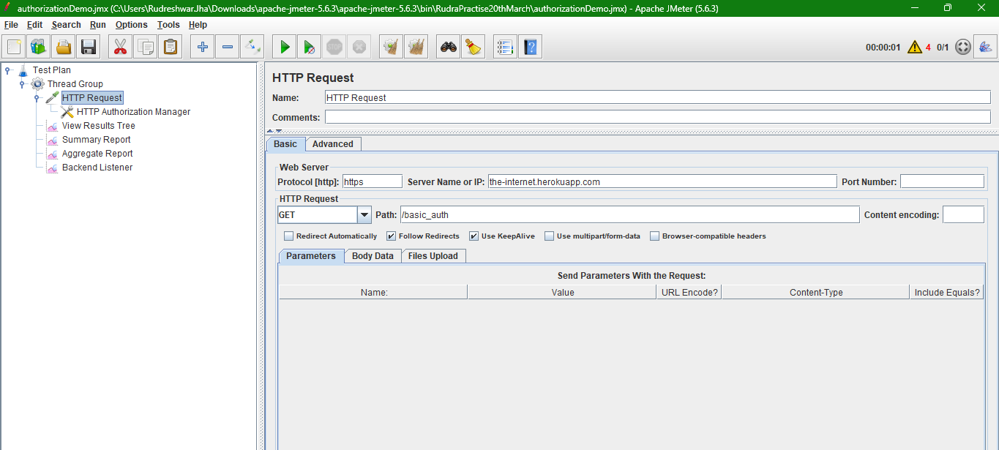

if you run first without authorization manager you will get 401 - unauthorized

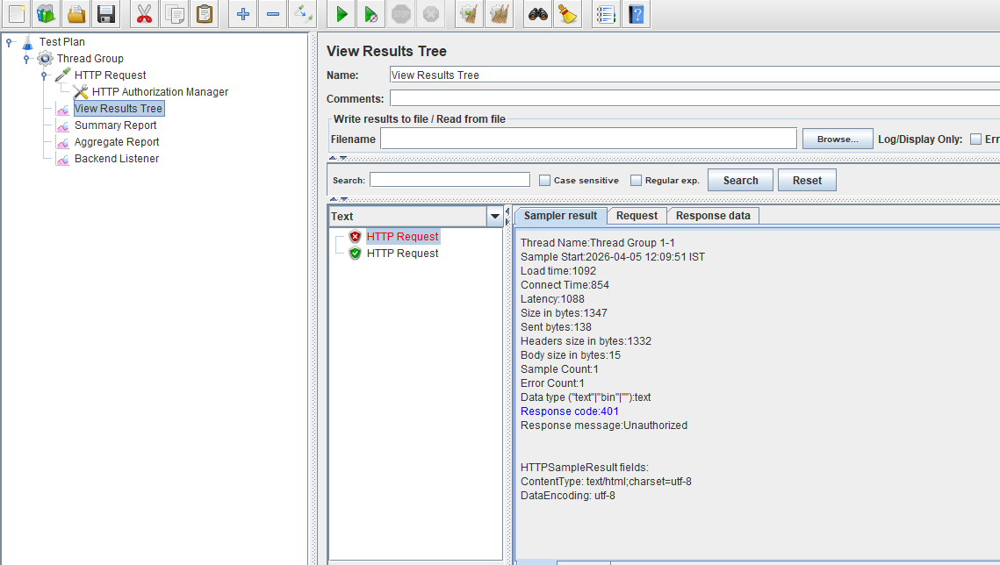

after adding authorization  

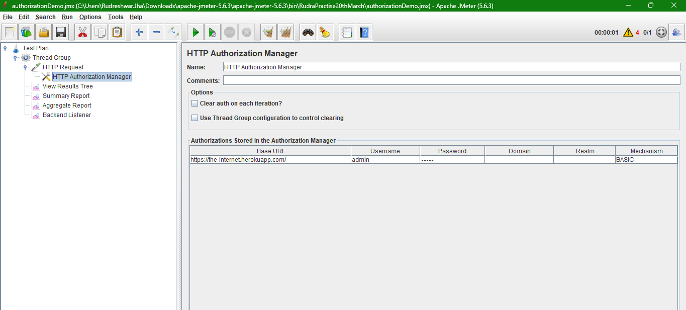

you will run successfully  

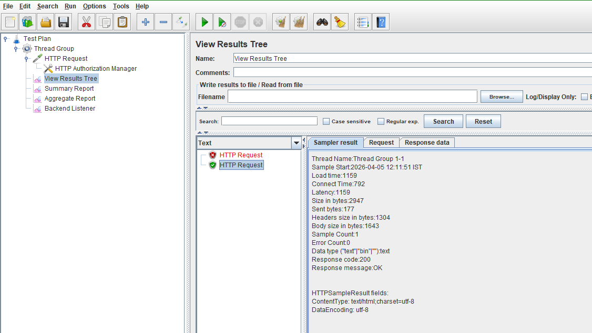

## How to send Email and do Performance testing of Email(SMTP) server using JMeter

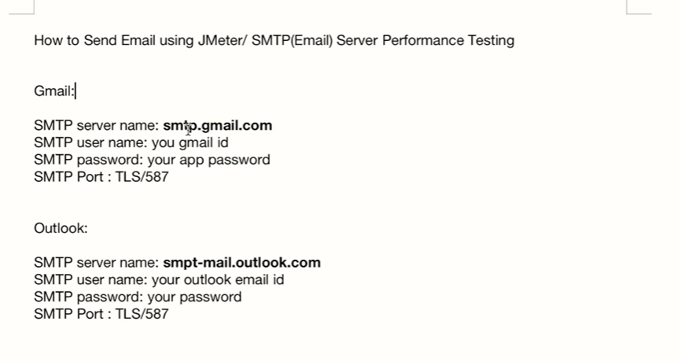

Add the SMTP Sampler

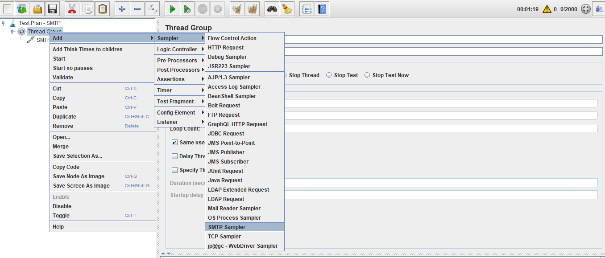

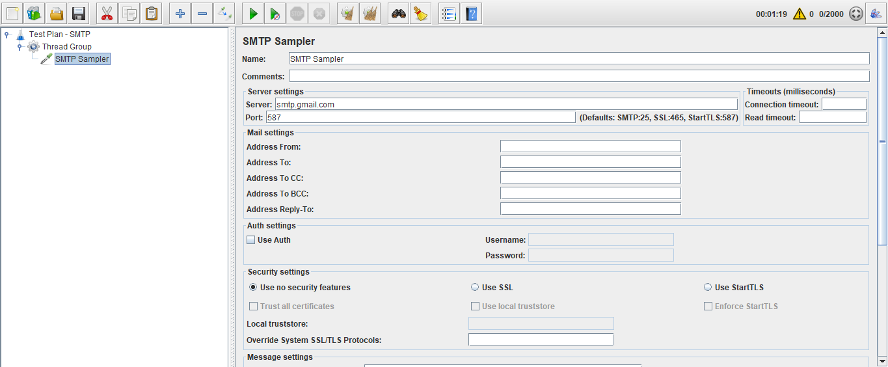

Now generate the app password - 

Click on user profile picture => Click on Manage your Google Account => Search "App Password" using search bar.  
Then generate App Password & Notedown

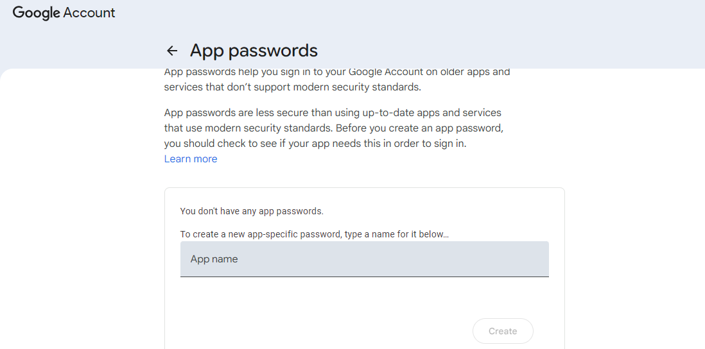

delete the app password after use.

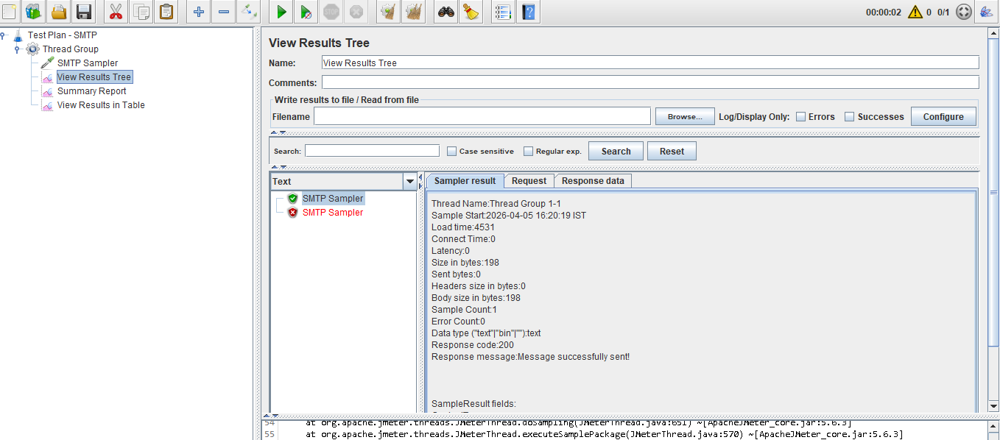

## How to do Database Performance Testing Using JMeter

## 75. How to use JSON Extractor Post Processor

1. **Introduction**
   * **Purpose** - The JSON Extractor is usedtoextract values from JSON responses in JMeter.
   * **When to use** - When you need to process and use data from JSON responses in subsequent requests or assertions.
2. **Adding JSON Extractor**
   1. * **Steps**
      1. Right click on the sampler(HTTP Request) where you want to add the extractor
      2. Navigate to **Add > Post Processors > JSON Extractor**
3. **Configuration Elements**
   1. **Name** - Give a meaningful name to the JSON Extractor
   2. **JSON Path Expressions** - Define the JSON Path to extract the required value
   3. **Variable Names** - Define the variable names to store the extracted values
   4. **Default Value** - Specify a default value to be used if the JSON path does not find any matchingvalue. 
   5. **Compute Concatenation Var(suffix _ALL)** - When checked, it creates a variable with all matchesconcatenated by a delimiter.


**Different ways of extracting values:**
Extract Random Values  
Extract Sepcific Value  
Extract all values  
Extract all values in single variable  

4. **JSON Path Expressions**
   1. **Syntax** - JSON Path uses a dot notation to navigate through JSON elements
      1. To format JSON - https://jsonformatter.org/
      2. To validate expression -  https://jsonpath.com/
      3. Sample APIs for testing -  https://reqres.in/

* **Common Operators** - 
  * $ : Root element
  * . : Child element
  * [*] : Wildcard to match any element in an array
  * [index] : Specific index in an array

5. **Using Extracted Variables**
   1. Reference in subsequent requests - Use ${variableName} to refer to the extracted value.
   2. > examples - ${id} ${email}

## 76. How to control Thread Count, Ramp-up period and Loop count from command line

**In Test Plan:**

**Use function :**  __P
This is a simplified property function which is intended for use with properties defined on the command line.
**Example:**  

${__P(user,1)}

**Syntax:**  

Windows OS:

jmeter -n -t “path to jmx test script file”
-l “path to csv result file”
-e -o “path to result folder”
-Juser=10 -Jrampup=10 -Jloop=10

windows OS:

jmeter -n -t "/Users/vishwa/Desktop/Test/commandline.jmx" -l "/Users/vishwa/Desktop/Test/result.csv" -e -o "/Users/vishwa/Desktop/Test/untitled folder" -Juser=10 - Jrampup=11 -Jloop=2


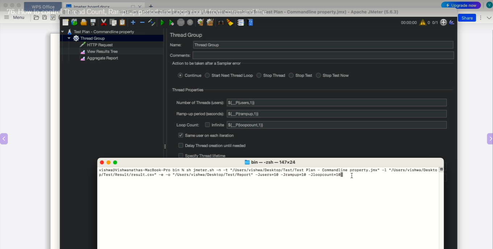


## Understand HTTP Cookie Manager in JMeter


Website - the-internet.herokuapp.com/login

1. record a user action from blazemeter
2. download the .jmx file
3. import the file in JMeter
4. run the thread group and check if you are really logged in or not by enabling and disabling the cookie manager.


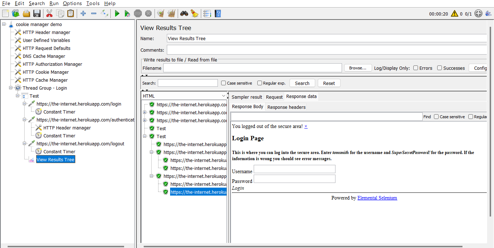

## Introduction to Controllers in JMeter and If Controller in JMeter

> Controllers help to achieve control on the flow of execution of requests

* In JMeter, controllers are elements that determine the flow of execution for the requests in a test plan.
* They help structure and manage how different parts of the test plan are executed, allowing you to create complex test scenarios.

* If Controller
  * Purpose - Conditionally execute child elements based on a specified condition
  * Example - Run a next sampler only if previous sampler response code is success(200)

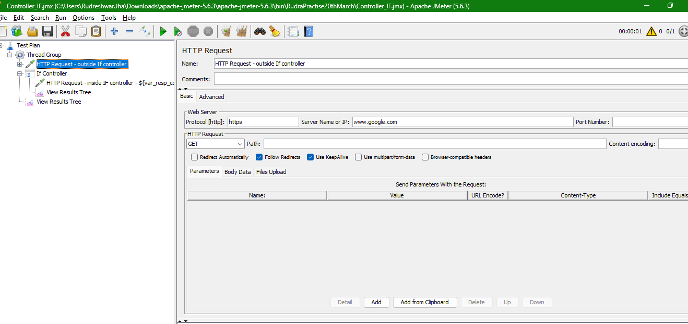

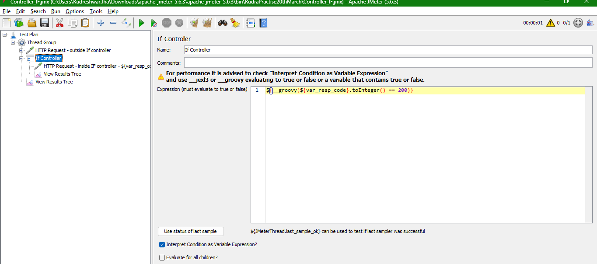

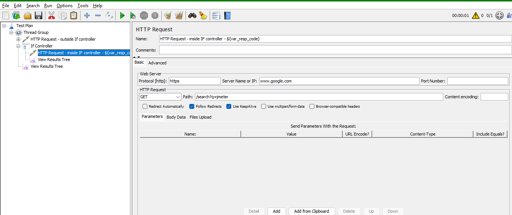


if we put 400 as response code, then http request inside if controller will not be executed

`${__groovy(${var_resp_code}.toInteger() == 400)}`

## Transaction Controller in JMeter

* **Purpose** - Group requests to measure overall time for a transaction.
* **Exmaple** - Measure the time for the entire login process, including entering credentials and receiving response.

> The purpose of the transaction controller is to group the requests to measure the overall time for a transaction. It means you can group multiple samplers and calculate the combined time.

> So by using a transaction controller you can measure the time taken for a particular transaction.

> In this case, it is a login transaction that we have taken as an example,

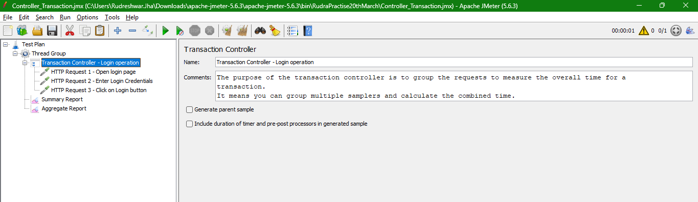


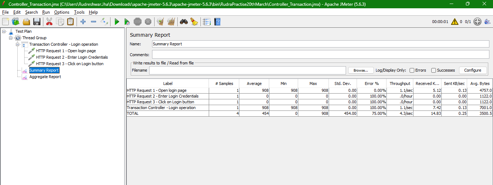

>> So basically it will give time taken for any operation which you want to measure by grouping


## Loop Controller in JMeter

* Purpose - Repeat child elements a specified number of times
* Example - Run a login request 10 times with 10 different credentials


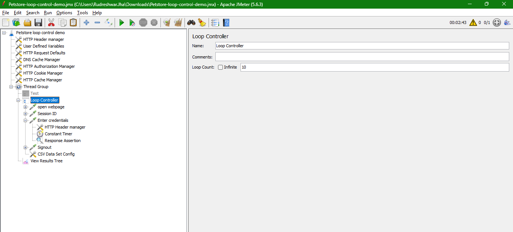

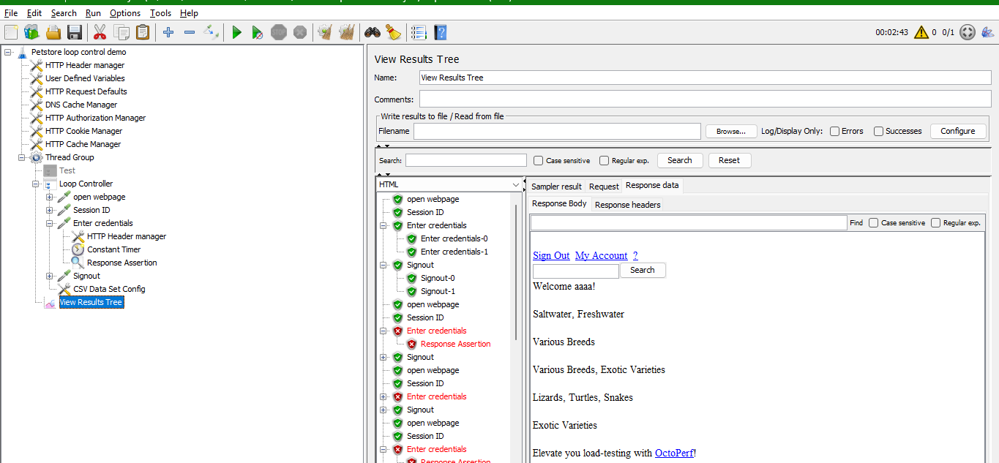

> In this way, you can use the loop controller to run a set of request or a request multiple times.

## While Controller in JMeter

* Purspose - Repeat child elements as long as the specified condition is true
  * Example - Execute the request until count <= 10

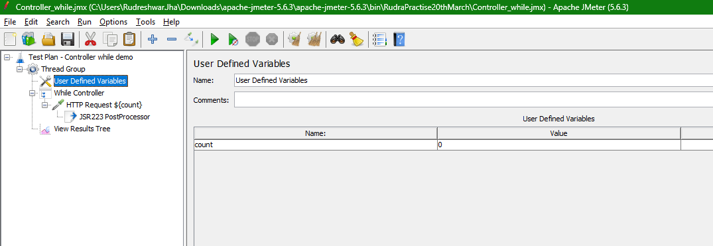

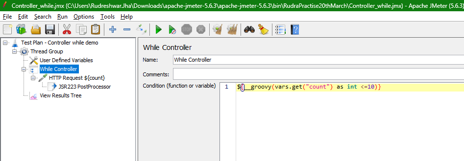

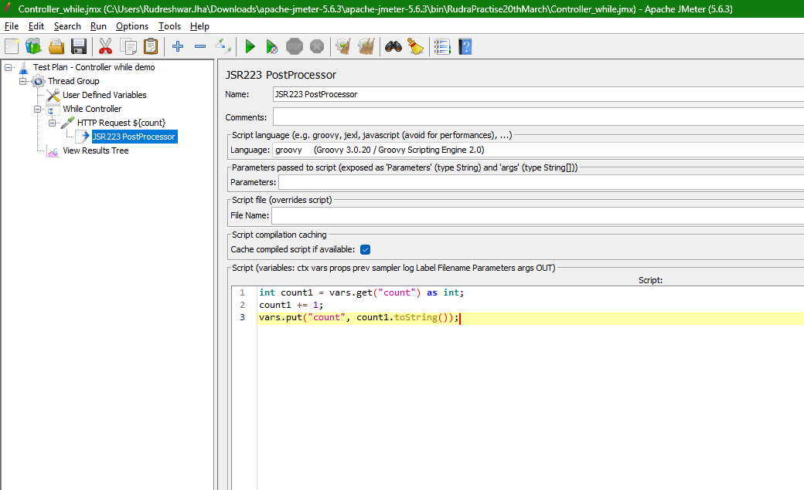

> we are executing the request in the while controller.As long as count value is less than or equal to ten.

## Critical Section Controller in JMeter
* The Critical Section Controller in JMeter is used to ensure that certain parts of a test plan are executed **by only one thread at a time**, effectively creating a mutex(Mutually exclusive) or lock around those parts
* This is particularly useful in scenarios where you need to **prevent race conditions** or ensure that shared resources are accessed in a controlled manner.
* Suppose you have a test scenario where multiple users (threads) are performing actions that involve updating a shared resource, like a **database record, file, or session data.**
* If these actions are not synchronized, it could **lead to inconsistent states or data corruption.**
* The Critical Section Controller helps to **serialize access** to that shared resource ensuring that only one thread can execute the critical section at a time.

* Multiple threads are not allowed enter critical section at same time, Next thread enters critical
section after previous thread completes and exits critical section.

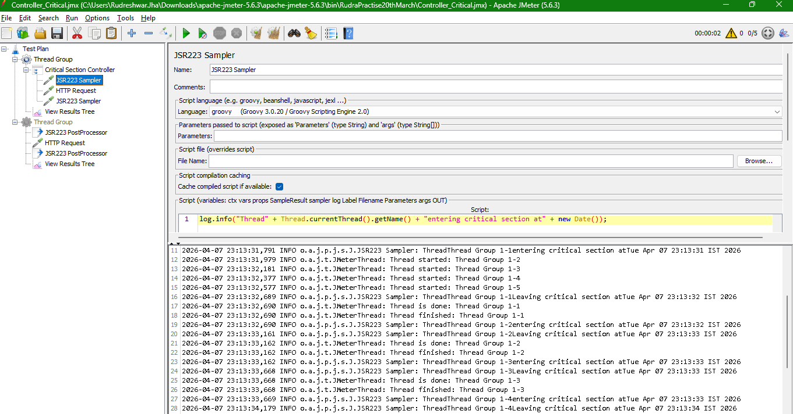

now for second thread group where we don't have Critical Section controller, the ordering is different

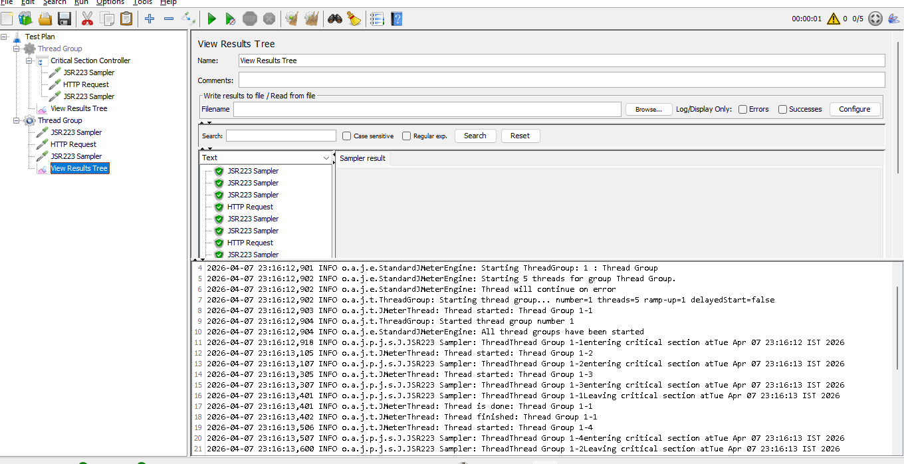

```txt
When you don't use a critical section controller here, there are multiple threads who are running in

parallel and they might be accessing the resource at the same time.

To avoid that, we are using the critical section controller, that is, to avoid the lock to avoid
```

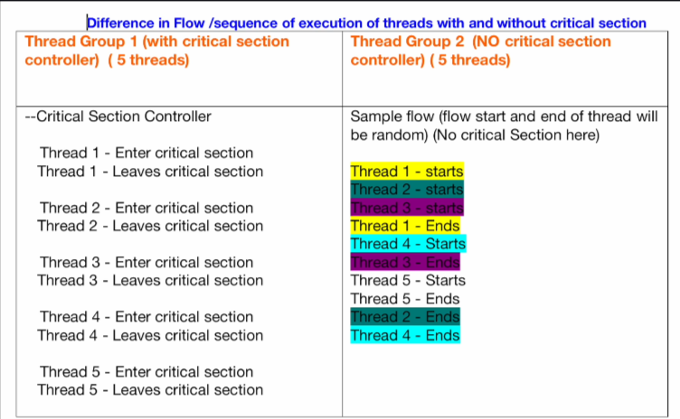

## ForEach Controller in JMeter

* What is the ForEach Controller?
  * The ForEach Controller allows you to iterate over a set of variables or values and perform a set of actions for each item.
  * It is useful when you want to repeat the same steps for multiple items like processing each value in a list or performing operations on multiple data sets.


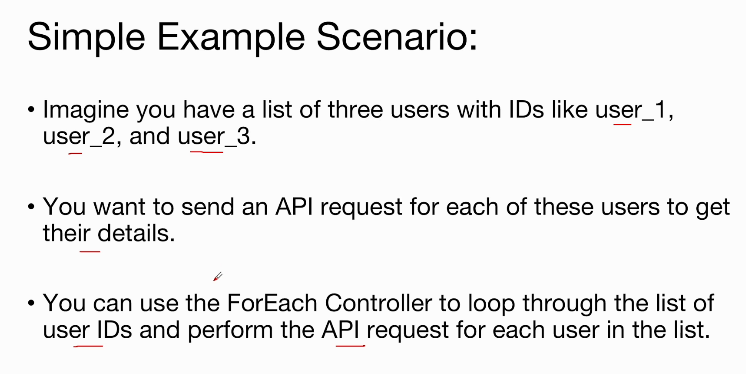

Now let's paractically understand  