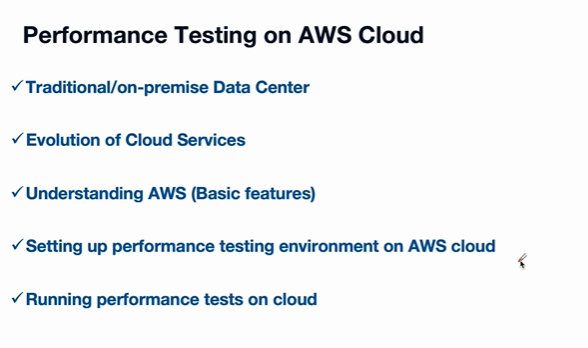
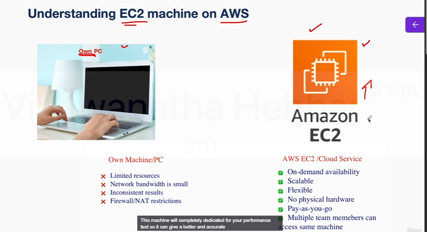
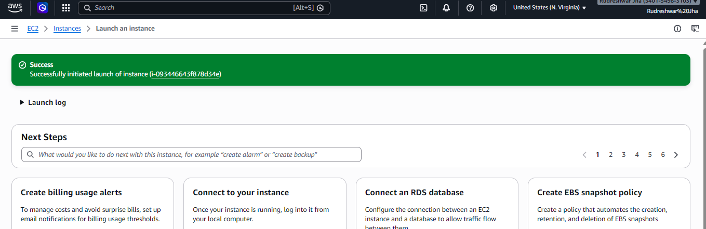
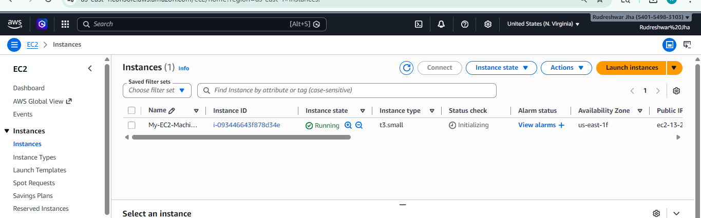

# Performance Testing on AWS Cloud - Hands on Guide



## Understanding Traditional(on-premise) Data centres


## Understanding Concept of Cloud Computing

## Creating AWS Account and Setup Zero Spend Budget

## Introduction to AWS EC2 and its advantages

* **Own Machine/PC**
  * Limited resources
    * Fixed amount of CPU capacity, RAM capacity and storage
  * Network bandwidth is small
  * Inconsistent results
  * Firewall/NAT restrictions


* **AWS EC2/Cloud Service**
  * On-demand availability
  * Scalable
    * You can increase the RAM storage CPU whenever you want
  * Flexible
    * Choose operating system based on your need
  * No physical hardware
  * Pay-as-you-go
  * Multiple team members can access same machine



```txt
Earlier we have discussed and understood how we can use our own PC to run the performance test.

We have installed Java as well as Jmeter on our own PC or a laptop, and then we have run the performance

test from there.

Here EC2 is a machine that is hosted by AWS.

That is a machine that is located in the Amazon Data center.

Instead of using our own PC here, we will be using Amazon EC2, Amazon Elastic Compute Cloud Machine

to run the performance test.

Just like we have installed Java and Jmeter.

Here we will install Java and Jmeter here, and we will try to run the performance test on the Amazon

EC2 machine.
```


```txt
Let us assume you are running a performance test, such as endurance test for 8 hours or 24 hours.

Then you need to ensure that your laptop is running fine or your computer is running fine.

But here, Amazon takes care of all those things
```

## Creating EC2 instance on AWS cloud

* Search EC2
* Click launch instance
  * Give name
  * Select OS e.g windows
* Select instnace type e.g. t2.small
* Key pair - Create new key pair(give name same as EC2 machine name instance from above)
  * give name and click generate



