# Performance Engineering - Thread Dump Analysis and Insights

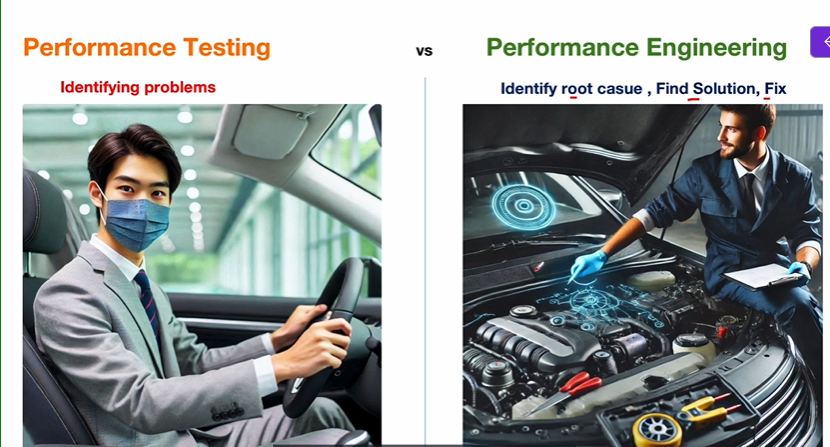

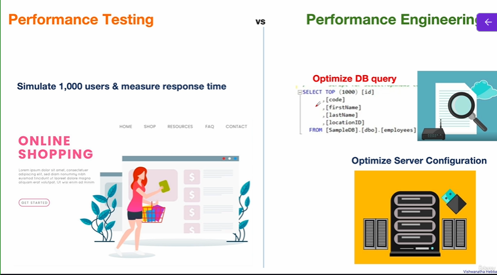

| Aspect              | Performance Testing                                                                 | Performance Engineering                                                                                  |
|--------------------|--------------------------------------------------------------------------------------|-----------------------------------------------------------------------------------------------------------|
| Definition         | The process of evaluating a system's speed, scalability, and stability under different conditions. | A proactive approach to designing, optimizing, and maintaining a system to perform efficiently under all conditions. |
| Focus              | Identifies performance issues like slowness or failures.                            | Fixes root causes of performance issues and ensures long-term efficiency.                                |
| Goal               | Measure system performance (e.g., response time, throughput).                       | Enhance and maintain optimal performance for real-world usage.                                            |
| Timeframe          | Done in the testing phase, before deployment.                                        | Continuous, spanning the entire lifecycle of the system.                                                  |
| Key Tools          | Tools like JMeter, LoadRunner, and Gatling to simulate and measure load.             | Includes performance testing tools plus profilers, debuggers, thread/heap analyzers, and monitoring tools. |
| Real-world Example | Testing a new shopping website by simulating 1,000 users and measuring response time. | Redesigning database queries and optimizing server configuration to ensure performance for 10,000+ users. |
| Analogy            | Taking a car for a speed test to check how fast it can go under load.                | Regularly tuning the car engine, ensuring efficient fuel usage, and preventing future breakdowns.        |

## What is Thread?
A thread is the smallest unit of execution within a process  

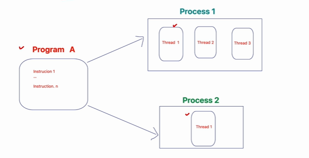

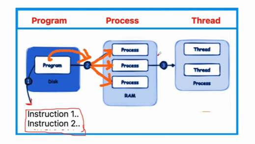

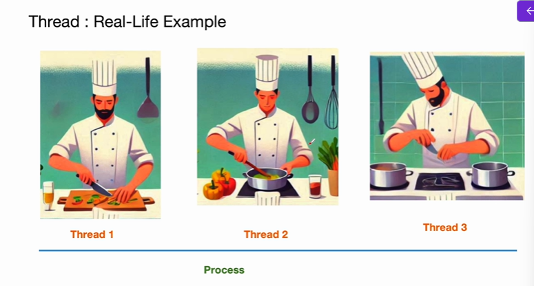

## What is Thread Dump?
* A thread dump is like taking a "snapshot" of all the threads running inside your application at a specific moment.
  * e.g. Imagine workers working in a industry
* Thread dump shows thread status - 
  * Working
  * Waiting
  * Stuck
  * Trouble
* Thread dumps helps to identify
  * Bottlenecks
  * Deadlocks
  * High CPU Usage

## When to take Thread Dump?
* **Application is Slow or Freezing**
  * e.g. application may become slow during flash sale
* **High CPU Utilization**
  * A banking application may show 90% during non-peak hours
* **Deadlocks**
  * Two or more resource waiting for each other
* **Long-Running Threads**
  * To analyze the threads taking longer than the expected time to complete the task.
  * It will identify thread which are slow.
    * e.g. you expect something to complete in an hour
* **Thread Count Keeps Increasing**
  * If new threads are getting created and existing thread are not getting terminated, then **Thread Count** will keep increasing
  * A hotel booking app creates a new thread for every new search and those threads keep running
* **Application Fails to start**
  * To check which threads are blocking the application startup process
    * An app might hang during the initilization process
* **Scheduled Jobs Delayed**
  * To identify the threads that are stuck or blocked causing the delay in the job execution
    * e.g. there might be a job which will send the salary slip after the salary is paid and that job might get delayed due to certain threads
* **Application Crash(Just before crash)**
  * There are certain tools which can take a thread dump based on the condition, such as whenever CPU utilization reaches 90 percentage.
* **Issues During Load/Endurance Testing**
  * It will help to examine the thread behavior during a user load, and when the test is running for longer duration, it will help to detect the bottlenecks or resource contention issues caused by high load.
    * For example, there might be a streaming platform which might struggle with 1000 concurrent users

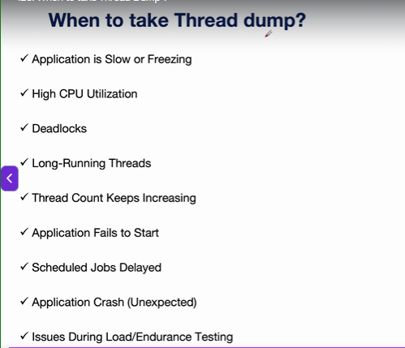

## How to Take Thread Dump? - Part 1
* Method of taking thread dump varies depending on the
  * Operating system/hosting environment
  * tools
  * application framework
* Take Multiple Dumps
  * Collect at 5-10 second intervals to observe trends

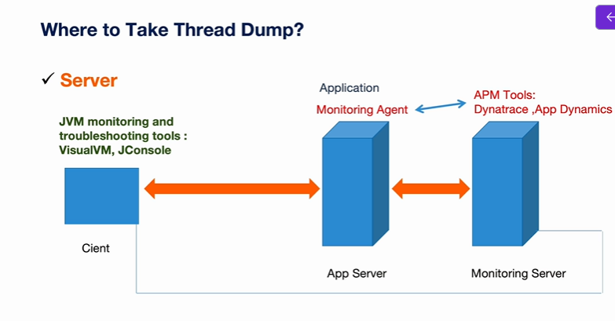

We need to take thread dump where the application server is running  
but sometimes we might not have server access in that case we can use JVM monitoring tools  
or you can you application performance tools like Dynatrace, App dynamics  

If you have server access, login and take thread dump directly. You need to execute some commands on the server. we will talk about commands later

Dynatrace and app dynamics are paid tools

You can install the monitoring on the server but it will increase the load on the application server. so ideally we should have a separate monitoring server.so that load on the application server will be less.

* **Part 2** -  

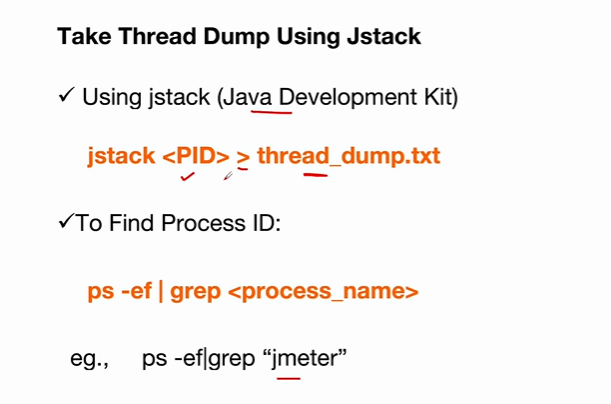

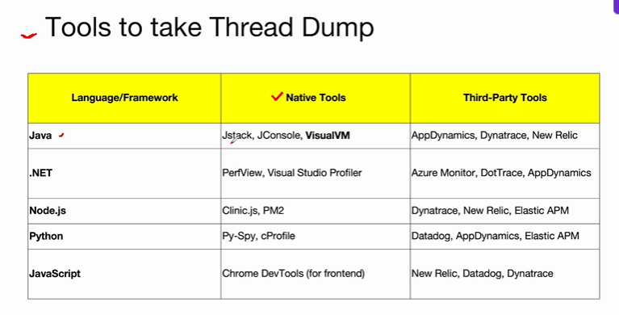

* **Part 3** - Using VisualVM

**Navigate to URL** - https://visualvm.github.io/download.html  

download the zip file for windows  

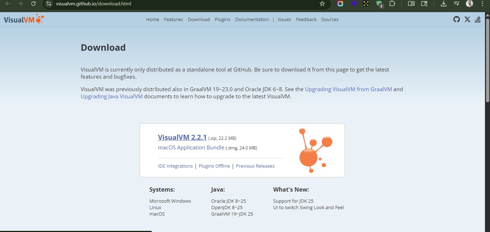

double click on visualvm.exe  

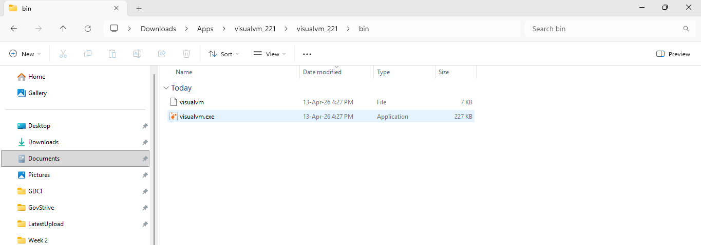

* VisualVM is also a java based application

you can see the usage in Monitor tab  

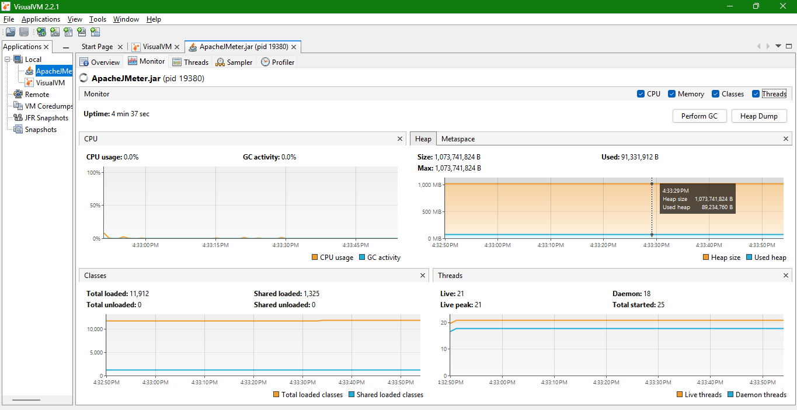

Click on Thread Dump button to get the thread dump

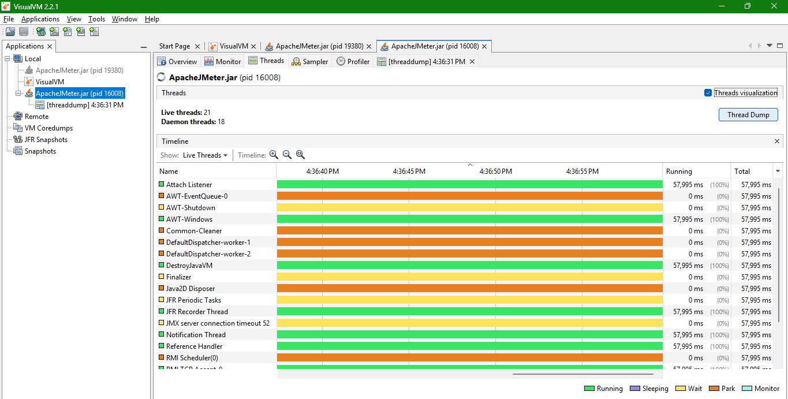

You can also select all and paste it in a text file  

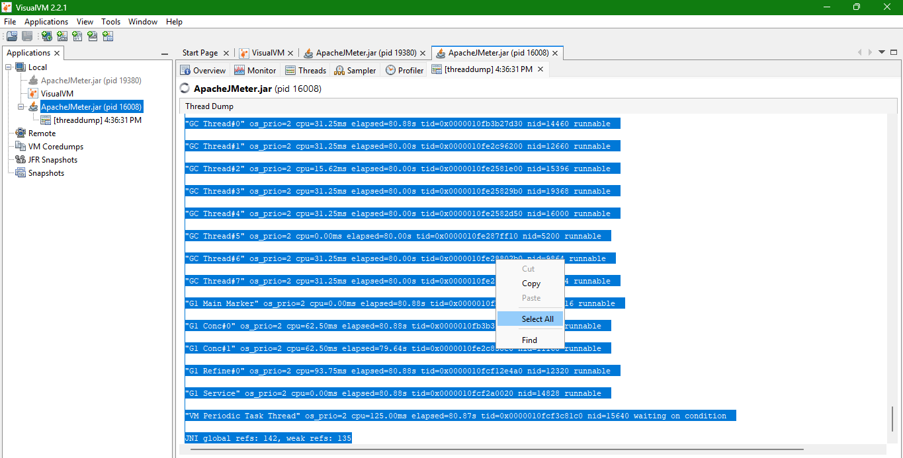

There are lot of tools available in the market to take the thread dump  
It's not practical to go deeper into each tool  

Visit the documentation -  

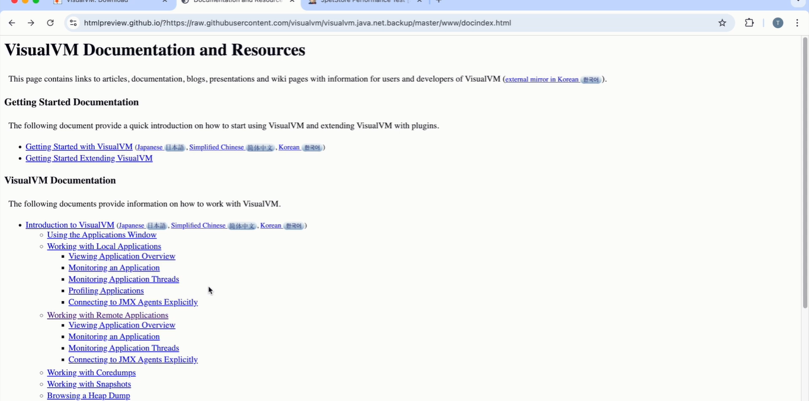

## Thread Dump Analysis - Introduction
* A thread dump is basically snapshot of the thread

* Thread Dump
  * **Snapshot** -  It contains  
    * Thread name
    * Thread state
    * Stack trace
  * **Key Parameters to check**
    * **Thread State** - 
      * RUNNABLE
      * BLOCKED
      * WAITING OR TIMED_WAITING
    * **Thread Name** - 
      * Identifies thread
    * **Stack Trace**
      * Code being executed by thread
    * **Locked Resources**
      * Check for - `locked <object> or waiting to lock <object>`

* **Identify Common Issues**
  * High CPU Usage
  * Deadlocks
  * Thread Contention
  * Too many waiting Threads
  * Stuck Threads

## Thread Dump Analysis - High CPU Scenario


```java
package jmetertesting;

public class HighCpuUsageExample {

	public static void main(String[] args) {
		// TODO Auto-generated method stub
		Thread myThread = new Thread( ()->{
			
			while(true) {
				double value = Math.random()*Math.random();
			}
		});
		
		myThread.setName("myThread");
		myThread.start();
		System.out.println("Main thread finished. myThread is running...");
	}

}

```


```txt

2026-04-13 21:56:07
Full thread dump Java HotSpot(TM) 64-Bit Server VM (17.0.11+7-LTS-207 mixed mode, sharing):

Threads class SMR info:
_java_thread_list=0x00000210d98b0a90, length=20, elements={
0x00000210ffa661b0, 0x00000210ffa66b70, 0x00000210ffa78070, 0x00000210ffa78a30,
0x00000210ffa79a00, 0x00000210ffa7a3c0, 0x00000210ffa83580, 0x00000210ffa8ed90,
0x00000210ffa937b0, 0x00000210d825f130, 0x00000210d826da50, 0x00000210d8275f60,
0x00000210f2a0e7f0, 0x00000210d8dac990, 0x00000210d9d7ccf0, 0x00000210da837d70,
0x00000210da838250, 0x00000210dabd2820, 0x00000210d9d30d40, 0x00000210d9d30320
}

"Reference Handler" #2 daemon prio=10 os_prio=2 cpu=0.00ms elapsed=94.07s tid=0x00000210ffa661b0 nid=0x3a94 waiting on condition  [0x000000c3e7bff000]
   java.lang.Thread.State: RUNNABLE
        at java.lang.ref.Reference.waitForReferencePendingList(java.base@17.0.11/Native Method)
        at java.lang.ref.Reference.processPendingReferences(java.base@17.0.11/Reference.java:253)
        at java.lang.ref.Reference$ReferenceHandler.run(java.base@17.0.11/Reference.java:215)

   Locked ownable synchronizers:
        - None

"Finalizer" #3 daemon prio=8 os_prio=1 cpu=0.00ms elapsed=94.07s tid=0x00000210ffa66b70 nid=0x8a4 in Object.wait()  [0x000000c3e7cff000]
   java.lang.Thread.State: WAITING (on object monitor)
        at java.lang.Object.wait(java.base@17.0.11/Native Method)
        - waiting on <0x000000008a420178> (a java.lang.ref.ReferenceQueue$Lock)
        at java.lang.ref.ReferenceQueue.remove(java.base@17.0.11/ReferenceQueue.java:155)
        - locked <0x000000008a420178> (a java.lang.ref.ReferenceQueue$Lock)
        at java.lang.ref.ReferenceQueue.remove(java.base@17.0.11/ReferenceQueue.java:176)
        at java.lang.ref.Finalizer$FinalizerThread.run(java.base@17.0.11/Finalizer.java:172)

   Locked ownable synchronizers:
        - None

"Signal Dispatcher" #4 daemon prio=9 os_prio=2 cpu=0.00ms elapsed=94.06s tid=0x00000210ffa78070 nid=0x440 waiting on condition  [0x0000000000000000]
   java.lang.Thread.State: RUNNABLE

   Locked ownable synchronizers:
        - None

"Attach Listener" #5 daemon prio=5 os_prio=2 cpu=703.12ms elapsed=94.06s tid=0x00000210ffa78a30 nid=0x1fa0 waiting on condition  [0x0000000000000000]
   java.lang.Thread.State: RUNNABLE

   Locked ownable synchronizers:
        - None

"Service Thread" #6 daemon prio=9 os_prio=0 cpu=15.62ms elapsed=94.06s tid=0x00000210ffa79a00 nid=0x1238 runnable  [0x0000000000000000]
   java.lang.Thread.State: RUNNABLE

   Locked ownable synchronizers:
        - None

"Monitor Deflation Thread" #7 daemon prio=9 os_prio=0 cpu=31.25ms elapsed=94.06s tid=0x00000210ffa7a3c0 nid=0x524c runnable  [0x0000000000000000]
   java.lang.Thread.State: RUNNABLE

   Locked ownable synchronizers:
        - None

"C2 CompilerThread0" #8 daemon prio=9 os_prio=2 cpu=1515.62ms elapsed=94.06s tid=0x00000210ffa83580 nid=0x1f1c waiting on condition  [0x0000000000000000]
   java.lang.Thread.State: RUNNABLE
   No compile task

   Locked ownable synchronizers:
        - None

"C1 CompilerThread0" #11 daemon prio=9 os_prio=2 cpu=859.38ms elapsed=94.06s tid=0x00000210ffa8ed90 nid=0x1b34 waiting on condition  [0x0000000000000000]
   java.lang.Thread.State: RUNNABLE
   No compile task

   Locked ownable synchronizers:
        - None

"Sweeper thread" #12 daemon prio=9 os_prio=2 cpu=0.00ms elapsed=94.06s tid=0x00000210ffa937b0 nid=0x3338 runnable  [0x0000000000000000]
   java.lang.Thread.State: RUNNABLE

   Locked ownable synchronizers:
        - None

"Notification Thread" #13 daemon prio=9 os_prio=0 cpu=0.00ms elapsed=94.05s tid=0x00000210d825f130 nid=0x53a8 runnable  [0x0000000000000000]
   java.lang.Thread.State: RUNNABLE

   Locked ownable synchronizers:
        - None

"Common-Cleaner" #14 daemon prio=8 os_prio=1 cpu=0.00ms elapsed=94.04s tid=0x00000210d826da50 nid=0x8b0 in Object.wait()  [0x000000c3e86ff000]
   java.lang.Thread.State: TIMED_WAITING (on object monitor)
        at java.lang.Object.wait(java.base@17.0.11/Native Method)
        - waiting on <no object reference available>
        at java.lang.ref.ReferenceQueue.remove(java.base@17.0.11/ReferenceQueue.java:155)
        - locked <0x000000008a410260> (a java.lang.ref.ReferenceQueue$Lock)
        at jdk.internal.ref.CleanerImpl.run(java.base@17.0.11/CleanerImpl.java:140)
        at java.lang.Thread.run(java.base@17.0.11/Thread.java:842)
        at jdk.internal.misc.InnocuousThread.run(java.base@17.0.11/InnocuousThread.java:162)

   Locked ownable synchronizers:
        - None

"myThread" #15 prio=5 os_prio=0 cpu=92328.12ms elapsed=94.04s tid=0x00000210d8275f60 nid=0x1a5c runnable  [0x000000c3e87fe000]
   java.lang.Thread.State: RUNNABLE
        at jmetertesting.HighCpuUsageExample.lambda$0(HighCpuUsageExample.java:9)
        at jmetertesting.HighCpuUsageExample$$Lambda$1/0x0000021094000a00.run(Unknown Source)
        at java.lang.Thread.run(java.base@17.0.11/Thread.java:842)

   Locked ownable synchronizers:
        - None

"DestroyJavaVM" #16 prio=5 os_prio=0 cpu=46.88ms elapsed=94.03s tid=0x00000210f2a0e7f0 nid=0x257c waiting on condition  [0x0000000000000000]
   java.lang.Thread.State: RUNNABLE

   Locked ownable synchronizers:
        - None

"JFR Recorder Thread" #17 daemon prio=5 os_prio=0 cpu=0.00ms elapsed=87.09s tid=0x00000210d8dac990 nid=0xf48 waiting on condition  [0x0000000000000000]
   java.lang.Thread.State: RUNNABLE

   Locked ownable synchronizers:
        - None

"JFR Periodic Tasks" #18 daemon prio=5 os_prio=0 cpu=359.38ms elapsed=86.79s tid=0x00000210d9d7ccf0 nid=0x7b0 in Object.wait()  [0x000000c3e8bff000]
   java.lang.Thread.State: TIMED_WAITING (on object monitor)
        at java.lang.Object.wait(java.base@17.0.11/Native Method)
        - waiting on <no object reference available>
        at jdk.jfr.internal.PlatformRecorder.takeNap(jdk.jfr@17.0.11/PlatformRecorder.java:544)
        - locked <0x000000008a430550> (a jdk.jfr.internal.JVM$ChunkRotationMonitor)
        at jdk.jfr.internal.PlatformRecorder.periodicTask(jdk.jfr@17.0.11/PlatformRecorder.java:524)
        at jdk.jfr.internal.PlatformRecorder.lambda$startDiskMonitor$1(jdk.jfr@17.0.11/PlatformRecorder.java:449)
        at jdk.jfr.internal.PlatformRecorder$$Lambda$44/0x0000021094042798.run(jdk.jfr@17.0.11/Unknown Source)
        at java.lang.Thread.run(java.base@17.0.11/Thread.java:842)

   Locked ownable synchronizers:
        - None

"RMI TCP Accept-0" #21 daemon prio=5 os_prio=0 cpu=0.00ms elapsed=81.16s tid=0x00000210da837d70 nid=0x2e94 runnable  [0x000000c3e8cff000]
   java.lang.Thread.State: RUNNABLE
        at sun.nio.ch.Net.accept(java.base@17.0.11/Native Method)
        at sun.nio.ch.NioSocketImpl.accept(java.base@17.0.11/NioSocketImpl.java:760)
        at java.net.ServerSocket.implAccept(java.base@17.0.11/ServerSocket.java:675)
        at java.net.ServerSocket.platformImplAccept(java.base@17.0.11/ServerSocket.java:641)
        at java.net.ServerSocket.implAccept(java.base@17.0.11/ServerSocket.java:617)
        at java.net.ServerSocket.implAccept(java.base@17.0.11/ServerSocket.java:574)
        at java.net.ServerSocket.accept(java.base@17.0.11/ServerSocket.java:532)
        at sun.management.jmxremote.LocalRMIServerSocketFactory$1.accept(jdk.management.agent@17.0.11/LocalRMIServerSocketFactory.java:52)
        at sun.rmi.transport.tcp.TCPTransport$AcceptLoop.executeAcceptLoop(java.rmi@17.0.11/TCPTransport.java:413)
        at sun.rmi.transport.tcp.TCPTransport$AcceptLoop.run(java.rmi@17.0.11/TCPTransport.java:377)
        at java.lang.Thread.run(java.base@17.0.11/Thread.java:842)

   Locked ownable synchronizers:
        - <0x000000008a397b78> (a java.util.concurrent.locks.ReentrantLock$NonfairSync)

"RMI TCP Connection(1)-192.168.88.34" #22 daemon prio=5 os_prio=0 cpu=609.38ms elapsed=81.08s tid=0x00000210da838250 nid=0x3488 runnable  [0x000000c3e8dfe000]
   java.lang.Thread.State: RUNNABLE
        at sun.nio.ch.Net.poll(java.base@17.0.11/Native Method)
        at sun.nio.ch.NioSocketImpl.park(java.base@17.0.11/NioSocketImpl.java:186)
        at sun.nio.ch.NioSocketImpl.timedRead(java.base@17.0.11/NioSocketImpl.java:290)
        at sun.nio.ch.NioSocketImpl.implRead(java.base@17.0.11/NioSocketImpl.java:314)
        at sun.nio.ch.NioSocketImpl.read(java.base@17.0.11/NioSocketImpl.java:355)
        at sun.nio.ch.NioSocketImpl$1.read(java.base@17.0.11/NioSocketImpl.java:808)
        at java.net.Socket$SocketInputStream.read(java.base@17.0.11/Socket.java:966)
        at java.io.BufferedInputStream.fill(java.base@17.0.11/BufferedInputStream.java:244)
        at java.io.BufferedInputStream.read(java.base@17.0.11/BufferedInputStream.java:263)
        - locked <0x000000008a402600> (a java.io.BufferedInputStream)
        at java.io.FilterInputStream.read(java.base@17.0.11/FilterInputStream.java:82)
        at sun.rmi.transport.tcp.TCPTransport.handleMessages(java.rmi@17.0.11/TCPTransport.java:569)
        at sun.rmi.transport.tcp.TCPTransport$ConnectionHandler.run0(java.rmi@17.0.11/TCPTransport.java:828)
        at sun.rmi.transport.tcp.TCPTransport$ConnectionHandler.lambda$run$0(java.rmi@17.0.11/TCPTransport.java:705)
        at sun.rmi.transport.tcp.TCPTransport$ConnectionHandler$$Lambda$136/0x00000210940fb5e0.run(java.rmi@17.0.11/Unknown Source)
        at java.security.AccessController.executePrivileged(java.base@17.0.11/AccessController.java:776)
        at java.security.AccessController.doPrivileged(java.base@17.0.11/AccessController.java:399)
        at sun.rmi.transport.tcp.TCPTransport$ConnectionHandler.run(java.rmi@17.0.11/TCPTransport.java:704)
        at java.util.concurrent.ThreadPoolExecutor.runWorker(java.base@17.0.11/ThreadPoolExecutor.java:1136)
        at java.util.concurrent.ThreadPoolExecutor$Worker.run(java.base@17.0.11/ThreadPoolExecutor.java:635)
        at java.lang.Thread.run(java.base@17.0.11/Thread.java:842)

   Locked ownable synchronizers:
        - <0x000000008a37f310> (a java.util.concurrent.locks.ReentrantLock$NonfairSync)
        - <0x000000008a402ae8> (a java.util.concurrent.ThreadPoolExecutor$Worker)

"RMI Scheduler(0)" #23 daemon prio=5 os_prio=0 cpu=0.00ms elapsed=81.06s tid=0x00000210dabd2820 nid=0x3d34 waiting on condition  [0x000000c3e8eff000]
   java.lang.Thread.State: TIMED_WAITING (parking)
        at jdk.internal.misc.Unsafe.park(java.base@17.0.11/Native Method)
        - parking to wait for  <0x000000008a430950> (a java.util.concurrent.locks.AbstractQueuedSynchronizer$ConditionObject)
        at java.util.concurrent.locks.LockSupport.parkNanos(java.base@17.0.11/LockSupport.java:252)
        at java.util.concurrent.locks.AbstractQueuedSynchronizer$ConditionObject.awaitNanos(java.base@17.0.11/AbstractQueuedSynchronizer.java:1672)
        at java.util.concurrent.ScheduledThreadPoolExecutor$DelayedWorkQueue.take(java.base@17.0.11/ScheduledThreadPoolExecutor.java:1182)
        at java.util.concurrent.ScheduledThreadPoolExecutor$DelayedWorkQueue.take(java.base@17.0.11/ScheduledThreadPoolExecutor.java:899)
        at java.util.concurrent.ThreadPoolExecutor.getTask(java.base@17.0.11/ThreadPoolExecutor.java:1062)
        at java.util.concurrent.ThreadPoolExecutor.runWorker(java.base@17.0.11/ThreadPoolExecutor.java:1122)
        at java.util.concurrent.ThreadPoolExecutor$Worker.run(java.base@17.0.11/ThreadPoolExecutor.java:635)
        at java.lang.Thread.run(java.base@17.0.11/Thread.java:842)

   Locked ownable synchronizers:
        - None

"JMX server connection timeout 24" #24 daemon prio=5 os_prio=0 cpu=15.62ms elapsed=81.05s tid=0x00000210d9d30d40 nid=0x2bbc in Object.wait()  [0x000000c3e8fff000]
   java.lang.Thread.State: TIMED_WAITING (on object monitor)
        at java.lang.Object.wait(java.base@17.0.11/Native Method)
        - waiting on <no object reference available>
        at com.sun.jmx.remote.internal.ServerCommunicatorAdmin$Timeout.run(java.management@17.0.11/ServerCommunicatorAdmin.java:171)
        - locked <0x000000008a410530> (a [I)
        at java.lang.Thread.run(java.base@17.0.11/Thread.java:842)

   Locked ownable synchronizers:
        - None

"RMI TCP Connection(idle)" #25 daemon prio=5 os_prio=0 cpu=31.25ms elapsed=79.88s tid=0x00000210d9d30320 nid=0x35f4 waiting on condition  [0x000000c3e8aff000]
   java.lang.Thread.State: TIMED_WAITING (parking)
        at jdk.internal.misc.Unsafe.park(java.base@17.0.11/Native Method)
        - parking to wait for  <0x000000008a4627b8> (a java.util.concurrent.SynchronousQueue$TransferStack)
        at java.util.concurrent.locks.LockSupport.parkNanos(java.base@17.0.11/LockSupport.java:252)
        at java.util.concurrent.SynchronousQueue$TransferStack.transfer(java.base@17.0.11/SynchronousQueue.java:401)
        at java.util.concurrent.SynchronousQueue.poll(java.base@17.0.11/SynchronousQueue.java:903)
        at java.util.concurrent.ThreadPoolExecutor.getTask(java.base@17.0.11/ThreadPoolExecutor.java:1061)
        at java.util.concurrent.ThreadPoolExecutor.runWorker(java.base@17.0.11/ThreadPoolExecutor.java:1122)
        at java.util.concurrent.ThreadPoolExecutor$Worker.run(java.base@17.0.11/ThreadPoolExecutor.java:635)
        at java.lang.Thread.run(java.base@17.0.11/Thread.java:842)

   Locked ownable synchronizers:
        - None

"VM Thread" os_prio=2 cpu=31.25ms elapsed=94.07s tid=0x00000210ffa5f7f0 nid=0x3ed8 runnable  

"GC Thread#0" os_prio=2 cpu=15.62ms elapsed=94.11s tid=0x00000210f2a6bec0 nid=0x4cc0 runnable  

"GC Thread#1" os_prio=2 cpu=15.62ms elapsed=78.92s tid=0x00000210da836430 nid=0x4868 runnable  

"GC Thread#2" os_prio=2 cpu=15.62ms elapsed=78.92s tid=0x00000210d9c75460 nid=0x3b38 runnable  

"GC Thread#3" os_prio=2 cpu=15.62ms elapsed=78.92s tid=0x00000210da2102b0 nid=0x417c runnable  

"GC Thread#4" os_prio=2 cpu=0.00ms elapsed=78.91s tid=0x00000210d9e92ec0 nid=0x510c runnable  

"GC Thread#5" os_prio=2 cpu=0.00ms elapsed=78.91s tid=0x00000210d94e55a0 nid=0x435c runnable  

"GC Thread#6" os_prio=2 cpu=0.00ms elapsed=78.91s tid=0x00000210d94e5860 nid=0x266c runnable  

"GC Thread#7" os_prio=2 cpu=0.00ms elapsed=78.91s tid=0x00000210d9c225a0 nid=0x4090 runnable  

"G1 Main Marker" os_prio=2 cpu=0.00ms elapsed=94.11s tid=0x00000210f2a7da80 nid=0x16d4 runnable  

"G1 Conc#0" os_prio=2 cpu=0.00ms elapsed=94.11s tid=0x00000210f2a803a0 nid=0x37f0 runnable  

"G1 Refine#0" os_prio=2 cpu=0.00ms elapsed=94.11s tid=0x00000210ff90d1d0 nid=0x312c runnable  

"G1 Service" os_prio=2 cpu=0.00ms elapsed=94.11s tid=0x00000210ff90d8b0 nid=0x203c runnable  

"VM Periodic Task Thread" os_prio=2 cpu=62.50ms elapsed=94.05s tid=0x00000210f2ac94e0 nid=0x3b08 waiting on condition  

JNI global refs: 32, weak refs: 0

```


myThread is taking lot of cpu time , basically continuouslly using the CPU since the start. High cpu consuming thread. It needs to be investigated by developer any infinite loops, unoptimized logic and they can optimize the code

> You can use the various monitoring tool and confirm the impact on the overall CPU usage

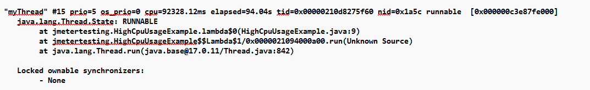

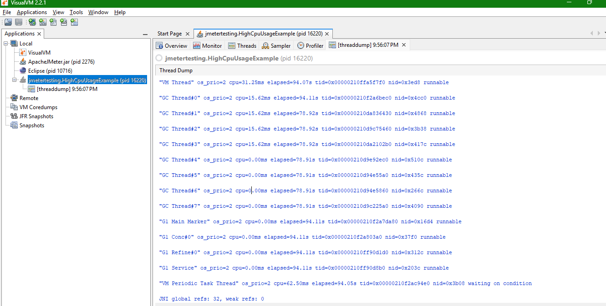

## Thread Dump Analysis - Deadlock Scenario

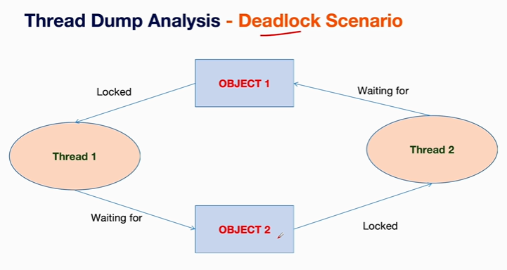

In above case, program cannot continue the execution and it will be stuck at one point

**When Deadlock occurs?**  
* A deadlock occurs when two or more processes are unable to proceed because each is waiting for the other(s) to release a resource.
* This creates a state of indefinite blocking where none of the processes can continue execution

**Resolution for Deadlock**  

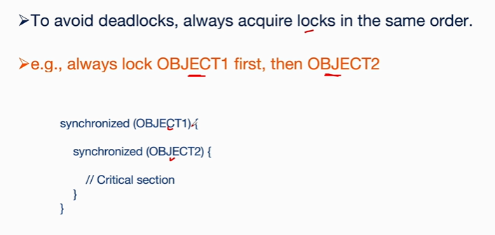

Let's take a sample program

## Thread Dump Analysis - Thread Contention Scenario

```txt
Imagine a bank counter where there are multiple customers, but there is only one customer service executive.

If many customers arrive at the same time, they have to wait for their turn to speak to the customer

service executive and get the things done.

Similarly, in thread contention, multiple threads will be competing to access the shared resource

at the same time, causing the delay or inefficiencies in the thread contention.

Shared resources include resources such as files, variables, database record, etc. in this real world
```

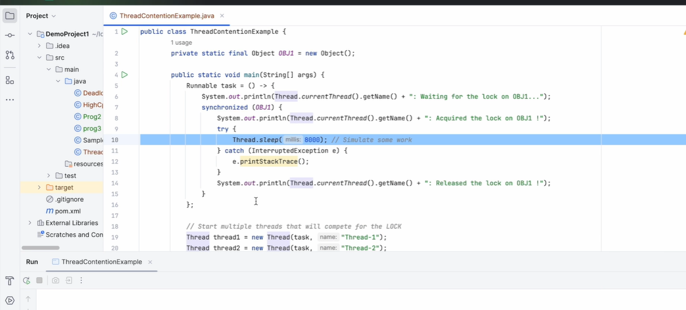

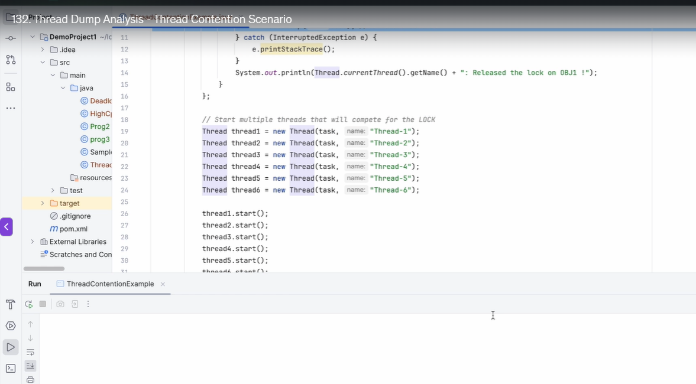

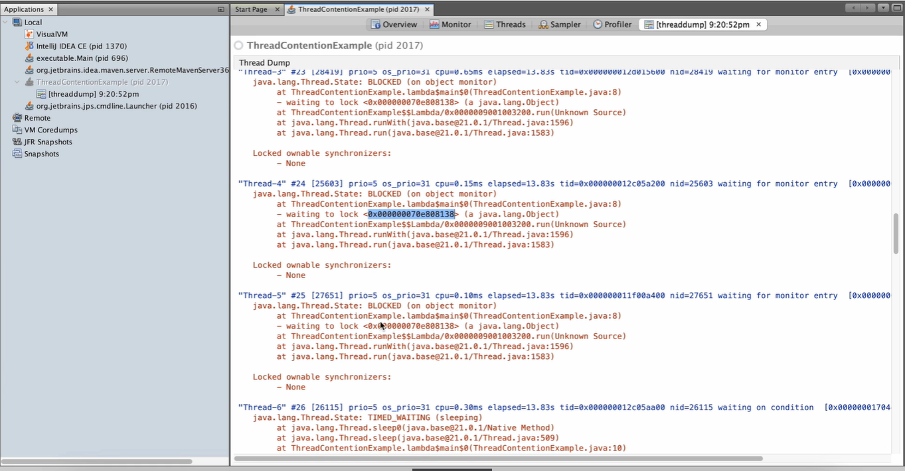

You need to provide the feedback to developer to fixing the issue

* **Resolution - To reduce contention**
  * **Minimize synchronized blocks** - Reduce the time threads spend in the critical section
  * **Use more granular locks** - Avoid locking large shared resources
  * **Use thread-safe alternatives** - Replace shared data structures with thread-safe options(e.g. ConcurrentHashMap, ReentrantLock)

## Using Tools for Thread Dump Analysis

> We can use various tools available in market for thread dump analysis
> Here our purpose not to go deep in a tool
> once you understand the concept, you can use any tool

* FastThread
* GCEasy Thread Dump Analyzer
* HP Thread Dump Analyzer

some of tools are free for couple of weeks

Steps - Thread Dump Analysis using tools  
* Collect thread dump
* Load into tool
* Insights from analysis
* Action taken
* Retest and verify Result


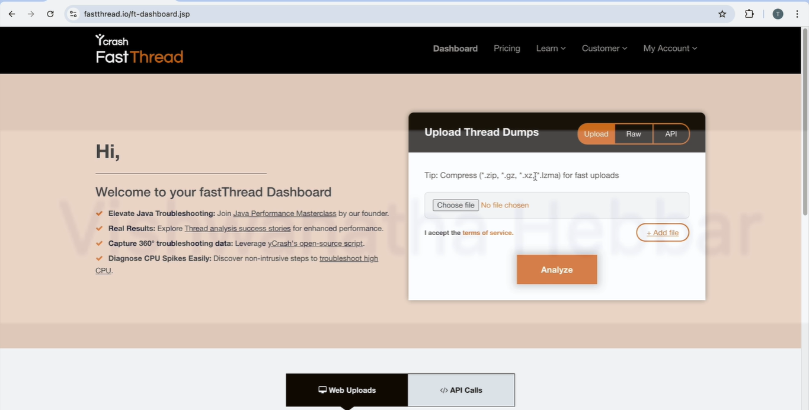

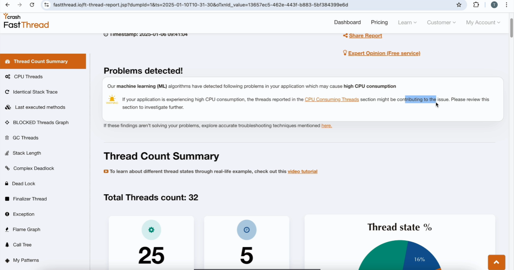

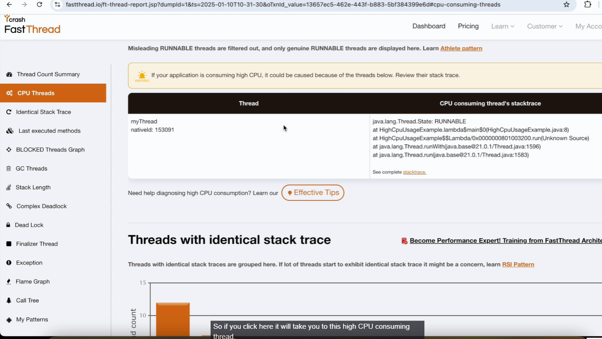

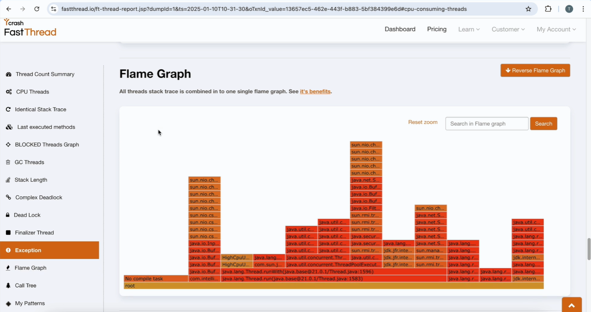

> Flame graph means here this flame graph provides the stack trace, the flow of the program and how many threads are active at a given point of time.


> You can learn the features in 1-2 weeks of time. Once you understand the concept, it should not be difficult for you to adapt to any tool 