# Performance Engineering - Heap Dump Analysis and Insights

## What is Heap and What is Garbage Collector?

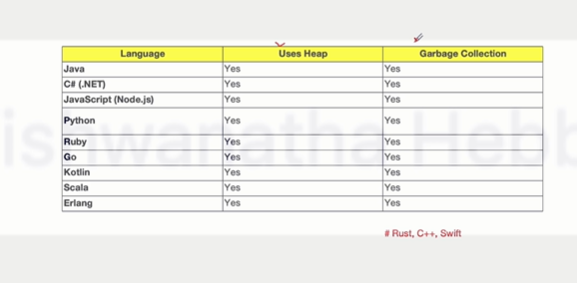

> All have a managed memory space where objects live and some form of automatic memory reclamation, which is also called garbage collection.

* **What is Heap?**
  * Heap is the memory area where objects are stored.
  * It is managed by JVM(Java virtual machine)


```txt
Think of it like a warehouse where all the products created in your factory are stored.

Similarly, all the objects created by the Java program are stored in the heap.

The heap is part of a memory used for storing the objects created by your application.
```

* **What is Garbage Collector(GC)?**
  * Garbage Collection(GC) is a Program or process, which cleans up unused objects to free up space

Analogy - 


```txt
Here guests have already finished eating and they have vacated the seat and those responsible for removing

this used plate, you can call it as a garbage collector and they will be removing plates which are

being unused, means guests have already completed eating and they have left this place.
```
> Similarly, in a Java program, the objects that are no longer being used will be cleaned up by the garbage collector, and this garbage collector will help to free up the space for the other objects.

## What is Heap Dump?
* A **heap dump** is a **snapshot** of the **heap memory** of a Java application at a specific point in time.
* Heap Dump is helpful to
  * Identify Memory Leak
  * Understand Memory Usage

* Heap Dump - Real - world Example
  

```txt
Imagine a library with many shelves where books are stored and each shelf has a limited space.

Every book will have a some kind of a tag to indicate that whether it is a science book or a maths book

or a fiction book, so on.

And some books might also have a relation with other books, indicating that it is a part of a series

of books.

A heap dump is creating a inventory list of all the books available in the library at a given point

of time.

It will help to indicate how books are organized in a library.
```


## When to Take Heap Dump? Scenarios and Situations

* These are general scenarios for understanding purpose
* You might have specific scenario for your application

1. During an **OutOfMemoryError**

```txt
It is like having a library where all shelves are full and no more books can fit in the library, right?

Similar situation happens in the memory as well.

There are many objects that have got created in the heap and filled up the heap memory space, and there

is no space for the new objects, just like there is no space for new books in this library, right?

All the shelves are full.
```

2. **Diagnosing Memory Leaks**

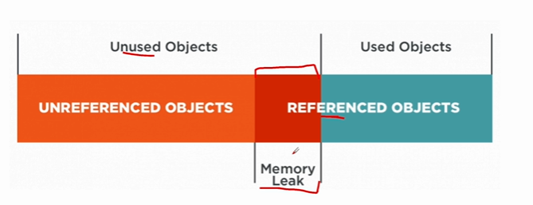

```txt
This memory leak happens because these objects are unused objects.

These are unused objects, but they are still referenced, so they cannot be garbage collected.

This leads to the memory leak.
```


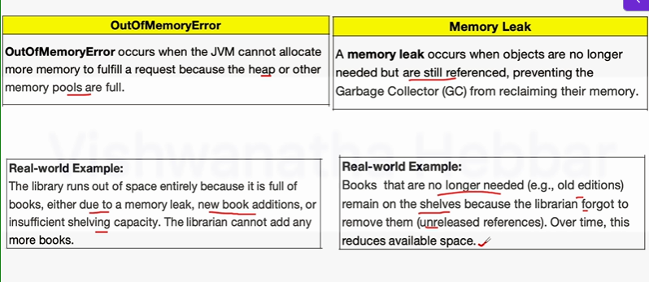

3. **Performances Issues Due to Memeory Usage**

Analogy - Imagine in a library if too many books are crammed in a one location, it will be difficult to access

4. During Memory Profiling

> Memory profiling means monitoring and analyzing the memory to identify any issue.
> The heap dump will help to understand memory allocation, trend and object lifecycle patterns.

5. **Before and After a Major Operation**

```txt
Imagine you have a library and you are adding a new section to the library after adding a new section

to the library.

You check and ensure that space is utilized properly without wasting the space.

Similarly, when you are performing any major operation, you can take a heap dump to analyze the memory

trend before and after that major operation.
```

* Tip to remember - 

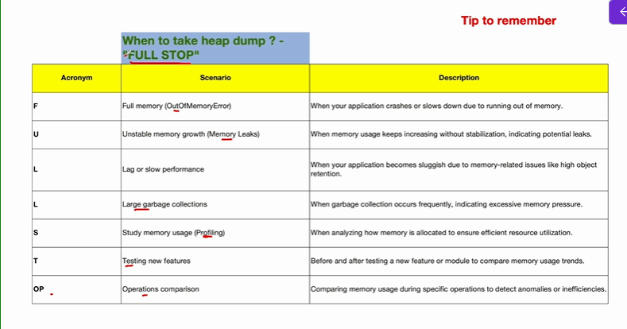

Above are general scenarios only

## How to Capture Heap Dump Automatically on Out of Memory Error?

* In most cases we will be taking Heap dump on the server side as majority of the applications will be hosted on the server and they will be utilizing the memory on the server side

* How to Capture Heap Dump using **JVM arguments**? - Automatically on **OutOfMemoryError**

> We will use a local application running on own machine

* Command

`-XX:+HeapDumpOnOutOfMemoryError -XX:HeapDumpPath=<path-to-save-dump>`

Above command enables automatic heap dump generation whenever out of memory error occurs

okay what about that NASA rocket blast scenario?

```java
package jmetertesting;

import java.util.ArrayList;

public class OutOfMemoryTest {

	public static void main(String[] args) {
		// TODO Auto-generated method stub
		
		ArrayList<int[]> list = new ArrayList<>();
		
		try {
			while(true) {
				// Allocate memory continuously
				list.add(new int[1024*1024]);
			}
		}
			catch(OutOfMemoryError e) {
				System.out.println("out of memory occured");
			}
		}

	}

```

For automatic heap dump in Intellij Idea

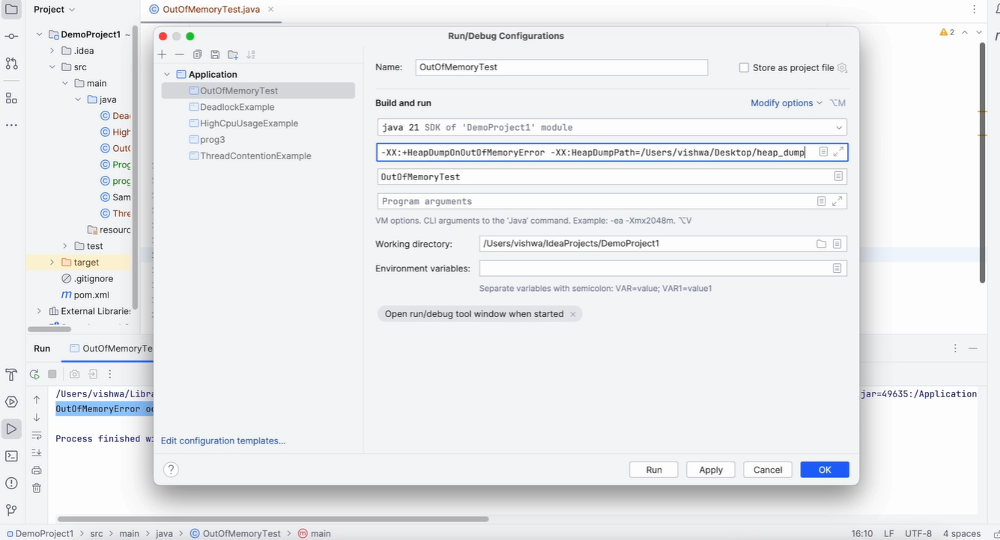


## How to Capture Heap Dump on Server side on OutOfMemoryError?

* Capturing Heap Dump for Applications Running in Servers
  * **Tomcat**
  * **Jetty**
  * Apache
  * Nginx
  * WebLogic
  * Microsoft IIS

On Tomcat - 

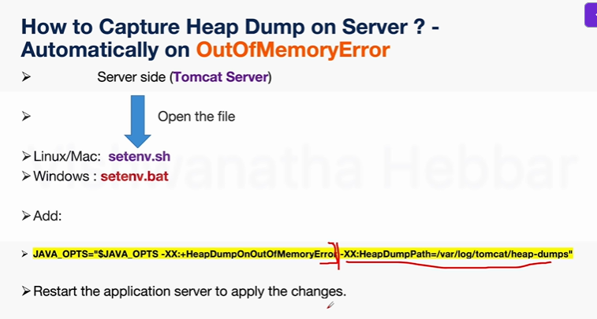

On Jetty - 

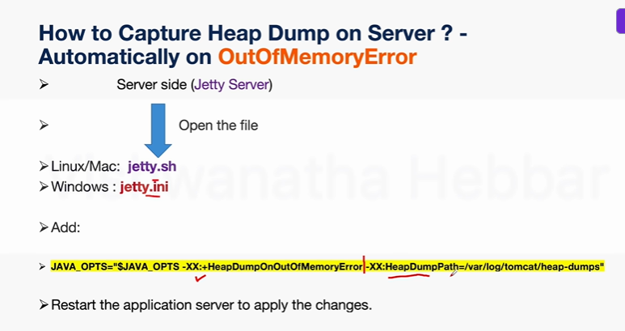

## How to Trigger Heap Dump Manually using jcmd?

* Manually Triggering a Heap Dump(While Application is Running)
* Firs identify the process ID of your Java application
  * `jps` - Lists all currently running java processes on a system
    * if jdk is installed in your system it will list down the process ID
  * Use the **jcmd** utility to trigger a heap dump
    * `jcmd <pid> GC.heap_dump /path/to/heapdump.hprof`

Now let's practically understand  

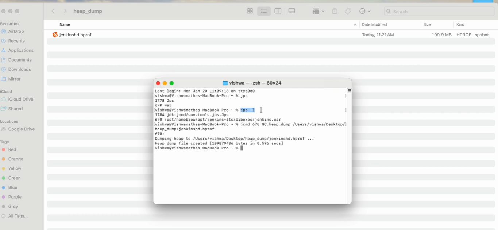

## How to take Heap Dump manually using Jmap?


JMAP means - Java Memory Map  

Install JDK in your system  

* **Syntax** - 
  * jmap -dump:live,format=b,file=/path/to/heapdump.hprof<PID>
    * live : Captures only live objects(those not eligible for garbage collection).
    * format = b means binary format
    * file specifies the path where heap dump file to be saved 
  

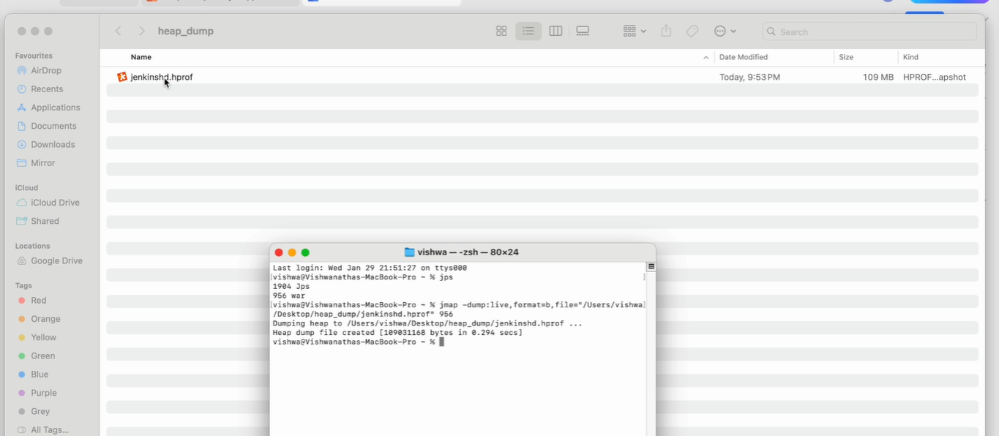

## How to Capture Heap Dump using a program

Scenarios - 
1. Memory Leak Investigation
2. Performance bottleneck Idnetification
3. Live Debugging in Production
4. Automated Monitoring and alerts
5. Before Restarting an application

We will use the this particular API  

* use `com.sun.management.HotSpotDiagnosticMXBean` API
  * above import you need to do in your program.

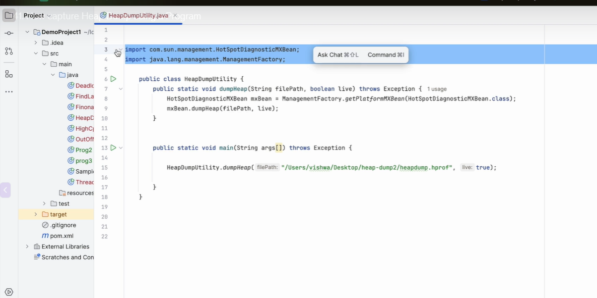

run the program and go to folder path  

## Tools for Capturing Heap Dump - Java Visual VM

* JDK(Jcmd, Jmap)
* JVisualVM(Java VisualVM)
* Eclipse Memory Analyzer(MAT)
* IBM HeapAnalyzer
* YourKit Java Profiler

Above tools are mainly for Java based application  

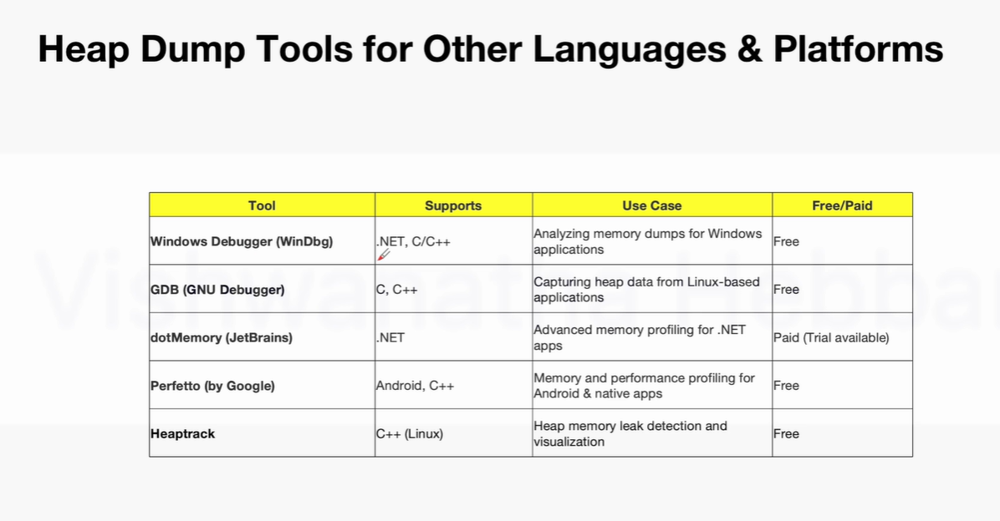


> Once you understand the concept you should be able to adapt to any tool based on the tool that is being used in your organization


* JVisualVM (Java VisualVM)  

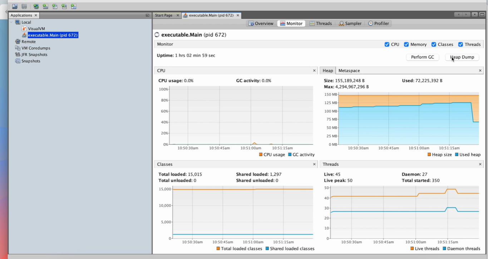

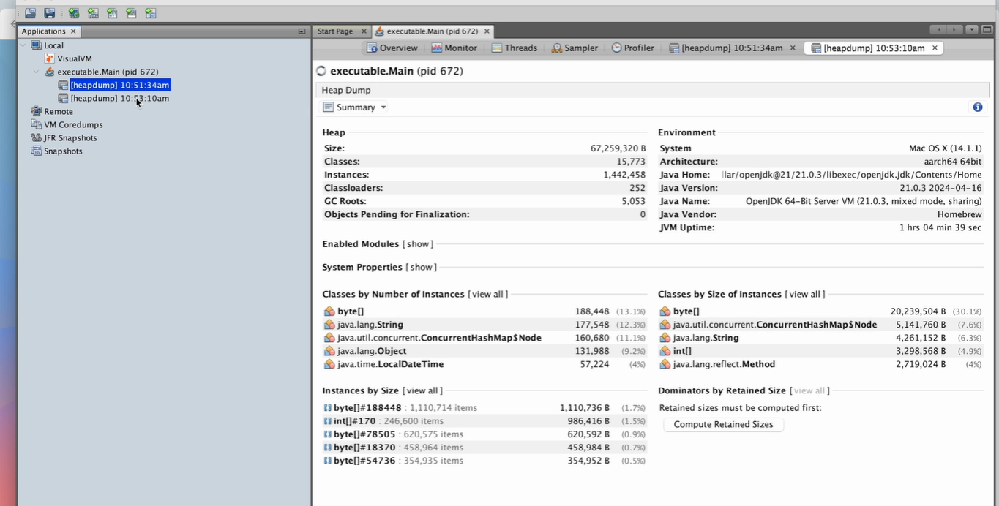

## Understanding Shallow Heap and Retained Heap

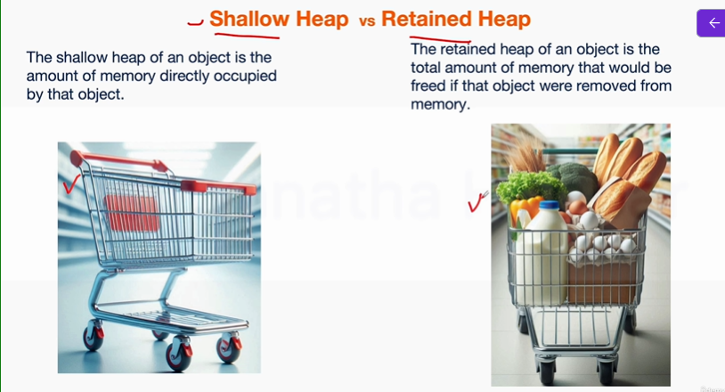

```txt
Similarly, the shallow heap of an object is memory directly occupied by the object here, in this case,

space occupied by the shopping cart, but the retained heap of an object is total amount of memory that

would be freed if an object is removed from the memory.

If this loaded cart is removed from the shopping mall along with the cart, these items will also get freed up
```

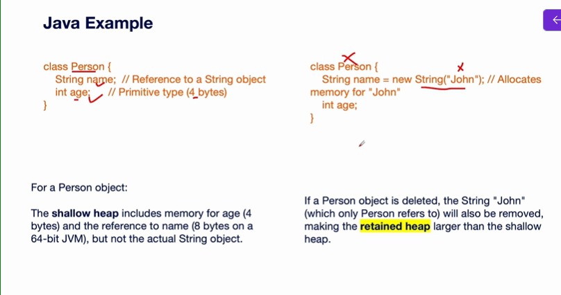

Example 1 - Objects in Memory  

