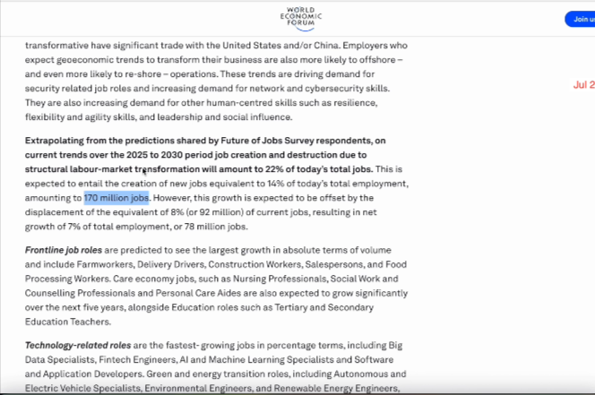
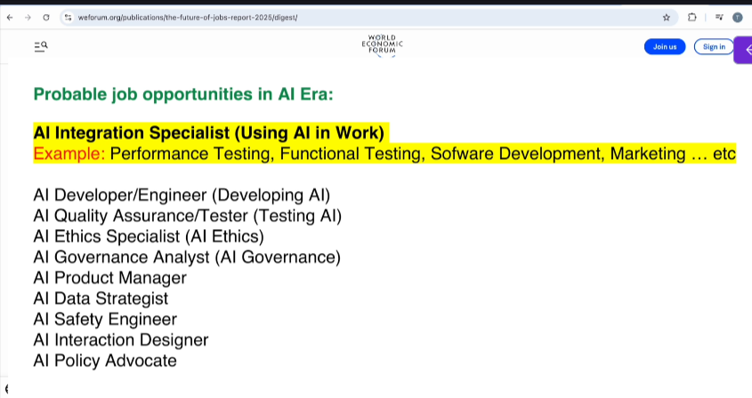
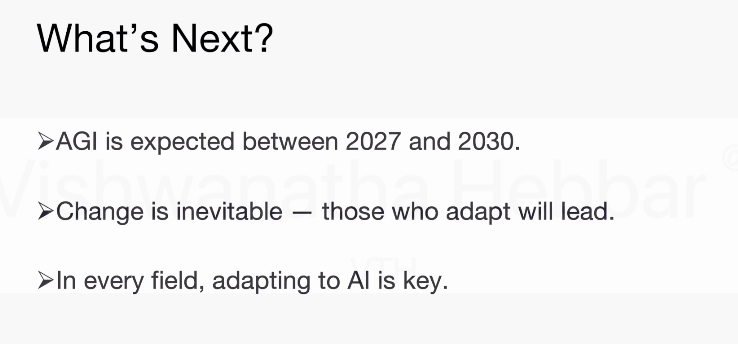
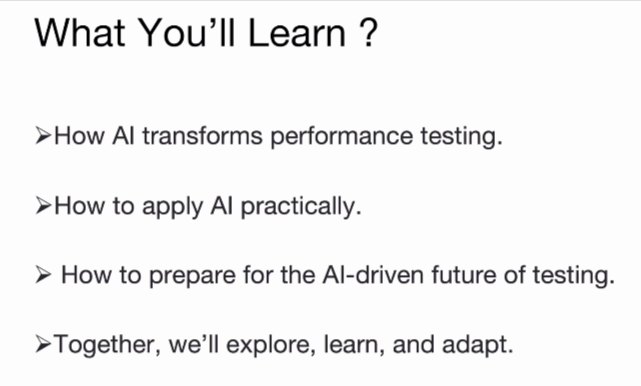
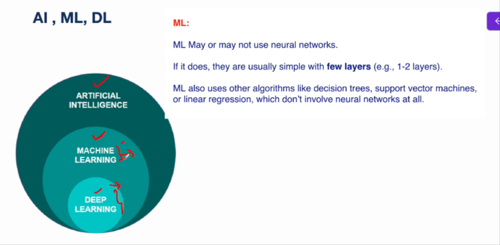
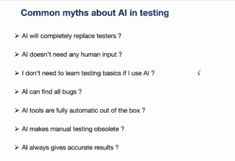
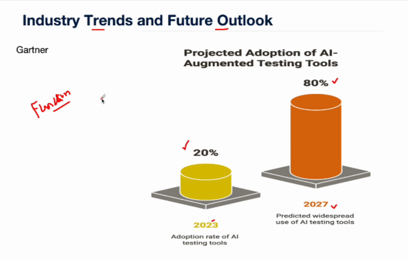
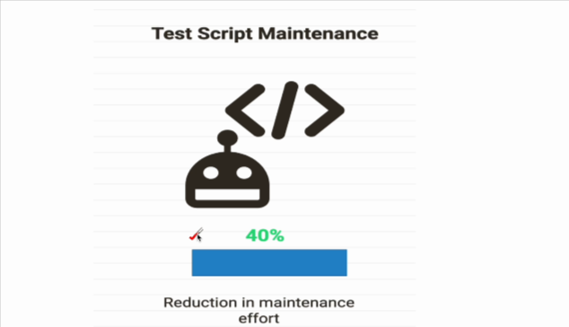
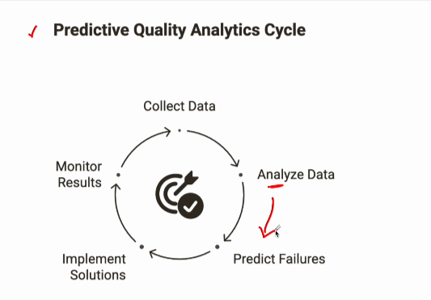
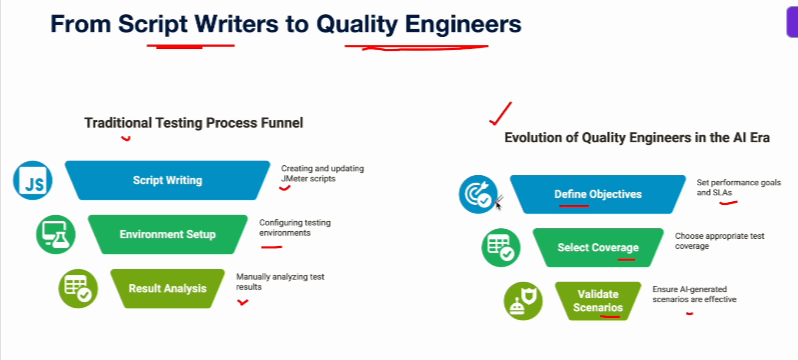

# Introduction to AI in Performance Testing





```txt
Most of these jobs are going to require some knowledge of AI.

It can be either how to use AI, or maybe you become a developer of AI.

So in one or other way, these jobs are going to require some knowledge of AI.

```





Those who understand and adopt AI will be best prepared for the future roles.



## Understanding AI, ML and DL

DL is a part of ML
ML is a part of AI

**Artificial Intelligence -**   
AI - AI is when computers or machines are designed to think and act like humans.

**Machine Learning -**  
ML is a part of AI
It's a method where computers learn from data to improve their performance without being explicitly programmed for every task.


**Deep Learning** -  
Deep learning is a part of ML that specifically uses nural networks with many layers(called deep neural networks) to learn complex from ras data





**tabular comparison** between **Machine Learning (ML)** and **Deep Learning (DL)**:

| Aspect                  | Machine Learning (ML)                                          | Deep Learning (DL)                                        |
| ----------------------- | -------------------------------------------------------------- | --------------------------------------------------------- |
| **Definition**          | A subset of AI that learns patterns from data using algorithms | A subset of ML that uses neural networks with many layers |
| **Data Requirement**    | Works well with small to medium datasets                       | Requires large amounts of data                            |
| **Feature Engineering** | Manual feature extraction required                             | Automatically learns features                             |
| **Algorithms Used**     | Decision Trees, Random Forest, SVM, KNN, etc.                  | Neural Networks (CNN, RNN, Transformers)                  |
| **Training Time**       | Faster training                                                | Slower, requires high computation                         |
| **Hardware Dependency** | Can run on CPUs                                                | Often needs GPUs/TPUs                                     |
| **Accuracy**            | Good for structured data                                       | Superior for complex/unstructured data                    |
| **Interpretability**    | More interpretable (easier to understand)                      | Less interpretable (“black box”)                          |
| **Use Cases**           | Spam detection, fraud detection, recommendation systems        | Image recognition, speech recognition, NLP                |
| **Human Intervention**  | More human involvement needed                                  | Less human intervention after setup                       |

### Simple Way to Remember:

* **ML = Learn from data with human guidance**
* **DL = Learn automatically using layered neural networks**

## AI in Testing - A Broader Perspective and common Myths

```txt
First thing is, you might be wondering if I am using AI for performance testing.

Do I still need to learn the basics of performance testing and tools like Jmeter?

The simple answer is yes.

You still have to learn the basics of performance testing and tools like Jmeter.

If you want to become a performance test engineer or a performance engineer, having a solid foundation

in performance testing concepts and tools is still essential.

While AI can accelerate your work by helping to automate certain tasks or helping to analyze the test

results or providing certain recommendations, it does not replace the need for core knowledge and understanding

of performance testing.

Matrix test planning, bottleneck analysis tools configurations like Jmeter having these skill sets

and knowledge is essential and can help to make an informed decision and troubleshoot the problems effectively.

When the things do not go as expected, you can think of AI as an assistant, not as a replacement.

The better your foundational knowledge, more effectively, you can leverage AI to enhance your performance

testing workflow.
```


```txt
You might have heard that AI will completely replace the testers.

AI can assist the testers, not replace them.

Human judgment, domain knowledge, and critical thinking are still needed.

AI will act as a assistant, not replacement.

AI may suggest some test cases, but the tester decides if they are relevant to a business context,

right?

So testers are still needed.

AI does not need any human input.

That is also not true.

AI models require data and guidance.

They can't automatically test an app unless you configure them.

You must define the goals.

Else AI won't know what to do and optimize right.

And another assumption may be I don't need to learn testing basics if I use AI.

That is also not true as we have already discussed.

Without the core testing knowledge, you won't know what AI is doing or if it is doing it right.

You still need to have understanding of concepts and tools.

Another myth might be AI can find all the bugs.

That is also not true.

AI improves coverage and optimization, but it can't replace real world exploratory or context driven

testing.

AI might miss a logical errors in business workflows that require human validation.

Another myth can be AI tools are fully automatic out of the box.

That is also not true.

Most AI testing tools need set up training.

Maintenance AI based test automation tools require input parameters, test objectives, validation rules

to function.

Another myth might be AI makes manual testing obsolete.

Manual testing will be still needed, especially for UI, UX checks, exploratory testing, and edge

cases.

For example, if you want to test how a user feels while using a mobile application, this cannot be

tested by AI user.

Need to test that and feel how you feel about using that particular application.

For that user need to use that app, test that app and see how user feels while using that application.

Another myth can be AI always gives accurate results.

That is also not true.

AI can make mistakes and wrong predictions, especially if training data is poor or not relevant.

These are some of the common myths and assumptions that might be floating around.
```
## Why AI for Performance Testing?

* Faster Testing cycle(speed)

## Where AI helps in Performance Testing?
* Test planning
* Test Scenario Design
* Test Data Generation and Manangement
* Identifying Performance Bottlenecks
* Analysis of Test Results
* Predicting Future Performance Issues

## Responsible use of AI - Ethics, Bias, Data privacy, Human

> When you are dealing with some sensitive data
> Like personal data, banking data

* Ethical AI use
* Bias Mitigation
* Data Privacy
* Human in the loop

1. Ethical AI Use(very important)
   1. Transparency
   2. Explainability
   3. Avoiding Misuse
   4. Accountability
2. Bias Mitigation
   1. Dataset - Check if it covers all user types, regions, devices, and time periods(e.g. weekdays + weekends)
   2. Different business flows
   3. Different metrics
   4. Different scenarios - peak load, slow network, global users
3. Data Privacy and security
   1. Identify and protect Sensitive Data(e.g. Email, phone, credit card number)
   2. Anonymize or Mask before sharing
   3. Ensure Compliance with Laws(e.g. GDPR)
4. Human in the loop
   1. Keep Humans in Control
   2. Validate AI Outputs
   3. Apply Critical Thinking
   4. Maintain Skills & Context Awareness
   5. Track Decisions

## Industry Trends and Future Outlook
> Based on survey by various org
1. 


2. Test Script Maintenance



It is more relevant for functional testing not much in performance testing.
Automatic test script maintenance is called **Self-Healing**

3. Predictive Quality Analytics Cycle




From Script Writer to Quality Engineers

