# AI-Driven Performance Testing - Practical Use cases and End to End project

## Project Overview

1. Application E-commerce WebApp - Juice Shop

Application Intallation

GitHub URL - https://github.com/juice-shop/juice-shop?tab=readme-ov-file


2. Install Node.js

Node.js download link - https://nodejs.org/en/download 

```txt
Install node.js
Run git clone https://github.com/juice-shop/juice-shop.git --depth 1 (or clone your own fork of the repository)
Go into the cloned folder with cd juice-shop
Run npm install (only has to be done before first start or when you change the source code)
Run npm start
Browse to http://localhost:3000
```


Complete the installation and run


3. DB tools(DB browsing)

Download link - 
https://sqlitebrowser.org/dl


Change the settings here -  


Download the .zip file -  


click on SQLite.exe file  


open the following file in database


## Requirement Analysis in Performance Testing and How AI Enhances it - Part 1


```txt
Help me to prepare performance requirement Specification(PRS) document using the Non Functional requirement document(NFR) provided.
Include the below sections in the PRS document based on the given NFR document
1. Introduction
2. Performance Requirements
3. Business and Technical Use Cases
4. Service Level Agreements(SLAs)
5. System Architecture Overview
6. Technology Stack
7. Test Scope
8. Workload Modelling Inputs
9. Risks and Assumptions
10. Initial Tool Feasibility Summary
```

## ## Requirement Analysis in Performance Testing and How AI Enhances it - Part 2

```txt
we have discussed how we can use and leverage the AI to prepare a performance

Requirement specification document from the documents that have been provided to you.

It can be non-functional requirement document or a business requirement documents and whatever the documents

that has been provided to you by business users or a business analyst.
```

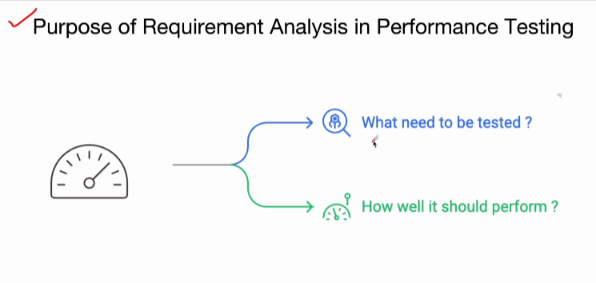

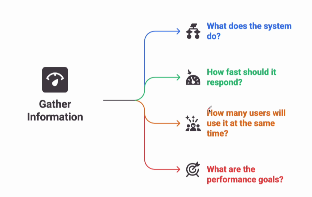

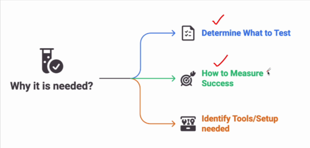

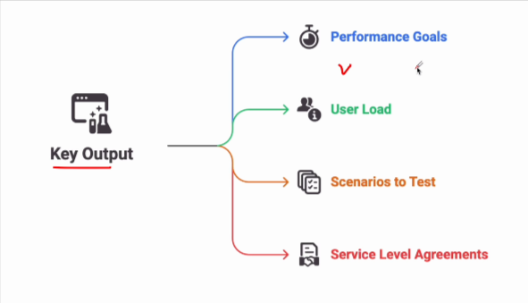

> You can follow the process based on your organization in your organization.
> You might just gather the information in some table format or something like that.

* Prompt

> To gather key info in table format
> Upload PRS document to AI tool and use the below prompt.


```txt
Assume you are performance test engineer who is analysing requirements. Go through this document and provide key parameters necessary for performance testing in table format.
```

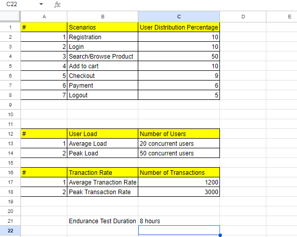

> This distribution should be based on real user behavior in production. Get it from analytics/Business team.

## Adapting AI in Performance Test Planning - How AI Enhances Test Plan Preparation

* Test Planning
  * Test Plan document - It will serve as blueprint
    * Objectives
    * Scope
    * Strategy
    * tools
    * timeline
    * Responsibilities

> How we can use AI for above

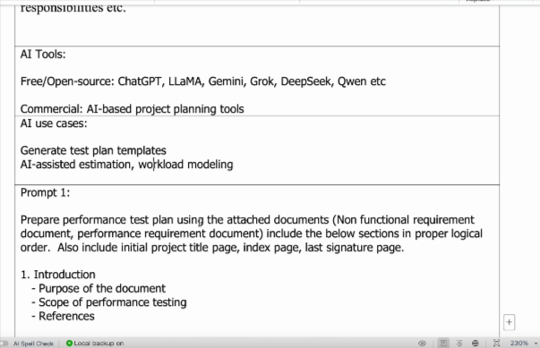

* prompt - 

```txt
Prepare performance test plan using the attached documents(Non functional requirement document, performance requirement document) include the below sections in proper logical order. Also include initial project title page, index page, last signature page.

1. Introduction
    - Purpose of the document
    - Scope of performance testing
    - References
2. Objectives
    - Performance goals
    - Business scenarios to be validated
3. Test Strategy
    - Types of performance testing(load, stress, soak, etc)
    - Approach (script-based, protocol-level, UI-level)
    - Entry and exit criteria
    - Pass/fail criteria
4. Test Scope
    - In-scope components
    - Out-of-scope components
    - User journeys and critical transactions
5. Workload Modelling
    - User profiles
    - Concurrent users
    - Transaction mix and pacing
    - Think time and ramp-up/ramp-down patterns
6. Test Environment
    - Hardware and software setup
    - Network configuration
    - Environment topology(app servers, DB, etc.)
    - Data requirements
7. Tool Selection
    - Performance testing tools
    - Monitoring and analysis tools
    - Test data management tools
8. Scripting Plan
    - Script development guidelines
    - Parameterization
    - Correlation
    - Reusability strategy
9. Execution Plan
    - Test cycles and schedule
    - Pre-test checks
    - Execution steps
    - Rollback/cleanup steps
10. Monitoring and Metrics
    - Server-side metrics to be captured(CPU, memory, DB, etc)
    - Application-level metrics(response time, throughput, etc)
    - Monitoring tools and dashboards
11. Roles and Responsibilites
    - Team structure
    - Responsibilities of each team member
12. Risk Management
    - Potential risks
    - Mitigation strategies
    - Assumptions and constraints
13. Reporting and Analysis
    - Reporting format
    - Result analysis approach
    - Stakeholders for report distribution
14. Exit Criteria
    - Completion conditions
    - Criteria for success/failure
    - Sign-off process

```


## Customizing AI generated test plan

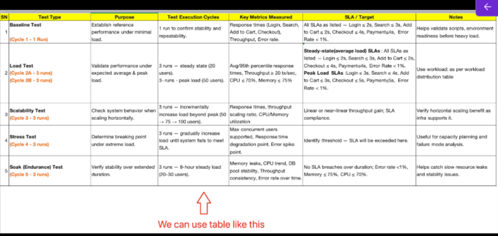

## Test Scenario, Test Case Design and Test Scripting with AI - Part 1

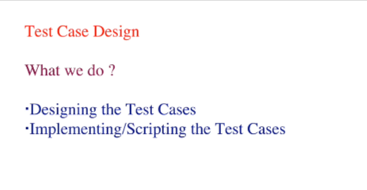

> So by leveraging the AI or adapting the AI, we are able to quickly design the test cases. Here, we just have to verify whether they are correct or not

## Test Scenario, Test Case Design and Test Scripting with AI - Part 2

* Modular
* Re-usable
* Easy to Maintain

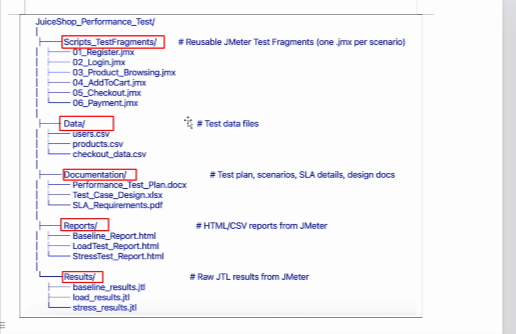


create the following folder structure

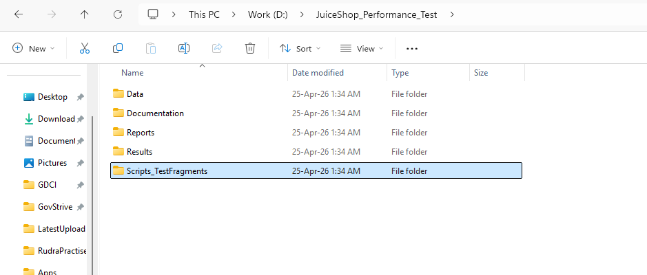

## Test Script Creation and Enhancement for Registration Scenario - Part 1

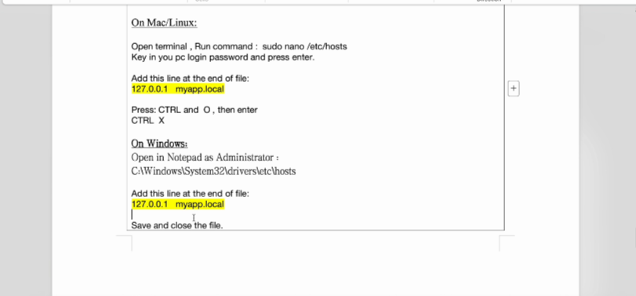

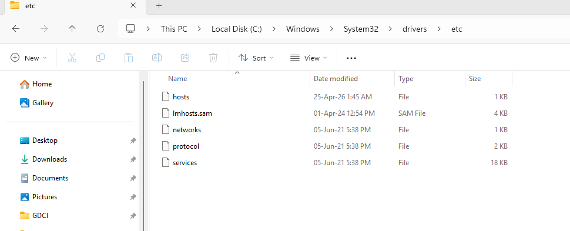


http://myapp.local:3000/#/


* **Prompt**

```txt
You are an experienced Performance Test Engineer specializing in creating and optimizing JMeter test scripts to meet industry best practices.
I will provide you with a JMeter.jmx script file.
Your tasks are:

Analyze the script's structure and configuration – review Thread Groups, HTTP Requests, Timers, Assertions, Listeners, Config Elements, and any data parameterization.

Identify gaps or issues – such as hardcoded data, missing correlation, lack of modularization, unnecessary requests, or unrealistic user behavior simulation.

Recommend specific improvements as per industry standards, including:

Parameterization with CSV Data Set Config

Use of HTTP Request Defaults & Variables (e.g., $${BASE_URL})

Correlation for dynamic values

Appropriate Think Time and pacing

Functional validations (Assertions)

Modular structure (Reusable Test Fragments)

Naming conventions and documentation

Provide examples of improved XML snippets where relevant, so I can directly apply changes

Ensure all recommendations are clear, practical and ready for immediate implementation in JMeter
```

Think Time  

Total Delay - Constant Delay offset + Random delay maximum  

## Test Script Creation and Enhancement - Login Scenario

* **Note** - In your organization you can check with API specification document or check with developers on which API is doing what
* > Basically what are the APIs that need to be tested you can get in touch with development team and you know the exact logic what exactly it is doing if you have a API specific document 
* > Here we don't have API specific documentation, I will follow based on my understanding
* > But in your organization when you are testing, know what exactly each API is doing. You can get in touch with backend developer or API development team. so you will know what you need to test

## Test Script Creation and enhancement - Product Search Scenarios

* Prompt

```txt
Go through the given API details below (or API specification document) provided

API Details :
Home page API URL - http://myapp.local:3000/
Search API URL - http://myapp.local:3000/rest/products/search?1=apple

here "apple" is search item to be parameterized.

Create jmeter performance test script using the details given below, you can provide xml or jmx file.

I'm using jmeter version 5.6.3, my JDK version is 21

Scenario:
Product Browsing(Search)

Steps:
1. Use Search bar with keyboard
2. View product listing
3. Click product for details
4. Click on Close button

Think time -  2-3 sec between actions
Pacing - 2 searches/user/min
Number of threads = 10

Performance Targets:
Average load :
Response time <=3 sec
Error rate <= 1%
Peak Load:
Response time <= 4 sec
Error rate <=1%

Add assertions to verify the relevant performance targets are met

Add listeners view result tree, summary report

```

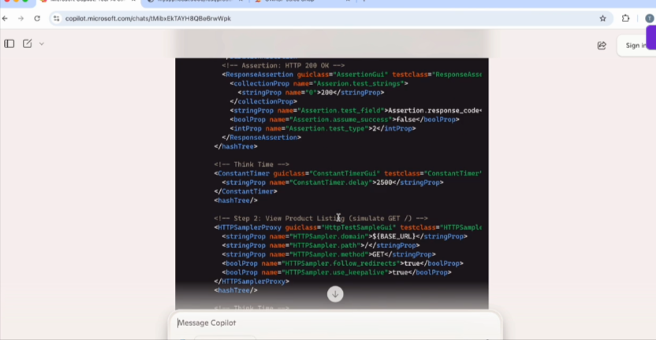

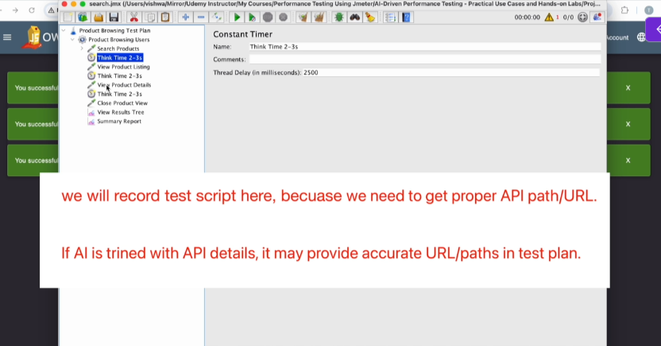

* If you have proper API details document for your project, you will have better idea on which API to use
* Also can discuss with developers

We need to parameterize these -  so for that you can read from a csv file

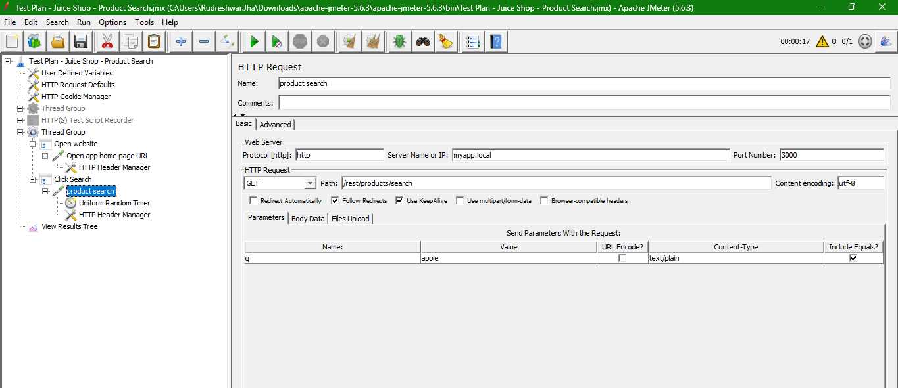

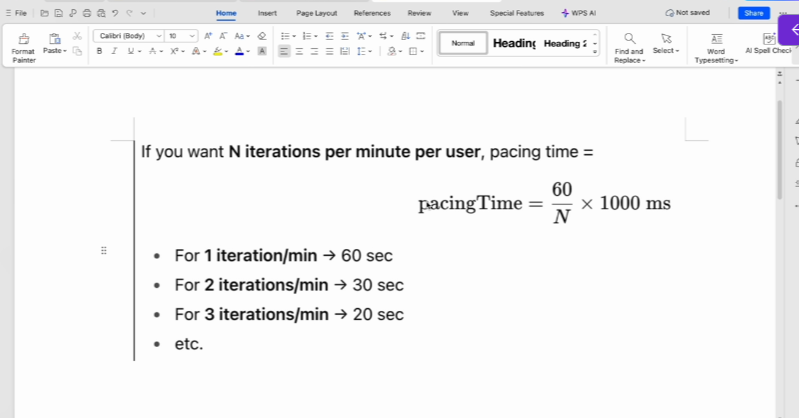

## Test Script Creation and Enhancement - Add to Cart

* We will take the useful API's

* Also add a delete if something product is added

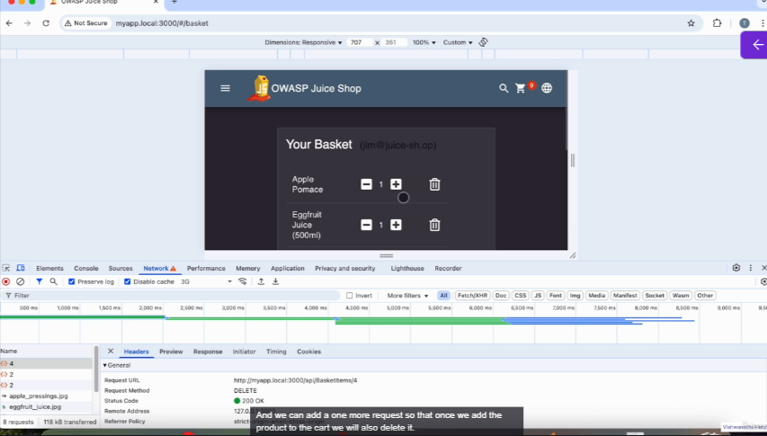

## Test Script Creation and Enhancemen - Checkout Scenario

## Test Script Creation and Enhancement - Payment Scenario

Order details should match 

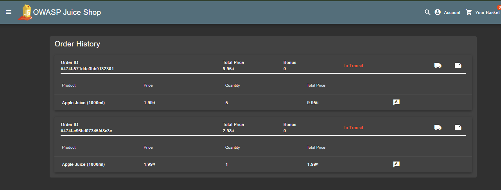

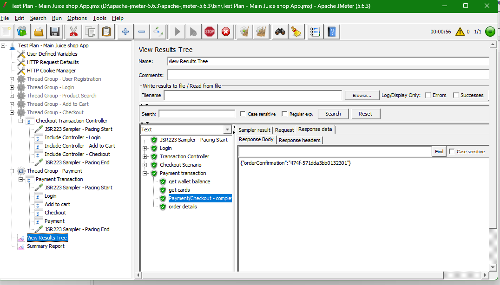

## Enhancing and Customizing Test Plan further

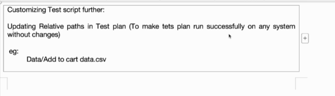

## Understanding Performance Test Environment Architecture

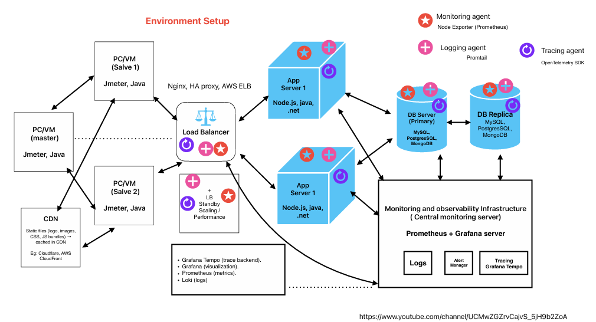


