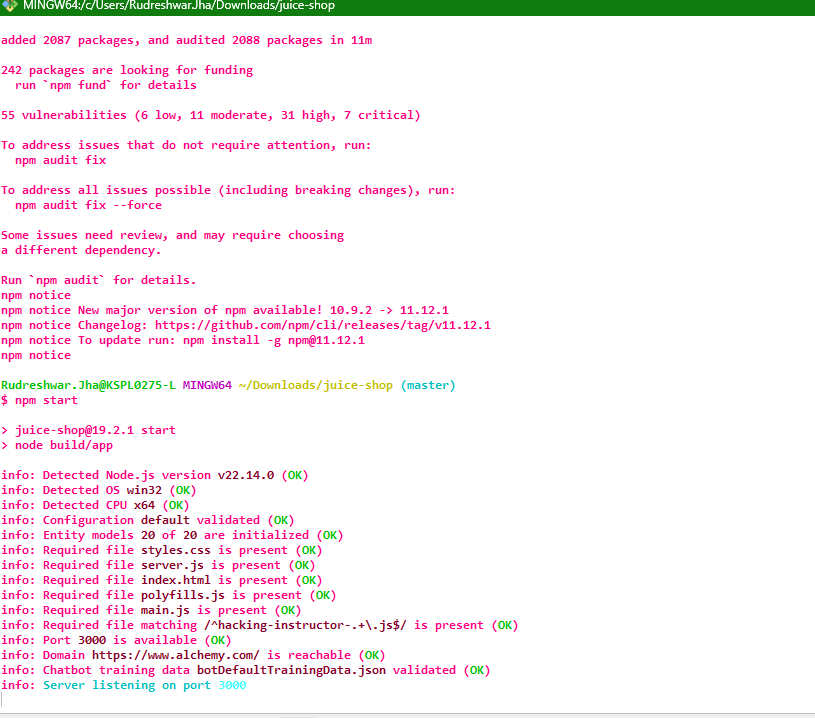
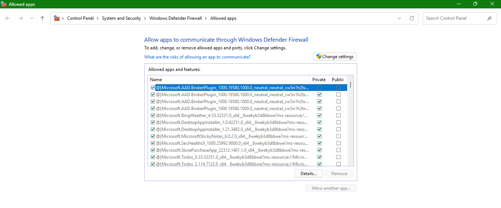
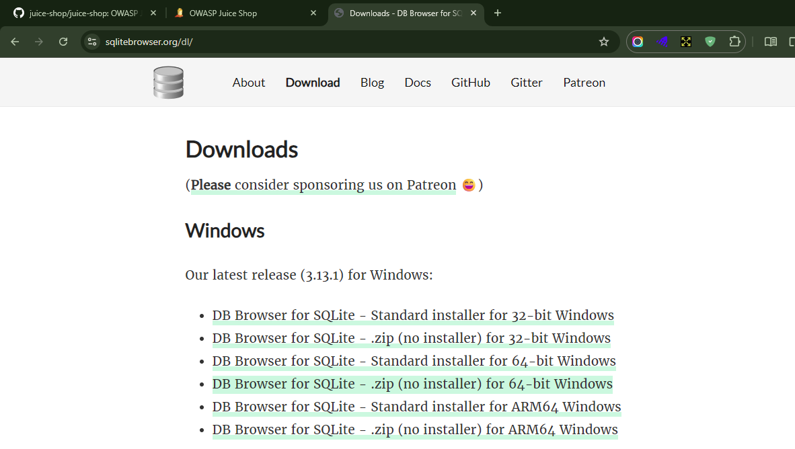
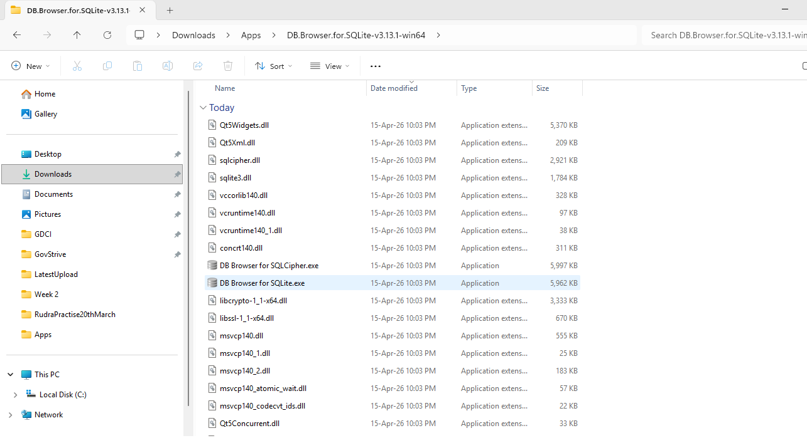
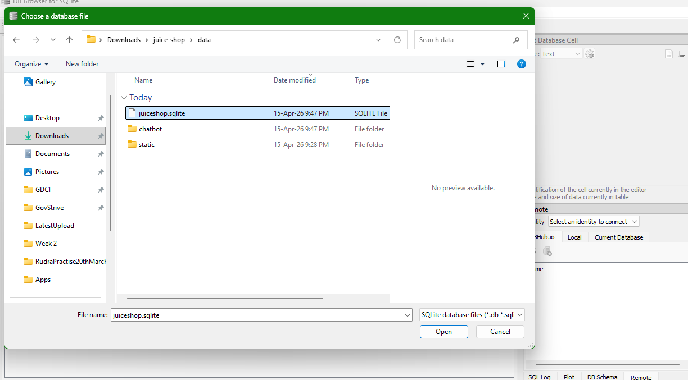
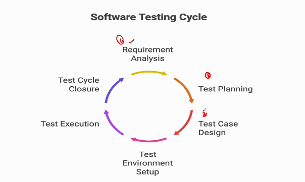
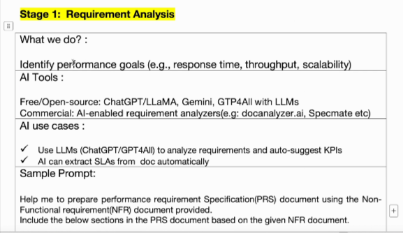

# AI-Driven Performance Testing - Practical Use cases and End to End project

## Project Overview

1. Application E-commerce WebApp - Juice Shop

Application Intallation

GitHub URL - https://github.com/juice-shop/juice-shop?tab=readme-ov-file


2. Install Node.js

Node.js download link - https://nodejs.org/en/download 

```txt
Install node.js
Run git clone https://github.com/juice-shop/juice-shop.git --depth 1 (or clone your own fork of the repository)
Go into the cloned folder with cd juice-shop
Run npm install (only has to be done before first start or when you change the source code)
Run npm start
Browse to http://localhost:3000
```


Complete the installation and run



3. DB tools(DB browsing)

Download link - 
https://sqlitebrowser.org/dl


Change the settings here -  




Download the .zip file -  



click on SQLite.exe file  




open the following file in database



## Requirement Analysis in Performance Testing and How AI Enhances it - Part 1





```txt
Help me to prepare performance requirement Specification(PRS) document using the Non Functional requirement document(NFR) provided.
Include the below sections in the PRS document based on the given NFR document
1. Introduction
2. Performance Requirements
3. Business and Technical Use Cases
4. Service Level Agreements(SLAs)
5. System Architecture Overview
6. Technology Stack
7. Test Scope
8. Workload Modelling Inputs
9. Risks and Assumptions
10. Initial Tool Feasibility Summary
```

## ## Requirement Analysis in Performance Testing and How AI Enhances it - Part 2

## Adapting AI in Performance Test Planning - How AI Enhances Test Plan Preparation

## Customizing AI generated test plan

## Test Scenario, Test Case Design and Test Scripting with AI - Part 1

## Test Scenario, Test Case Design and Test Scripting with AI - Part 2

