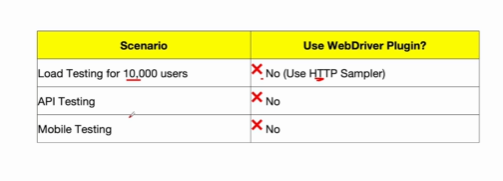
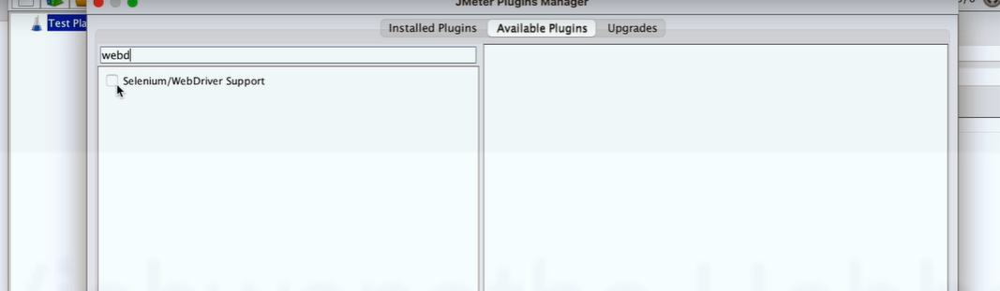
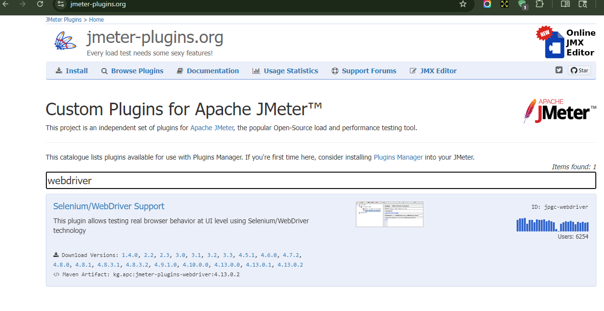
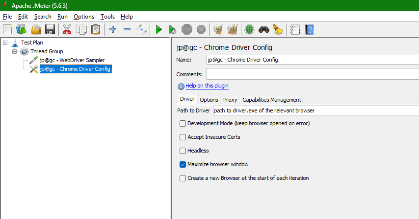
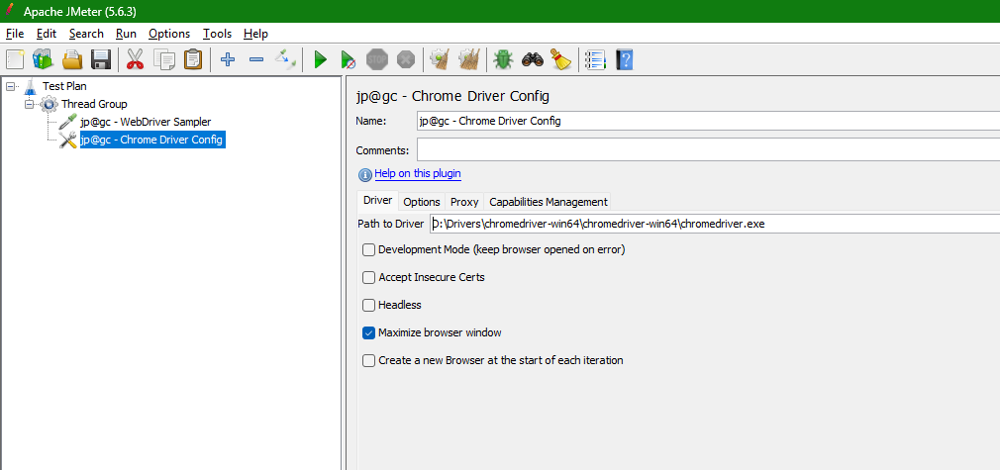
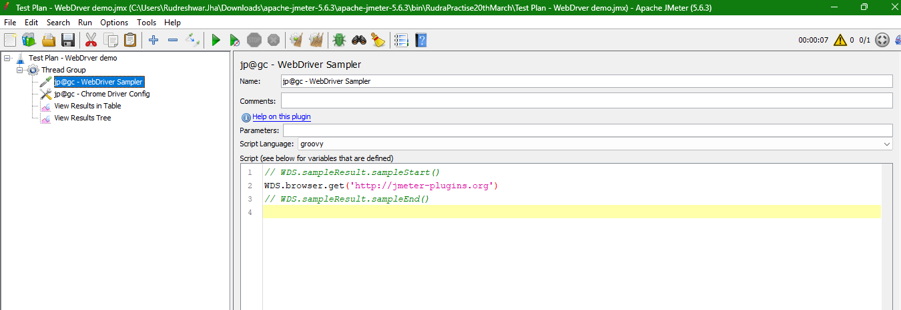
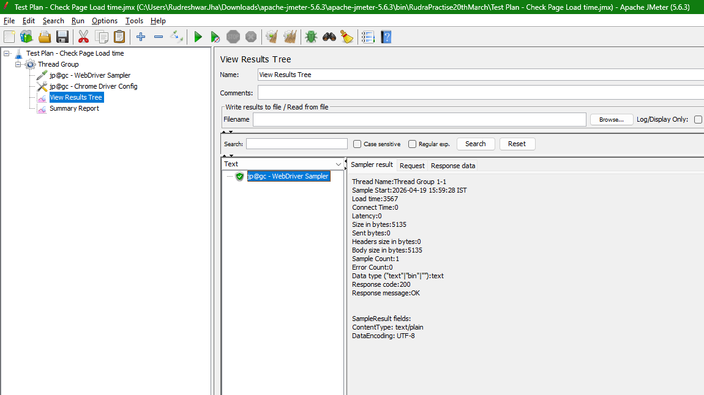
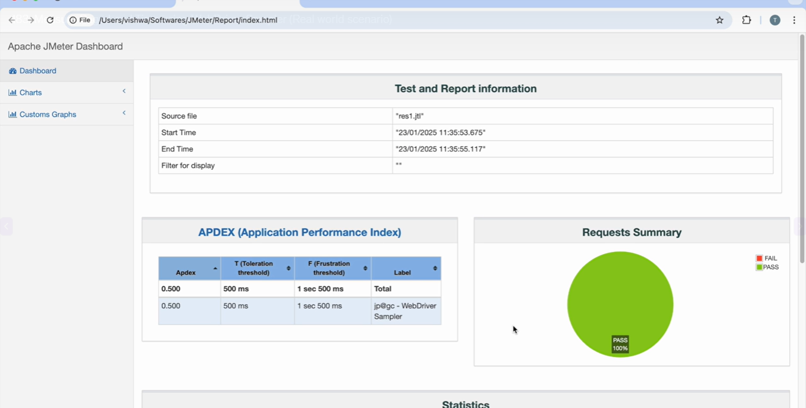
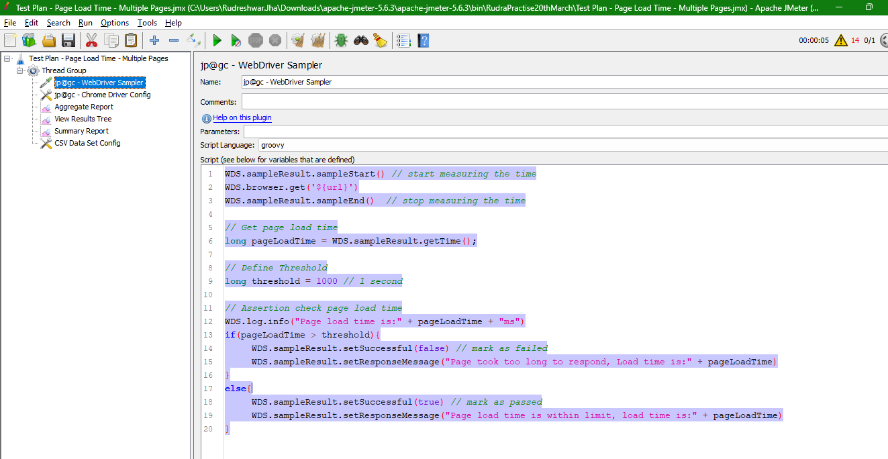
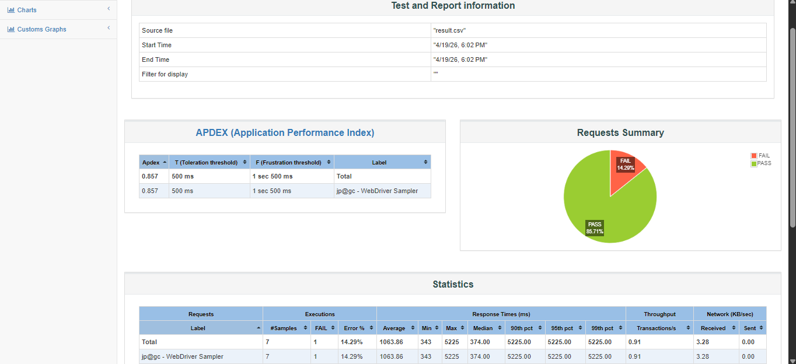

# Client-Side Performance Testing Using WebDriver Plugin for JMeter

> It means we will be installing a web driver plugin to the Jmeter, and we will do the client side performance testing using that plugin.

* **What is the WebDriver Plugin in JMeter?**
  * It allows to Perform client-side performance testing by automating browsers
  * It is built on Selenium Webdriver

* **Why Do We Need WebDriver Plugin in JMeter?**

```txt
What exactly is the problem it is solving?

Jmeter by default is a protocol based tool.

It means it sends the HTTP request and it does not execute the JavaScript, CSS or images, but modern

web applications are heavily dependent on the JavaScript.

The problem here is traditional jmeter samplers.

That is, HTTP request sampler do not measure the client side performance.

For that solution is to use WebDriver plugin, which helps us to test the real world user experience

by loading the pages in the actual browser.

Measuring how long it takes to respond.
```

* Traditional HTTP Request Samplers does not execute JavaScript, CSS, or images & do not measure client-side rendering performance

## When to use and When NOT to use WebDriver plugin for JMeter

* **Scenarios**
  * Measure Page Load time
  * Testing single page applications
  * Validating user experience

* **Example** - E-commerce Website
  * How long the homepage renders?
  * How long it takes to load images?
  * How JavaScript-based popups behave under load?

* **When Not to use WebDriver Plugin for JMeter?**



It's not possible to open 10000 browsers

## How to setup WebDriver Plugin to JMeter and Run Sample Script

Navigate to JMeter >> Options >> Plugin Manager



you can also install it from here -   



In the test plan add the following sampler and config element and later download the browser(chorome/firefox/edge) plugin



give the chrome driver pathe name here -  



Run the Sample test and you can see the execution of the browser  



## Measure Page Load Time using WebDriver Sampler(Real world scenario)

```java
import org.openqa.selenium.By
import org.openqa.selenium.support.ui.WebDriverWait
import org.openqa.selenium.support.ui.ExpectedConditions
import java.time.Duration

//Start measuring the page load time
WDS.SampleResult.sampleStart();

//open website
def driver = WDS.browser
driver.get("https://petstore.octoperf.com/actions/Catalog.action")

// wait until page loads
WebDriverWait wait = new WebDriverWait(driver, DurationOfSeconds(10))
wait.until(ExpectedConditions.presenceOfElementLocated(By.tagName("Body")))

//stop measuring page load time
WDS.sampleResult.sampleEnd();

long loadTime = WDS.sampleResult.getTime();
WDS.log.info("Page load time" + loadTime + "ms")

```



you can also generate the HTML report  



## Use Case - Test Page load time of multiple pages(Real World Scenario)

```java
WDS.sampleResult.sampleStart() // start measuring the time
WDS.browser.get('${url}')
WDS.sampleResult.sampleEnd()  // stop measuring the time

// Get page load time
long pageLoadTime = WDS.sampleResult.getTime();

// Define Threshold
long threshold = 1000 // 1 second

// Assertion check page load time
WDS.log.info("Page load time is:" + pageLoadTime + "ms")
if(pageLoadTime > threshold){
	WDS.sampleResult.setSuccessful(false) // mark as failed
	WDS.sampleResult.setResponseMessage("Page took too long to respond, Load time is:" + pageLoadTime)
}
else{
	WDS.sampleResult.setSuccessful(true) // mark as passed
	WDS.sampleResult.setResponseMessage("Page load time is within limit, load time is:" + pageLoadTime)
}
```



Run the file from command line - 

```txt
C:\Users\Rudreshwar.Jha\Downloads\apache-jmeter-5.6.3\apache-jmeter-5.6.3\bin>jmeter -n -t "C:\Users\Rudreshwar.Jha\Downloads\apache-jmeter-5.6.3\apache-jmeter-5.6.3\bin\RudraPractise20thMarch\Test Plan - Page Load Time - Multiple Pages.jmx" -l "C:\Users\Rudreshwar.Jha\Downloads\apache-jmeter-5.6.3\apache-jmeter-5.6.3\bin\petstore-project\TestResult\webdriverResult\result.csv" -e -o "C:\Users\Rudreshwar.Jha\Downloads\apache-jmeter-5.6.3\apache-jmeter-5.6.3\bin\petstore-project\TestReport\19thApril"
WARN StatusConsoleListener The use of package scanning to locate plugins is deprecated and will be removed in a future release
WARN StatusConsoleListener The use of package scanning to locate plugins is deprecated and will be removed in a future release
WARN StatusConsoleListener The use of package scanning to locate plugins is deprecated and will be removed in a future release
WARN StatusConsoleListener The use of package scanning to locate plugins is deprecated and will be removed in a future release
Creating summariser <summary>
Created the tree successfully using C:\Users\Rudreshwar.Jha\Downloads\apache-jmeter-5.6.3\apache-jmeter-5.6.3\bin\RudraPractise20thMarch\Test Plan - Page Load Time - Multiple Pages.jmx
Starting standalone test @ 2026 Apr 19 18:02:07 IST (1776601927896)
Waiting for possible Shutdown/StopTestNow/HeapDump/ThreadDump message on port 4445
Apr 19, 2026 6:02:10 PM org.openqa.selenium.devtools.CdpVersionFinder findNearestMatch
WARNING: Unable to find CDP implementation matching 147
Apr 19, 2026 6:02:10 PM org.openqa.selenium.chromium.ChromiumDriver lambda$new$5
WARNING: Unable to find version of CDP to use for 147.0.7727.101. You may need to include a dependency on a specific version of the CDP using something similar to `org.seleniumhq.selenium:selenium-devtools-v86:4.13.0` where the version ("v86") matches the version of the chromium-based browser you're using and the version number of the artifact is the same as Selenium's.
summary =      7 in 00:00:10 =    0.7/s Avg:  1063 Min:   343 Max:  5225 Err:     1 (14.29%)
Tidying up ...    @ 2026 Apr 19 18:02:18 IST (1776601938568)
... end of run

C:\Users\Rudreshwar.Jha\Downloads\apache-jmeter-5.6.3\apache-jmeter-5.6.3\bin>
```




## Advantages of WebDriver Plugin in JMeter
* **Best of Both Worlds**
  * > It means we already know that we can do a server side performance testing using Jmeter.By adding this plugin, you can also do a client side performance testing. This plugin will combine the Jmeter performance testing with Selenium's browser automation.
* **Real Browser Testing**
  * > It supports various browsers such as Chrome, Firefox, Safari, etc. and helps to measure JavaScript execution time, page rendering, performance, etc
* **Simulates Real Users**
  * > It captures the end user experience. Unlike a protocol based testing. Using this plugin, we open the web browser and actual interaction is performed on the elements present in the web browser.
* **Supports Complex UI Testing**
  *  > It is useful for testing applications that are based on React or Angular or and Vue applications.

## Disadvantages of WebDriver Plugin to JMeter

* High Resource Consumption
* Not for High Load Testing
  * It is only suitable for small scale tests limited to few users but not for thousands users
  * We use this WebDriver plugin for only UI performance testing, such as checking the page load time, JavaScript execution time, etc
* Slower Execution

```txt
One of the disadvantage is higher resource consumption because here WebDriver plugin will open the browser

and perform the action.

And for every thread, you need to open one browser instance so it will lead to higher resource consumption

such as CPU and memory.
```

