# Performance Testing Interview Questions and Answers

## Implement Co-relation Scenario using JSON extractor(Interview question)

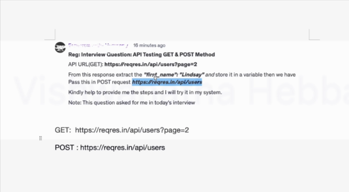

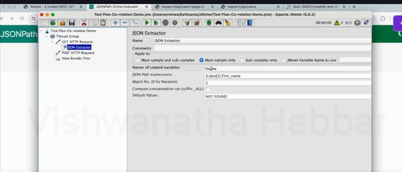

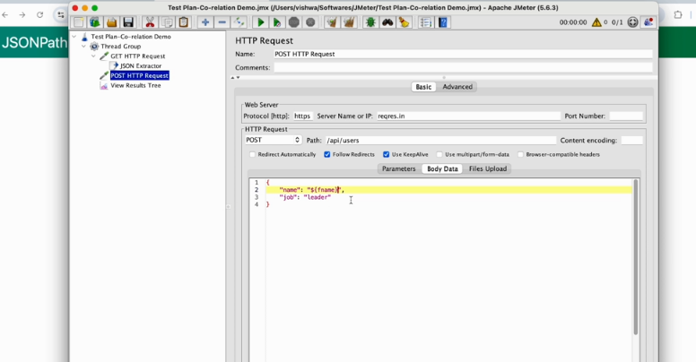

also add the content-type  

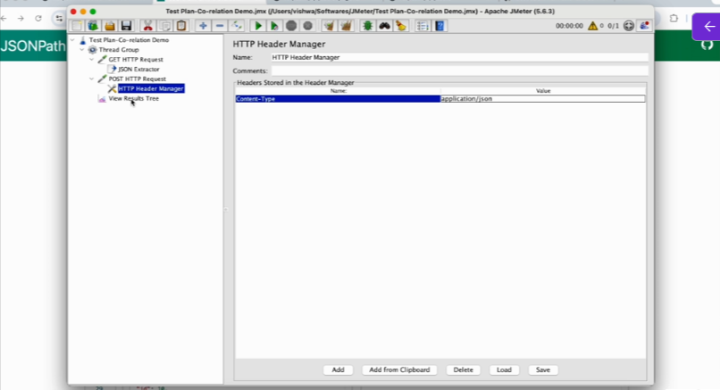

if the order changes use this -  

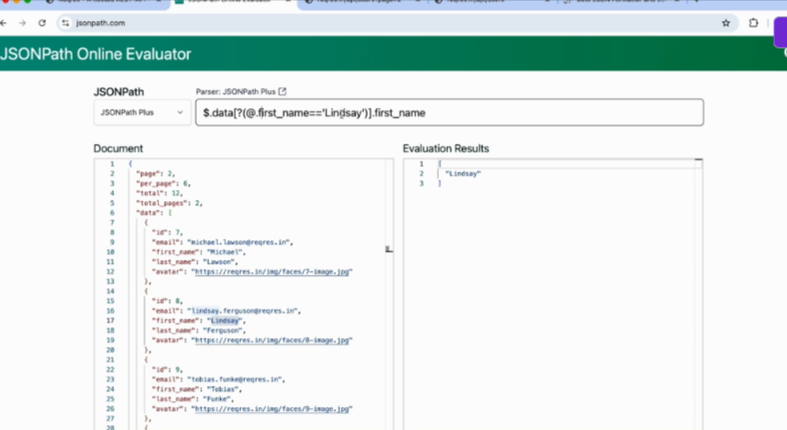

## Scenario Based Performance Testing Interview Questions - Part 1

* Question - Can you walk us through a challenging performance issue you faced and how you solved it using JMeter?

Above is basic Client server architecture  

**Problem**/Challenge - Slow response/timeout during fund transfer & bill payment

issue is faced when 500 users are crossing

why this slowness or timeout is happening? memory/ database issue or network issue? where exactly is the issue?

> we can use JMeter to simulate

* Steps taken to solve the issue - 
  * 1. Understanding the problem
  * 2. Setting Up JMeter Test Plan
  * 3. Install Server Monitoring tool on backend and JMeter in client
  * > We start with 500 users, as slowness started when users are 500 or more
  * 4. Running the test and Capturing Metrics
    * Capture throughput, response time, error rate and monitor server resource utilization
  * 5. Analyzing the Results
    * > Major performance issue during a fund transfer or bill payment
    * > Database server is using excessive resource
  * 6. Identifying the Bottleneck
    * > I cordinated with Database Administrator to get database logs and database developers
  * 7. Solution - Indexing, complex queries which taking longer response time
  * 8. Retest & observer results After Optimization
    * > Response time imporoved from 10 second to 3 second

* First understand the problem by discussing with JMeter and then simulate in JMeter and observe and monitor the parameters
* And based on that you can work with corresponding team to fix the issue

## Scenario Based Performance Testing Interview Questions - Part 2 

* Question -  Explain how you would design a performance test plan for a web application/API?

1. Define the Goal
   1. What do you want to check?
2. Identify Key Scenarios
   1. What users will do in my Website e.g. browsing, checkout, Add to cart
3. Set Performance Targets
   1. How fast should I respond?
4. Determine the Test Data
   1. What kind of data will you use for testing?
      1. e.g. login account, product to purchase , payment details based on application
5. Choose the Right Tools
   1. What tool will you use for testing?

> If you're testing an API, then you will need an API, endpoint, details, API payload, API key, etc

## Scenario Based Performance Testing Interview Questions - Part 3

* **Question** - You're tasked with testing the scalability of an e-commerce site. How would you approach this?

* Goal is to see how well it handles a growing & reducing number of visitor(shoppers) without slowing down or crashing

1. Understand the Goal(why are we doing this?)
2. Identify Key Actions on the Website(what do users do?)
   1. Add to cart, browsing, checkout
   2. what are possible actions and according to you need to design the test
3. Define Performance Targets(How fast should it be?)
4. Simulate User Load(How many people can shop at once?)
5. Monitor Key Metrics(What are we measuring?)
6. Identify and Fix Bottlenecks(What can go wrong)
   1. > Network issue, slow database queries, overloaded server
7. Repeat with Increasing Load(Test bigger numbers)

> Above are basic guidelines. you can changed based on your scenario

## Scenario Based Performance Testing Interview Questions - Part 4

* Question - How do you handle performance testing in a microservice-based architecture?

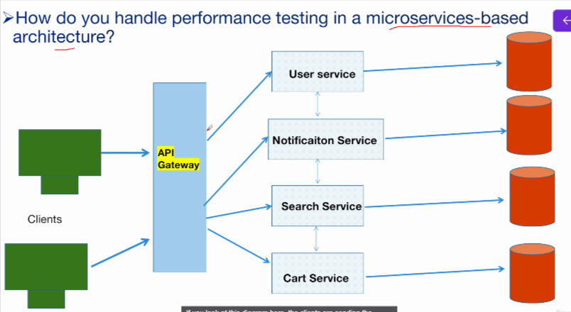

> A microservice architecture means a big application is built using collection of small independent services, and each service will be responsible for specific function.

* Understand the Architecture
  * How many services are there, how they are interacting
* Define the Performance Testing Goals
  * focus on critical service first e.g. payment service, login service
* Identify Critical Performance Scenarios
* Simulate Load on Individiual Microservices
* End-to-End Performance Testing
  * e.g. Simulate the entire user journey
* Monitor and Measure Key Metrics
  * Capture resource utilization
* Identify Bottlenecks
  * Slow communication between service
  * Slow payment service
* Implement Optimization and Retest

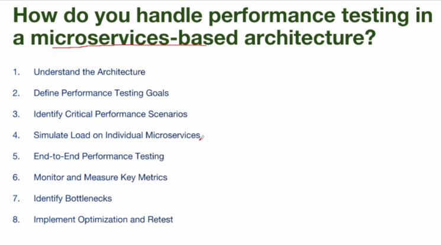

> The main thing here is you are testing the load on the individual microservices individually first, and then you are also doing the end to end testing.(Checking multiple microservices later)

> Above is guidelines

## General Performance Testing Interview Questions and Answers - Part 1

* **What is Performance Testing?**
  * Evaluating how a system performs under specific conditions such as varying user loads, to ensure its speed, scalability, and stability
* **Importance of Performance Testing in Software development?**
  * Optimizes User Experience
    * > You don't want user to get frustrated where website keeps on loading
  * Prevents Downtime
  * Ensures Reliability
  * Validates Scalability
* **What are the different types of performance testing?**
  * 1. **Load Testing**
    * Evaluates system performance **under expected user load**to ensure it functions as required
  * 2. **Stress Testing**
    * Tests the system by **increasing load beyond normal levels** to identify its breaking point and stability limits.
  * 3. **Endurance Testing(Soak Testing)**
    * Assesses system performance under sustained load over a long period to identify memory leaks or degradation
  * 4. **Spike Testing**
    * Examines how the system reacts to sudden, large spikes in user load
  * 5. **Scalability Testing**
    * Measures the system's ability to scale up or down in response to varying user loads
      * > Number of user will increase or decrease throughout the day
  * 6. **Volume Testing**
    * Tests the system's capacity to handle a large volume of data
  * 7. **Benchmark Testing**
    * It is a type of performance testing where a system or application is **measured against a predefined set of standards or benchmarks**
      * > What are your expectation
      * > e.g. This is response I want 

* **What metrics do you capture during performance testing?**

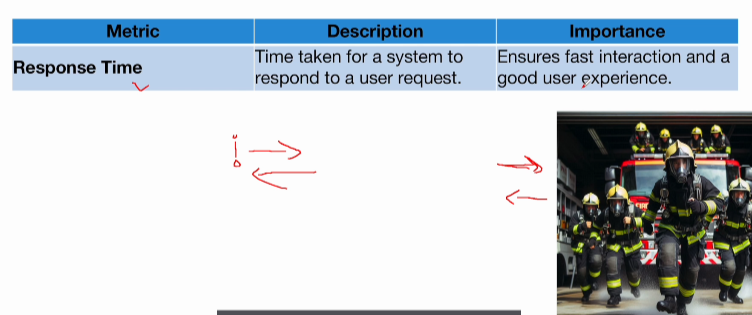

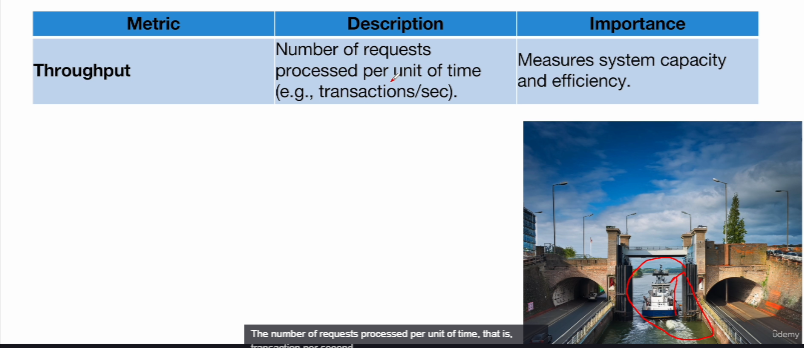

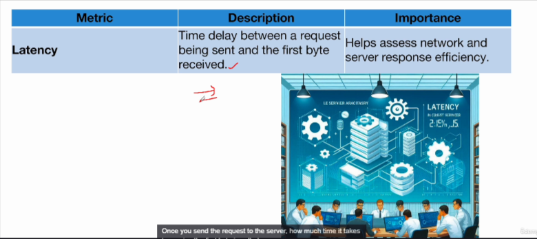

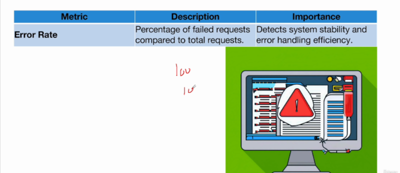

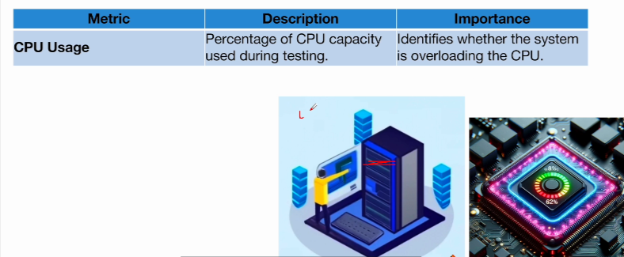

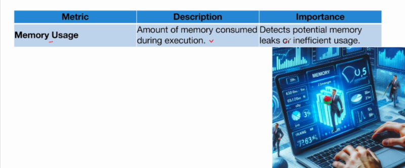

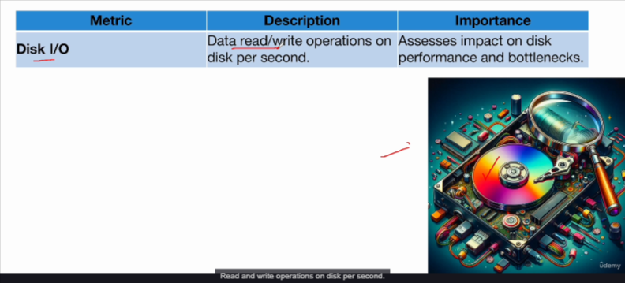

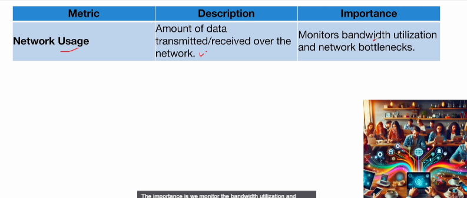

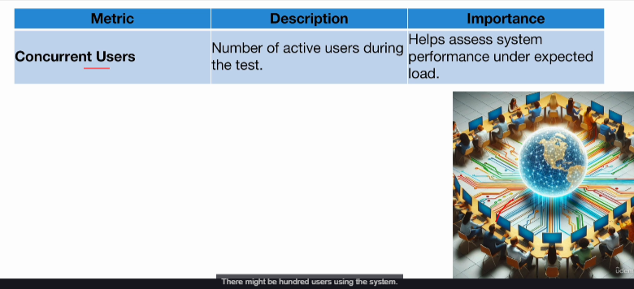

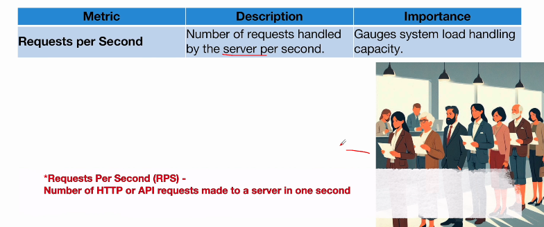

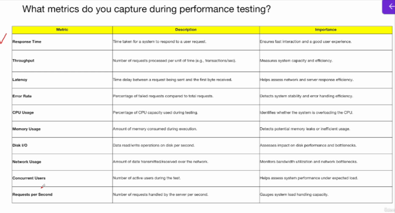

## General Performance Testing Interview Questions and Answers - Part 2

* **What is performance bottleneck? What are common performance bottlenecks in a system?**
  * A performance bottle is a part of a computer system, software, or network that slows everything else down

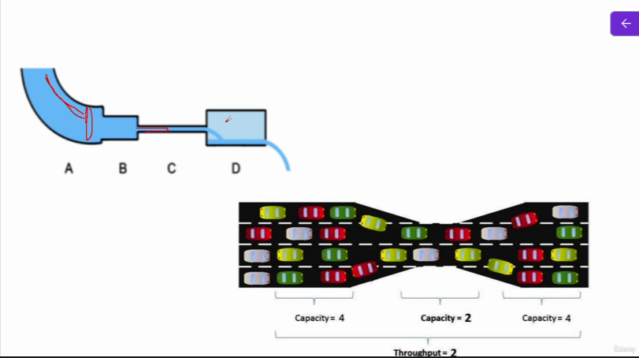

* Think of it like a narrow part of a water pipe that reduces the flow of water
* Even if the rest of the system works fast, this one slow part can limit the overall speed
* In software, it could be slow code, a busy server, or limited memory that causes delays, making the whole system perform poorly.

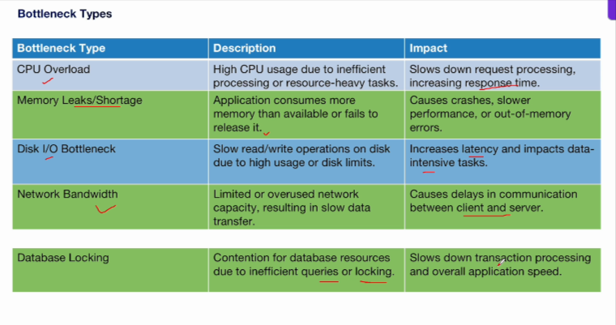

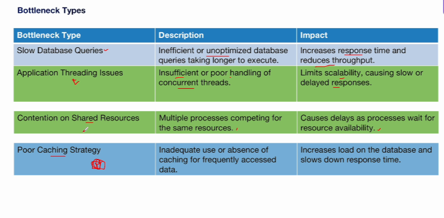

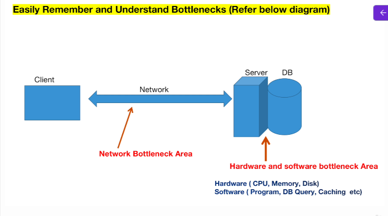

* **How do you determine performance testing requirements?**

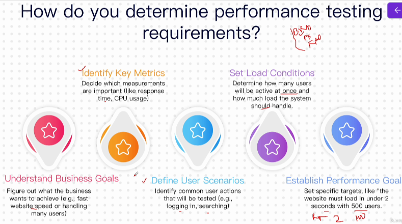

## Performance Testing Using JMeter - Interview Questions - Part 1

* **What is JMeter and what are its main features**
  * JMeter is an open-source performance testing tool used to analyze and measure the performance of a variety of services

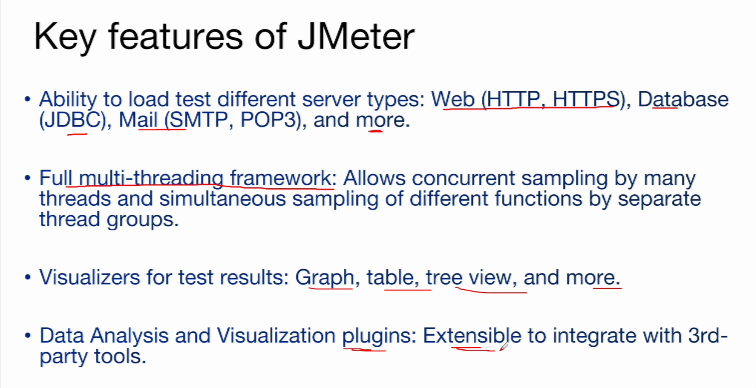

**Example** - Use JMeter to simulate a load test on a web application with 100 users hitting the login endpoint concurrently  

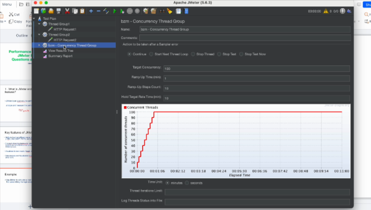

* Explain how you would set up a performance test in JMeter.

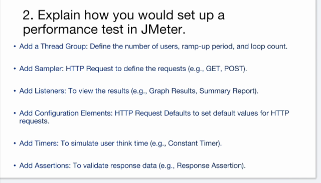

3. How do you analyze performance test results in JMeter

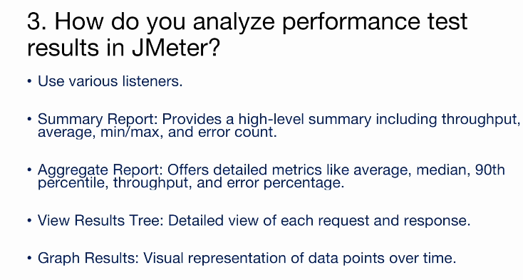

e.g. Analyzing a summary report to determine if the average response time meets the SLA of 2 seconds

4. What is the purpose of the "Thread Group" in JMeter?

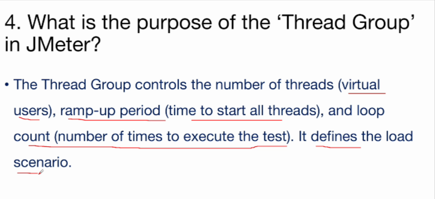

e.g. A Thread Group configured with 100 users, a 10-second ramp-up, and 5 iterations to simulate a peak load test

5. What are different types of processors in JMeter?

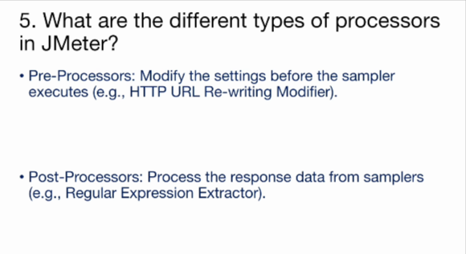

e.g. Using a Regular Expression Extractor to parse a token from a login response

