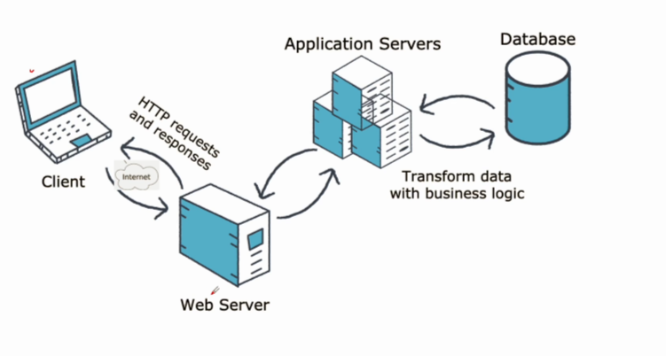
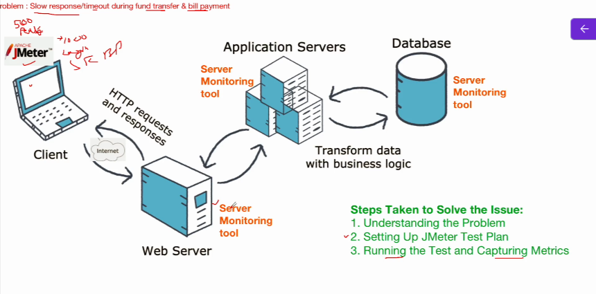
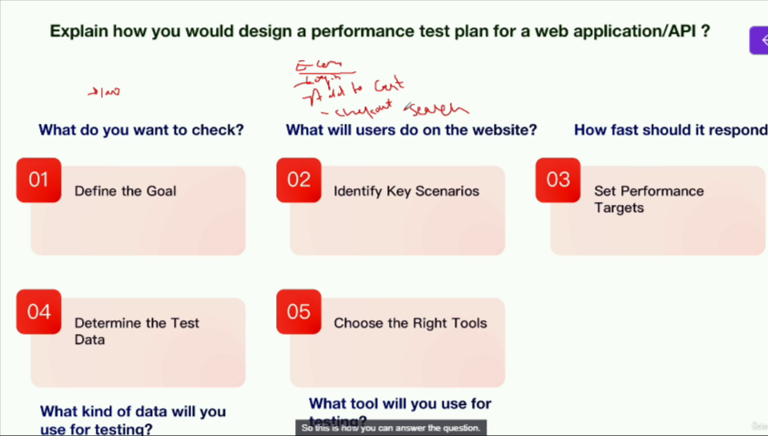
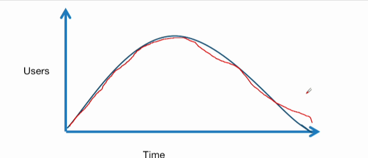
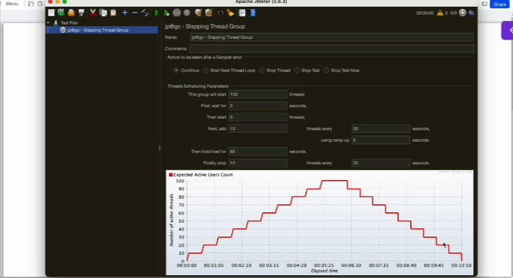
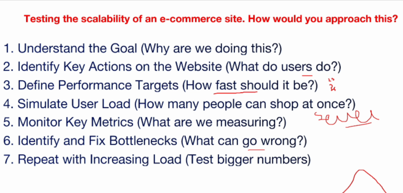

# Performance Testing Interview Questions and Answers

## Scenario Based Performance Testing Interview Questions - Part 1

* Question - Can you walk us through a challenging performance issue you faced and how you solved it using JMeter?

Above is basic Client server architecture  

**Problem**/Challenge - Slow response/timeout during fund transfer & bill payment

issue is faced when 500 users are crossing

why this slowness or timeout is happening? memory/ database issue or network issue? where exactly is the issue?

> we can use JMeter to simulate

* Steps taken to solve the issue - 
  * 1. Understanding the problem
  * 2. Setting Up JMeter Test Plan
  * 3. Install Server Monitoring tool on backend and JMeter in client
  * > We start with 500 users, as slowness started when users are 500 or more
  * 4. Running the test and Capturing Metrics
    * Capture throughput, response time, error rate and monitor server resource utilization
  * 5. Analyzing the Results
    * > Major performance issue during a fund transfer or bill payment
    * > Database server is using excessive resource
  * 6. Identifying the Bottleneck
    * > I cordinated with Database Administrator to get database logs and database developers
  * 7. Solution - Indexing, complex queries which taking longer response time
  * 8. Retest & observer results After Optimization
    * > Response time imporoved from 10 second to 3 second

* First understand the problem by discussing with JMeter and then simulate in JMeter and observe and monitor the parameters
* And based on that you can work with corresponding team to fix the issue

## Scenario Based Performance Testing Interview Questions - Part 2 

* Question -  Explain how you would design a performance test plan for a web application/API?

1. Define the Goal
   1. What do you want to check?
2. Identify Key Scenarios
   1. What users will do in my Website e.g. browsing, checkout, Add to cart
3. Set Performance Targets
   1. How fast should I respond?
4. Determine the Test Data
   1. What kind of data will you use for testing?
      1. e.g. login account, product to purchase , payment details based on application
5. Choose the Right Tools
   1. What tool will you use for testing?

> If you're testing an API, then you will need an API, endpoint, details, API payload, API key, etc

## Scenario Based Performance Testing Interview Questions - Part 3

* **Question** - You're tasked with testing the scalability of an e-commerce site. How would you approach this?

* Goal is to see how well it handles a growing & reducing number of visitor(shoppers) without slowing down or crashing

1. Understand the Goal(why are we doing this?)
2. Identify Key Actions on the Website(what do users do?)
   1. Add to cart, browsing, checkout
   2. what are possible actions and according to you need to design the test
3. Define Performance Targets(How fast should it be?)
4. Simulate User Load(How many people can shop at once?)
5. Monitor Key Metrics(What are we measuring?)
6. Identify and Fix Bottlenecks(What can go wrong)
   1. > Network issue, slow database queries, overloaded server
7. Repeat with Increasing Load(Test bigger numbers)

